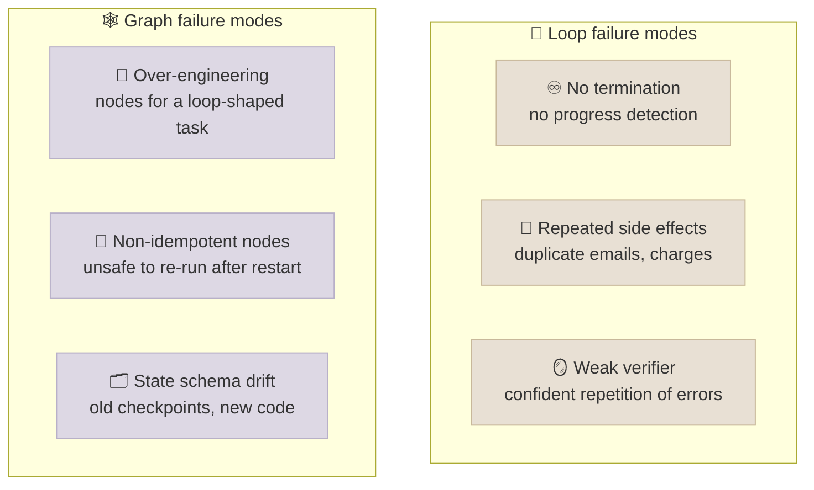

# Loops and Graphs

Two design decisions sit above the agent loop's mechanics: **whether to build a loop at all** - a standing process that keeps doing a class of work until a condition holds - and **when a loop should become a graph** of specialised, checkpointed steps. This chapter gives decision rules for both, grounded in what makes loops trustworthy: the quality of the signal they iterate against.

```objectives
time: 45 min
outcomes:
  - Decide whether a recurring task justifies a loop, using a setup-cost argument
  - Identify the verifier as the bottleneck of a loop and choose external checks over self-critique
  - Name the signals that justify splitting a loop into a graph, and apply the "what if it dies halfway?" test
  - Recognise the failure modes of both (runaway loops; over-engineered, non-idempotent graphs) and combine them in a hybrid
prerequisites:
  - "[The Agent Loop](../../12-Agent-Foundations/Notes/03-The-Agent-Loop.mdx) - loop mechanics and termination"
  - "[Workflow Patterns](../../14-Agent-Patterns/Notes/01-Workflow-Patterns.mdx)"
  - "[Harness Engineering](01-Harness-Engineering.mdx)"
```

## Design Loops, Not Prompts

A prompt says "do this." A loop says "keep doing this class of work until this condition holds, remember what happened, and stop when judgment is needed." Examples: a nightly job that triages new issues and drafts fixes for the easy ones; an agent that keeps a dependency set updated and opens PRs that pass CI; a migration that processes files until a manifest is empty. The design questions are when it's worth building, what it iterates against, and how it stops.

### When a loop pays for itself

A loop has a setup cost `F` (building tools, checks, state, permissions). It earns it back over `N` future occurrences if

`P × N × (S + R) > F`

where `P` is the probability a run succeeds, `S` the attention saved per occurrence, and `R` the risk avoided per occurrence (fewer manual slips). Small `N` - a one-off task - rarely justifies a loop; just do the task. A frequent task with a low `P` doesn't either, until the verifier improves `P`.

### The verifier is the bottleneck

**A loop is only as good as the signal it iterates against.** Each iteration is a chance to fix an error - or to repeat it more confidently. The evidence in this course points one way:

- In the [Module 14 lab](../../14-Agent-Patterns/CodeLabs/01-Patterns-Under-Measurement.mdx), self-review without new information fixed one solution and broke two, while feedback from the visible tests fixed one and broke none, at a fraction of the tokens - small differences on problems the model mostly already solved, but in the direction the literature predicts.
- Huang et al. (2023) found that models asked to self-correct reasoning without external feedback often don't improve and sometimes get worse.
- In [Lab 12](../../12-Agent-Foundations/CodeLabs/01-Agent-Loop-from-Scratch.mdx), a harness check that compared the reply with the actual database fixed one class of error and exposed another - a check tells you *that* something is wrong, which is what a loop needs to continue.

So invest in the check before the loop: tests, type checkers, schema validation, execution results, a comparison with source documents, a state check. When no reliable check exists, keep a human in the loop.

A good loop also **improves its environment**: it leaves behind a new test, a clearer instruction in `AGENTS.md`, or an automated check, so the next run is cheaper and safer.

## When a Loop Becomes a Graph

Default to one loop: one context, one prompt, fewer moving parts, easier debugging. Split into a graph (explicit nodes with their own prompts, tools, models and checkpoints) only when you can name the reason:

| Signal | Why one loop falls short |
|---|---|
| **Distinct specialities** | Phases need different instructions, tools or context that would dilute one prompt |
| **Parallelism** | Independent sub-tasks can fan out and join |
| **Different models or tools per step** | A small model for triage, a strong one for synthesis |
| **Auditable, branching control flow** | Regulated or high-stakes work needs visible decision points and approvals |
| **A verifier big enough to be its own step** | The completion check has become a substantial job |

### The sharper test: what if it dies halfway?

Ask what happens if the process is interrupted:

- **A loop is enough** when the task is bounded, restarting costs seconds, and nothing irreversible happens mid-run.
- **Use a graph (with checkpoints or durable execution)** when state must survive a restart, a human must approve intermediate output, or side effects mean a restart must resume rather than repeat ([Durable Execution](../../16-Production-Agents/Notes/03-Durable-Execution.mdx)).

This moves the argument from how complicated the process feels to what its failures cost, which settles it faster.

## Failure Modes on Both Sides



- **Loops** need every stop condition from [The Agent Loop](../../12-Agent-Foundations/Notes/03-The-Agent-Loop.mdx#bounds-and-termination) - iteration and budget caps, timeouts, repeated-call detection - and idempotent side effects.
- **Graphs** need idempotent nodes (they may run twice after a restart) and versioned state schemas; and each node inside usually runs its own small bounded loop, so the loop rules still apply.
- **Isolation beats instructions** for both: sandboxes and scoped credentials decide the blast radius of a failure, whatever the topology.

## The Hybrid Reality

Most production systems are **graphs of loops**: a deterministic outer graph holds durable state, approvals and the audit trail; inside each node a bounded agent loop handles the uncertain work. The outer graph answers "what is the shape of this process?"; the inner loops answer "what's the next step?".

## Check Yourself

```quiz
- q: "A task happens twice a year and takes an hour by hand. Building a reliable loop would take two days. Build it?"
  options:
    - "Probably not - small N means the setup cost is rarely recovered"
    - "Yes - automation always pays off"
    - "Yes, if the model is strong"
    - "Only as a graph"
  answer: 1
- q: "A loop wraps a model that critiques and revises its own answer three times. What limits its improvement?"
  options:
    - "The critique adds no new information; without an external check the loop can repeat errors more confidently"
    - "Three iterations are too few"
    - "The temperature"
    - "The context window"
  answer: 1
- q: "Which situation most clearly calls for a checkpointed graph rather than a loop?"
  options:
    - "A two-day process with a human approval midway and side effects that must not repeat on restart"
    - "A 20-second lookup that can simply be retried"
    - "A single summarisation call"
    - "A task with a very long prompt"
  answer: 1
- q: "Why must graph nodes be idempotent?"
  answer: "After a failure the runtime may re-run a node from the last checkpoint; if the node has side effects (payments, emails), running it twice must not duplicate them."
```

## Exercises

```exercise
- title: Justify or reject a loop
  task: |
    For three recurring tasks from your work, estimate P, N, S, R and F and decide whether to build a loop. For the one you'd build, name its verifier and its stop conditions.
  solution: |
    A strong answer quantifies N (occurrences per year), S (minutes saved each), R (errors avoided), a realistic P given the verifier, and F in engineer-days. The chosen loop has a deterministic verifier (tests, a schema check, a state comparison), bounds, repeated-call detection and an escalation path when the verifier can't decide.
- title: Loop to graph
  task: |
    Take the Lab 12 shop agent and redesign it for refunds over 500 that need finance approval within 48 hours. Which of the five signals apply? Sketch the graph and say which nodes contain loops.
  solution: |
    Auditable branching and human approval apply (and failure semantics: the approval can't hold a process). Graph: intake (loop: identify customer and order) -> policy check (deterministic) -> branch: small refunds execute (idempotent) / large refunds wait for approval (durable wait with timeout) -> execute -> notify. Loops live in intake and in drafting the customer message.
```

## Study Notes

- Loop = keep doing a class of work until a condition holds; build one when `P × N × (S + R) > F`
- The verifier bounds the loop: external checks over self-critique; good loops improve their environment
- Graph signals: specialities, parallelism, per-step models/tools, auditable branching, a large verifier
- "What if it dies halfway?" - failure semantics decide loop vs checkpointed graph
- Loops: stop conditions, idempotent side effects; graphs: idempotent nodes, versioned state; production = graphs of loops

## References

- Anthropic, [Building Effective Agents](https://www.anthropic.com/engineering/building-effective-agents) (Dec 2024)
- Huang et al., [Large Language Models Cannot Self-Correct Reasoning Yet](https://arxiv.org/abs/2310.01798) (2023)
- LangChain, [Workflows and agents](https://docs.langchain.com/oss/python/langgraph/workflows-agents) (2026)

*Last reviewed: 2026-09*
