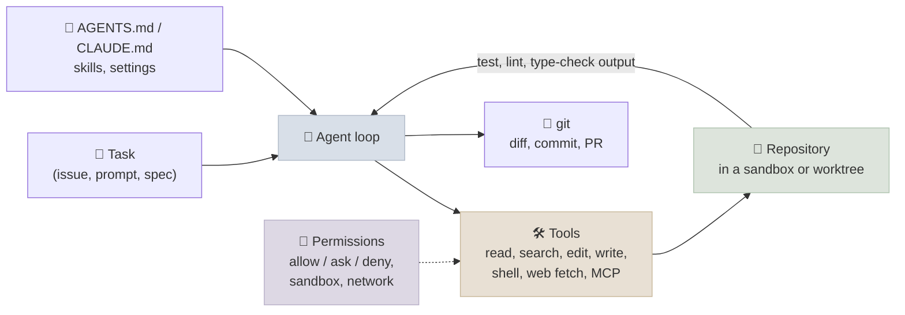

# Coding Agents

Coding agents - Claude Code, OpenAI Codex, Gemini CLI, Cursor's and GitHub Copilot's agent modes, and many open-source equivalents - are the most widely used agents today and the clearest case study in harness engineering. They are a model in a loop with file, search and shell tools over a repository, verifying their work with the project's own tests. This chapter dissects how they work, how to set a repository up for them, and what the evidence says about their productivity.

```objectives
time: 45 min
outcomes:
  - Describe the architecture shared by coding agents - tools, repository context, permissions and sandbox, verification, git
  - Set up a repository for agents with AGENTS.md, fast deterministic checks and clear task specifications
  - Choose between local interactive agents, background (cloud) agents and parallel agents in worktrees for a task
  - Interpret coding-agent benchmarks and productivity studies, including the METR randomised trial
prerequisites:
  - "[Harness Engineering](01-Harness-Engineering.mdx)"
  - "[Context Engineering for Agents](03-Context-Engineering-for-Agents.mdx)"
```

## Anatomy



| Component | In practice |
|---|---|
| **Tools** | File read/search (`grep`, `glob`), exact string edits rather than whole-file rewrites, file writes, a shell, web fetch, MCP servers for issue trackers, docs and databases |
| **Repository context** | Loaded just in time by search and reads, plus an instructions file read at start - `AGENTS.md` (an open format released by OpenAI in August 2025, now an Agentic AI Foundation project), or `CLAUDE.md` for Claude Code |
| **Permissions and sandbox** | Rules for which commands run without asking; OS-level sandboxes that restrict file writes to the workspace and block or allowlist network access |
| **Verification** | The project's tests, linters and type checkers - run by the agent, and ideally enforced by the harness before it reports done |
| **Git** | Every change is a reviewable diff; commits are checkpoints; worktrees give parallel agents isolated copies |
| **Context management** | Compaction for long sessions, sub-agents for exploration, to-do lists for multi-step plans |

The loop is the one from Module 12; the differences between products are in the harness - tool design, permission model, context management, and how they verify.

## Modes of Use

| Mode | Examples | Good for | Watch out for |
|---|---|---|---|
| **Interactive, local** | Claude Code, Codex CLI, Gemini CLI in a terminal; IDE agent modes | Exploratory work, debugging, changes you want to steer | Your attention is the bottleneck; approve commands carefully |
| **Background / cloud** | Codex cloud tasks, GitHub Copilot coding agent, Claude Code on the web | Well-specified issues; many small tasks in parallel; results as PRs | Specification quality decides outcome; review burden moves to PRs |
| **Parallel local agents** | Several sessions in separate git worktrees | Independent tasks at once; trying alternative approaches | Merge conflicts; review capacity |
| **Headless / CI** | Agent SDKs and CLIs in pipelines (`claude -p`, `codex exec`) | Automated fixes, triage, code review on every PR | Scoped credentials; never give CI agents production secrets |

## Setting a Repository Up for Agents

The OpenAI and Anthropic harness write-ups agree on the essentials: agents do well in repositories that make the right thing easy to find and easy to check.

1. **An `AGENTS.md`** with the commands to build, test and lint; conventions that aren't obvious from the code; where things live; what not to touch. Keep it short and current; link to deeper docs.
2. **Fast, deterministic checks** - unit tests that run in seconds, a type checker, a linter, a formatter. These are the agent's feedback signal; slow or flaky tests make every loop worse.
3. **Clear task specifications** - acceptance criteria, examples, the files involved ([Spec-Driven Development](08-Spec-Driven-Development.mdx)).
4. **Mechanical enforcement of architecture** - lint rules and structural tests for layering and naming, so the agent gets an error instead of a code-review comment days later.
5. **Isolation** - a sandbox or container with the dependencies installed, no production credentials, network restricted.

## What the Evidence Says

- **Benchmarks**: SWE-bench Verified (resolving real GitHub issues, graded by hidden tests) and Terminal-Bench (tasks in a real terminal) are the standard measures; scores depend on the harness as much as the model, which is why leaderboards list agent systems ([Evaluation and Benchmarks](../../16-Production-Agents/Notes/05-Agent-Evaluation-and-Benchmarks.mdx)).
- **Task length**: METR measures the length of tasks (in human time) that agents complete with 50% reliability; it roughly doubled every 7 months from 2019 to early 2025.
- **Productivity is not automatic**: METR's randomised controlled trial (July 2025) with 16 experienced open-source developers working in their own large repositories found that allowing early-2025 AI tools *increased* completion time by 19%, although the developers expected a 24% speed-up and still believed afterwards they had been sped up. The result is specific to that setting - expert developers, mature codebases with high quality bars, early-2025 tools - but it is a warning to measure outcomes rather than impressions.
- **At the other end**, OpenAI's harness-engineering report describes a team shipping a product whose code was written entirely by agents, with the humans' effort going into the environment - tests, docs, structure and review.

The common thread: output depends on the harness and the repository as much as the model, and the gains come from engineering both.

## Check Yourself

```quiz
- q: "What is AGENTS.md?"
  options:
    - "An open format for project instructions that coding agents read at the start of a session"
    - "A log of agent actions"
    - "The MCP configuration file"
    - "A list of approved models"
  answer: 1
- q: "A team's agent-written PRs often break conventions that reviewers catch days later. What's the most effective fix?"
  options:
    - "Encode the conventions as lint rules and structural tests the agent runs, and list the commands in AGENTS.md"
    - "Longer prompts"
    - "A larger model"
    - "Fewer tests"
  answer: 1
- q: "What did METR's 2025 randomised trial find?"
  options:
    - "Experienced developers took 19% longer with early-2025 AI tools on their own repositories, despite expecting a speed-up"
    - "Developers were 55% faster"
    - "No measurable difference"
    - "AI tools halved defects"
  answer: 1
- q: "When is a background (cloud) coding agent a better fit than an interactive one?"
  answer: "For well-specified, independent tasks with clear acceptance criteria and good tests, where results can be reviewed as PRs - many can run in parallel without the developer's attention; exploratory or ambiguous work is better done interactively."
```

## Exercises

```exercise
- title: Make a repository agent-ready
  task: |
    Pick a repository you know. Write its AGENTS.md (under 60 lines), list the checks an agent should run and how long each takes, and identify two conventions that currently live only in reviewers' heads. Turn one into a lint rule or test.
  solution: |
    A good AGENTS.md lists setup, test, lint and type-check commands with expected runtimes; the directory map; non-obvious conventions; forbidden actions (e.g. editing generated files, touching migrations). Converting a convention to a check - for example a test that fails when a module in `api/` imports from `db/` directly - turns a review comment into immediate feedback for the agent.
- title: Measure it yourself
  task: |
    Design a small study of a coding agent's effect on your own work: which tasks, how to randomise them between AI-allowed and AI-disallowed, what to measure, and how to avoid the self-report bias METR observed.
  solution: |
    Pre-register a task list; randomly assign each task to a condition; record wall-clock time and review outcomes (defects, rework) rather than perceived speed; include review and fix-up time in the agent condition; compare with a paired or stratified analysis over enough tasks to separate the effect from task variance.
```

## Study Notes

- Coding agent = loop + file/search/edit/shell tools + repository context (AGENTS.md) + permissions/sandbox + verification + git
- Modes: interactive local, background/cloud, parallel worktrees, headless CI
- Agent-ready repositories: short AGENTS.md, fast deterministic checks, clear specs, mechanically enforced architecture, isolation
- Evidence: benchmarks measure harness + model; METR task horizons doubling ~7 months; METR RCT found a 19% slowdown for experts in early 2025 - measure outcomes, not impressions

## References

- Anthropic, [Claude Code: best practices for agentic coding](https://www.anthropic.com/engineering/claude-code-best-practices) (2025)
- OpenAI, [Harness engineering: leveraging Codex in an agent-first world](https://openai.com/index/harness-engineering/) (Feb 2026)
- [AGENTS.md](https://agents.md/) (2025) and Linux Foundation, [Formation of the Agentic AI Foundation](https://www.linuxfoundation.org/press/linux-foundation-announces-the-formation-of-the-agentic-ai-foundation) (Dec 2025)
- Becker et al. (METR), [Measuring the Impact of Early-2025 AI on Experienced Open-Source Developer Productivity](https://arxiv.org/abs/2507.09089) (2025)
- METR, [Measuring AI Ability to Complete Long Tasks](https://metr.org/blog/2025-03-19-measuring-ai-ability-to-complete-long-tasks/) (Mar 2025)
- Simon Willison, [Vibe engineering](https://simonwillison.net/2025/Oct/7/vibe-engineering/) (Oct 2025)

*Last reviewed: 2026-09*
