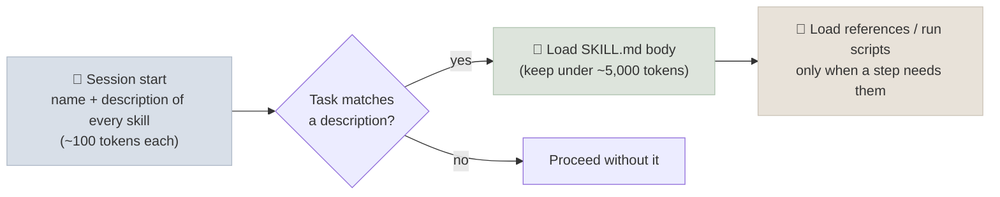

# Skills and Memory

Agents keep re-deriving what they already worked out: how this team formats a report, which command runs the tests, what the user prefers. Two mechanisms stop that. **Skills** package procedural knowledge - instructions, scripts and resources for a kind of task - that the agent loads only when relevant; the `SKILL.md` format is now an open standard. **Memory** persists facts, preferences and experience across sessions through an explicit write, retrieve and forget policy.

```objectives
time: 45 min
outcomes:
  - Write a valid SKILL.md skill with a description that triggers reliably, and structure it for progressive disclosure
  - Decide what belongs in a skill, in AGENTS.md, in a tool or MCP server, and in memory
  - Design a memory subsystem's write, retrieval, conflict and expiry policies, including its security
  - Review a third-party skill for risk before installing it
prerequisites:
  - "[Agent Memory](../../12-Agent-Foundations/Notes/05-Agent-Memory.mdx) - the memory taxonomy"
  - "[Context Engineering for Agents](03-Context-Engineering-for-Agents.mdx)"
```

## Skills

Anthropic introduced Agent Skills in October 2025 and published the format as an open standard (agentskills.io) that many agents have since adopted. A skill is a directory:

```text
pdf-forms/
├── SKILL.md          # required: YAML frontmatter + instructions
├── scripts/          # optional: code the agent can run (fill_form.py)
├── references/       # optional: docs loaded on demand (FIELDS.md)
└── assets/           # optional: templates, schemas, data
```

```markdown
---
name: pdf-forms
description: Fill PDF forms and extract form fields. Use when the user asks to complete, fill in or read the fields of a PDF form.
license: Apache-2.0
---

# Filling PDF forms

1. List the form's fields: `python scripts/list_fields.py <file.pdf>`
2. Map the user's data to field names; ask about anything missing - never guess values for signatures or dates.
3. Fill: `python scripts/fill_form.py <in.pdf> <values.json> <out.pdf>`
4. Verify by listing the fields of the output again.

Field naming quirks for government forms: see [references/FIELDS.md](references/FIELDS.md).
```

Spec essentials: `name` (required; lowercase letters, digits and hyphens, at most 64 characters, matching the directory name) and `description` (required; at most 1,024 characters, saying what the skill does **and when to use it**); optional `license`, `compatibility`, `metadata` and an experimental `allowed-tools`.

### Progressive disclosure



Only metadata is always in context, so an agent can have hundreds of skills installed. Consequences for authors:

- **The description is the trigger.** Write it with the words users will use and say when to use it; "Helps with PDFs" won't be selected reliably.
- **Keep `SKILL.md` short** (the spec recommends under 500 lines) and move detail into `references/` files, one level deep.
- **Scripts beat prose for deterministic steps.** Running `fill_form.py` is cheaper and more reliable than the model re-implementing it; the script's code need not enter the context at all - only its output.
- **Test skills like code**: a few tasks that should trigger it, a few that shouldn't, and graded outcomes.

### Skills, AGENTS.md, tools and MCP

| Put it in | When |
|---|---|
| `AGENTS.md` | Facts every session in this repository needs (commands, conventions) - always loaded |
| A skill | A procedure for a *kind* of task, needed only sometimes, possibly with scripts - loaded on demand |
| A tool / MCP server | An action or data source with an API, credentials, or state outside the agent's sandbox |
| Memory | Facts learned at runtime about users, projects or past episodes |

Skills and MCP complement each other: an MCP server gives the agent access to a system; a skill teaches it how to do a task well, possibly using that server's tools.

### Skill security

A skill is instructions *and code* that the agent will follow and run. Install skills only from sources you trust, read `SKILL.md` and every script before enabling one, pin versions, and watch for skills that fetch remote content or instructions at run time - that turns a reviewed skill into an injection channel ([supply-chain risk, ASI04](../../16-Production-Agents/Notes/02-Agent-Security.mdx)).

## Memory as a Subsystem

[Agent Memory](../../12-Agent-Foundations/Notes/05-Agent-Memory.mdx) defines the types (working, episodic, semantic, procedural) and systems (Mem0, Letta, Zep, LangMem, provider memory tools). The engineering questions are the policies:

| Policy | Questions | Typical answers |
|---|---|---|
| **Write** | What gets stored, when, by whom? | Explicit facts and preferences the user states; corrections; summaries at session end - not raw transcripts |
| **Retrieve** | How is memory found and how much enters context? | Scoped search (user, project) with a token budget; recent and high-importance first |
| **Conflict** | New fact contradicts an old one? | Update with timestamp and source; keep history; ask when uncertain |
| **Expiry** | When is memory forgotten? | Time-based decay, user deletion on request, retention limits for regulated data |
| **Security** | Can content injected today steer the agent next month? | Write only from trusted channels or with provenance; never store instructions as facts; per-user isolation ([ASI06 memory poisoning](../../16-Production-Agents/Notes/02-Agent-Security.mdx)) |

**File-based memory** - a memory directory the agent reads and writes (Anthropic's memory tool, `CLAUDE.md`-style notes, the progress logs from [Harness Engineering](01-Harness-Engineering.mdx)) - is transparent, versionable and easy to review, and is often enough. Vector or graph memory services pay off with many users, large histories and semantic recall needs.

**Procedural memory turns into skills.** When an agent keeps solving the same kind of problem the same way, write the procedure down as a skill - by a person, or by the agent proposing one for review - so the know-how becomes a reviewed, versioned artifact instead of something re-derived every time.

## Check Yourself

```quiz
- q: "Which SKILL.md frontmatter fields are required?"
  options: ["name and description", "name, description and version", "name only", "description and allowed-tools"]
  answer: 1
- q: "An agent never uses an installed skill even when it should. What is the first thing to fix?"
  options:
    - "The description - it must say what the skill does and when to use it, in the task's own words"
    - "Move all references into SKILL.md"
    - "Add more scripts"
    - "Rename the directory"
  answer: 1
- q: "Where should the command to run a repository's tests go?"
  options: ["AGENTS.md", "A skill", "Long-term memory", "An MCP server"]
  answer: 1
  explain: "Every session in the repository needs it, so it belongs in the always-loaded project instructions."
- q: "Why is 'store everything the user's emails say about their preferences' a risky memory write policy?"
  answer: "Emails are untrusted content; an attacker can plant 'preferences' or instructions that persist and steer the agent in later sessions (memory poisoning). Write memory from trusted channels or with provenance, and never store instructions as facts."
```

## Exercises

```exercise
- title: Write a skill
  task: |
    Package a procedure you repeat (for example: preparing a release, writing a data-quality report) as a skill with SKILL.md, one script and one reference file. Test it with three prompts that should trigger it and two that shouldn't, in any agent that supports skills.
  solution: |
    Check: name matches the directory; the description names the task and trigger phrases; SKILL.md is short with numbered steps and calls the script for deterministic work; the reference file is linked from the step that needs it. Record trigger precision and recall over the five prompts and revise the description until both are right.
- title: Memory policy
  task: |
    Specify write, retrieval, conflict, expiry and security policies for a support agent that remembers customers across conversations, under GDPR-style deletion rights.
  solution: |
    Write: explicit preferences and resolved-issue summaries, each with source and timestamp; nothing from untrusted attachments. Retrieve: by customer id only, top items within a 500-token budget. Conflict: newest wins, history kept for audit. Expiry: 24 months of inactivity; immediate deletion on request, including embeddings and backups on schedule. Security: per-customer isolation; stored items are data, rendered in a clearly delimited block.
```

## Study Notes

- Skills: directory with SKILL.md (+ scripts, references, assets); open standard; `name` and `description` required
- Progressive disclosure: metadata always, body on activation, resources on demand; description is the trigger; scripts for deterministic steps
- AGENTS.md for always-needed facts; skills for occasional procedures; tools/MCP for systems; memory for runtime facts
- Skills are code: review, pin, beware run-time fetching
- Memory policies: write, retrieve, conflict, expiry, security; file-based memory is often enough; recurring procedures become skills

## References

- Anthropic, [Equipping agents for the real world with Agent Skills](https://www.anthropic.com/engineering/equipping-agents-for-the-real-world-with-agent-skills) (Oct 2025)
- [Agent Skills specification](https://agentskills.io/specification) (2025-2026)
- Anthropic, [Effective context engineering for AI agents](https://www.anthropic.com/engineering/effective-context-engineering-for-ai-agents) (Sep 2025)
- Chhikara et al., [Mem0: Building Production-Ready AI Agents with Scalable Long-Term Memory](https://arxiv.org/abs/2504.19413) (2025)

*Last reviewed: 2026-09*
