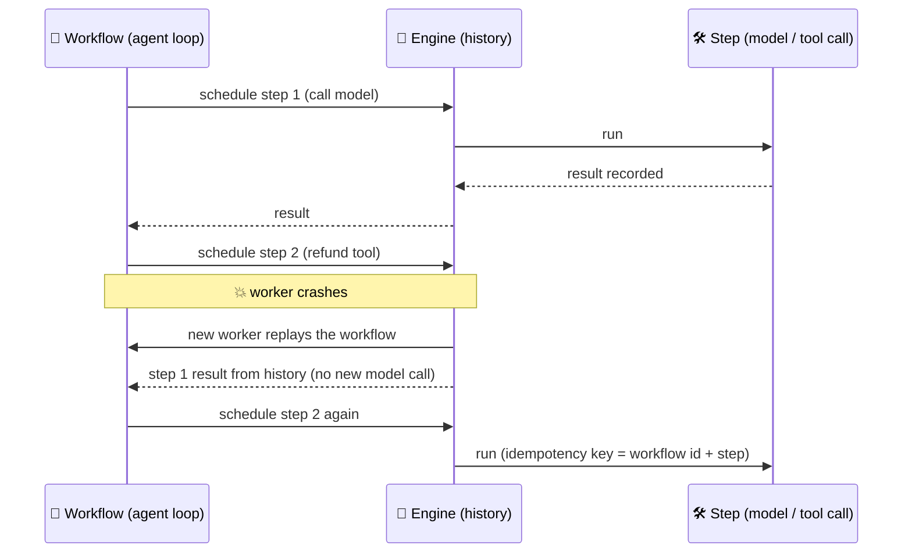

# Durable Execution for Agents

Durable execution means a program's progress is recorded as it runs, so that after a crash, deploy or timeout it resumes from where it stopped instead of starting over - and it can wait hours or days (for a human, a webhook, a scheduled time) without holding a process. Long-running agents need exactly this: dozens of expensive model calls, side-effecting tool calls that must not repeat, and approvals that take a day.

```objectives
time: 45 min
outcomes:
  - Explain why an in-memory agent loop fails for long or human-paced runs, and what durable execution records
  - Structure an agent as a durable workflow with model calls and tool calls as recorded steps, and explain the determinism rule
  - Compare Temporal, Restate, DBOS and framework checkpoints (LangGraph, MAF workflows) for an agent workload
  - Implement a human approval as a durable wait, and make side-effecting steps safe under retries
prerequisites:
  - "[Production Agent Architecture](01-Production-Agent-Architecture.mdx)"
  - "[LangChain and LangGraph](../../16-Agent-Frameworks/Notes/02-LangChain-and-LangGraph.mdx) - checkpoints and interrupts"
```

## Why Agents Need It

A plain agent loop keeps its state in process memory. That is fine for a 20-second chat turn and wrong for:

- **Long runs** - a research or coding agent that works for 40 minutes will meet a deploy, an out-of-memory kill or a provider outage. Restarting from scratch repeats every model call (cost) and every tool call (duplicate side effects).
- **Human waits** - an approval that takes a day cannot hold a worker thread.
- **External events** - waiting for a payment webhook, a CI run or a scheduled time.
- **Fan-out** - sub-agents or parallel tool calls whose results must all be collected even if some workers die.

## How It Works



The engine records each step's input and result in a durable log. After a failure, the workflow code is **replayed**: completed steps return their recorded results instantly, and execution continues from the first unrecorded step. Two rules follow:

1. **The orchestration code must be deterministic** - on replay it must make the same decisions in the same order. Anything non-deterministic (model calls, tool calls, clocks, random numbers, reading files or the network) goes inside a recorded step.
2. **Steps can run more than once** (a crash after the side effect but before the result is recorded), so side-effecting steps need idempotency keys. Engines give each step a stable id to build them from.

An LLM call is non-deterministic, so it is always a step. That's the whole trick for agents: the loop is the workflow; every model call and tool call is an activity/step.

## The Main Options

| | Model | State lives in | Human wait | Notes |
|---|---|---|---|---|
| **Temporal** | Workflows + activities; separate server (self-hosted or Temporal Cloud) | Temporal's event history | Signals/updates; workflow sleeps for days at no cost | Mature, polyglot; integrations for the OpenAI Agents SDK and PydanticAI (`TemporalAgent`) |
| **Restate** | Durable handlers; a Restate server journals each `ctx.run` | Restate's journal | Awakeables and durable promises | Also virtual objects (keyed, single-writer state) - useful for per-conversation agents |
| **DBOS** | A library: `@DBOS.workflow` and `@DBOS.step` decorators | Your Postgres database | `DBOS.recv` / `send`, durable sleep | No separate server; PydanticAI has `DBOSAgent` |
| **Framework checkpoints** | LangGraph checkpointer, MAF workflow checkpoints, CrewAI `@persist` | Postgres, SQLite, etc. | `interrupt()` / `request_info` | Resume from the last checkpoint; you still need workers, retries and timers around them |
| **Managed agent platforms** | Hosted sessions and runs (Google Agent Runtime, Bedrock AgentCore, Claude Managed Agents) | The platform | Platform-specific | Least to operate; least control |

Checkpointing and durable execution overlap. A checkpointer saves graph state *between* steps; a durable-execution engine also retries failed steps with policies, runs timers, delivers signals, schedules work on a fleet of workers and replays code deterministically. Many teams run LangGraph *inside* a durable engine, or use the engine directly with a thin agent loop.

## An Agent Loop as a Temporal Workflow

```python
from datetime import timedelta
from temporalio import activity, workflow
from temporalio.common import RetryPolicy

@activity.defn
async def call_model(messages: list[dict]) -> dict:
    return await llm.chat(messages=messages, tools=TOOLS)          # non-deterministic -> activity

@activity.defn
async def run_tool(name: str, args: dict, idempotency_key: str) -> dict:
    return await TOOLS_IMPL[name](**args, idempotency_key=idempotency_key)

@workflow.defn
class SupportAgent:
    def __init__(self):
        self.approval: bool | None = None

    @workflow.signal
    def review(self, approved: bool):
        self.approval = approved

    @workflow.run
    async def run(self, request: str) -> str:
        messages = [{"role": "system", "content": POLICY}, {"role": "user", "content": request}]
        for step in range(25):                                        # bounds live in the workflow
            reply = await workflow.execute_activity(
                call_model, messages, start_to_close_timeout=timedelta(minutes=2),
                retry_policy=RetryPolicy(maximum_attempts=5))
            messages.append(reply)
            if not reply.get("tool_calls"):
                return reply["content"]
            for call in reply["tool_calls"]:
                if call["name"] in NEEDS_APPROVAL:
                    self.approval = None
                    await workflow.wait_condition(lambda: self.approval is not None,
                                                  timeout=timedelta(days=2))   # no process held
                    if not self.approval:
                        messages.append(tool_result(call, {"error": "Declined by reviewer"}))
                        continue
                result = await workflow.execute_activity(
                    run_tool, args=[call["name"], call["arguments"], f"{workflow.info().workflow_id}-{step}-{call['id']}"],
                    start_to_close_timeout=timedelta(seconds=30))
                messages.append(tool_result(call, result))
        return "Stopped: step limit reached"
```

A crash anywhere replays the workflow from history without repeating completed model or tool calls; the two-day approval wait costs nothing while it waits; a timeout on `wait_condition` raises, so the policy for unanswered approvals is explicit. (The `tool_result` helper, `llm` client and tool registry are ordinary code.)

## Practical Concerns

- **History size.** Every model call's full message list is recorded. Long agents hit history limits and slow replay; store large payloads (documents, long transcripts) externally and record references, and use continue-as-new (Temporal) or equivalent to start a fresh history with a summary.
- **Versioning.** Changing workflow code while runs are in flight breaks determinism on replay. Use the engine's versioning (patching, worker versioning) or route new runs to new code.
- **Streaming.** Durable steps return whole results; stream tokens to the user through a side channel (a pub/sub topic, a queue) keyed by run id.
- **Cost of recording.** Each step adds a write; negligible next to a model call, not negligible for thousands of tiny steps.

## Check Yourself

```quiz
- q: "Why must a model call be an activity/step rather than code in the workflow body?"
  options:
    - "It's non-deterministic; on replay it would return different output and the workflow would diverge from its history"
    - "Activities are cheaper"
    - "Workflows can't make network calls for security reasons only"
    - "To stream tokens"
  answer: 1
- q: "A refund step crashed after the payment API succeeded but before the result was recorded. What prevents a double refund on retry?"
  options:
    - "An idempotency key derived from the workflow and step ids, checked by the payment API"
    - "Deterministic replay"
    - "The retry policy"
    - "The workflow history"
  answer: 1
- q: "What does a durable-execution engine add over a LangGraph checkpointer?"
  answer: "Step retries with policies, durable timers and sleeps, signals for external events, scheduling across a worker fleet, and deterministic replay of the orchestration code - a checkpointer only saves and restores graph state between steps."
- q: "An agent's workflow history grows to thousands of large events. What do you do?"
  answer: "Store large payloads outside the history (blob store) and record references; periodically continue-as-new with a compact summary of the conversation so the new history starts small."
```

## Exercises

```exercise
- title: Make Lab 13 durable
  task: |
    Port the Lab 13 agent loop to DBOS (or Temporal): the model call and each tool call become steps, the workflow is the loop. Kill the process in the middle of a multi-step task (for example with a sleep in a tool and Ctrl-C), restart, and show from logs that completed model calls were not repeated.
  hints: ["DBOS: @DBOS.workflow() on the loop, @DBOS.step() on call_model and run_tool; launch with DBOS.launch()"]
  solution: |
    After restart DBOS recovers the pending workflow, replays it, returns recorded results for completed steps (no new requests appear in the model server log) and continues from the interrupted step. Without idempotency keys, a tool step interrupted after its side effect runs again - demonstrate it with the shop's refund and fix it with a key check.
- title: Choose the engine
  task: |
    Pick a durability approach for: (a) a support agent with same-session approvals, 30-second runs; (b) a nightly research agent running 2 hours with 300 model calls; (c) a procurement agent that waits up to a week for a manager's approval. Justify each.
  solution: |
    (a) Framework checkpoints (LangGraph with Postgres) are enough - short runs, resume on the same thread. (b) A durable engine (Temporal or DBOS) so a crash at call 250 doesn't repeat 249 calls; keep payloads out of history. (c) A durable engine with a week-long durable wait and a timeout policy (escalate, then cancel); the run holds no resources while waiting.
```

## Study Notes

- Durable execution: record step results, replay on failure, wait without holding a process
- Determinism rule: orchestration deterministic; model calls, tools, clocks, randomness inside steps
- Steps may repeat: idempotency keys from workflow + step ids
- Options: Temporal (server, activities, signals), Restate (journal, awakeables, virtual objects), DBOS (library on Postgres), framework checkpoints, managed platforms
- Watch history size, versioning, and streaming via a side channel

## References

- [Temporal documentation](https://docs.temporal.io/) and its [OpenAI Agents SDK integration](https://docs.temporal.io/develop/python/integrations/openai-agents) (2026)
- [Restate documentation](https://docs.restate.dev/) (2026)
- [DBOS documentation](https://docs.dbos.dev/) (2026)
- [PydanticAI durable execution](https://ai.pydantic.dev/durable_execution/overview/) (2026)
- [LangGraph durable execution](https://docs.langchain.com/oss/python/langgraph/durable-execution) (2026)

*Last reviewed: 2026-09*
