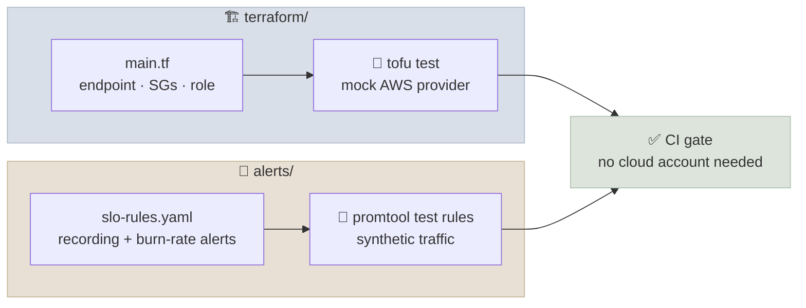

# Code Lab 02 - Terraform Private Endpoint and SLO Alerts

Build the two pieces of production plumbing that most LLM services need and most demos skip: private, least-privilege access from a workload to a managed model, written as infrastructure as code - and multi-window burn-rate alerts on the service's error budget. Both are tested offline: the infrastructure with `tofu test` against a mocked AWS provider, and the alerts with `promtool test rules` against synthetic traffic. No cloud account is needed to complete the lab.

← **Back to Overview:** [Production Engineering](../INDEX.mdx) · **Concepts:** [Cloud Networking & IAM for AI](../Notes/07-Cloud-Networking-and-IAM-for-AI.mdx) · [Infrastructure as Code](../Notes/08-Infrastructure-as-Code.mdx) · [LLM Observability, SLOs & Incident Response](../Notes/05-LLM-Observability-SLOs-and-Incident-Response.mdx)

```objectives
time: 2.5 hours
outcomes:
  - Write Terraform/OpenTofu for a private Bedrock endpoint, a scoped endpoint policy and a workload role that only works through that endpoint
  - Encode security requirements as tests (tofu test with mock providers) and as input validation, and see them fail when the code is wrong
  - Write recording rules and multi-window, multi-burn-rate alerts for an availability SLO
  - Unit-test alerts with synthetic traffic, including the cases that must not page
prerequisites:
  - "[Cloud Networking & IAM for AI](../Notes/07-Cloud-Networking-and-IAM-for-AI.mdx)"
  - "[LLM Observability, SLOs & Incident Response](../Notes/05-LLM-Observability-SLOs-and-Incident-Response.mdx) - burn rates"
```

---

## What's In This Lab

| Property | Detail |
|---|---|
| Infrastructure | `terraform/`: Bedrock runtime interface endpoint with private DNS; endpoint security group reachable only from the app's security group on 443; endpoint policy allowing only `InvokeModel` and `InvokeModelWithResponseStream` on approved model ARNs; an IAM role for EKS Pod Identity whose policy requires `aws:SourceVpce`; variable validation that rejects wildcard model ids and single-subnet layouts |
| Infrastructure tests | `terraform/tests/private_endpoint.tftest.hcl`: 4 `run` blocks with a mocked AWS provider - two mocked applies with assertions, two expected validation failures |
| Alerts | `alerts/slo-rules.yaml`: 5 recording rules (error ratio over 5 m, 30 m, 1 h, 6 h, 3 d) and 3 alerts - fast-burn page (14.4x), slow-burn page (6x), ticket (1x) - for a 99.5% availability SLO |
| Alert tests | `alerts/slo-rules.test.yaml`: 4 scenarios - a 10% outage, a 4% degradation, a healthy 0.2%, and a 1% slow leak |
| Verified | October 2026, offline: OpenTofu 1.13.1 with AWS provider 6.67.0 (`fmt`, `validate`, `test`: 4 passed) and Prometheus `promtool` 3.15.0 (`check rules`, `test rules`: SUCCESS). Nothing was applied to a real AWS account. |



---

## Run It

```bash
cd src/content/17-Production-Engineering/CodeLabs/02-Terraform-Private-Endpoint-and-SLO-Alerts

# Infrastructure (OpenTofu >= 1.8 or Terraform >= 1.7 for mock providers)
cd terraform
tofu init -backend=false
tofu fmt -check -recursive && tofu validate
tofu test

# Alerts (promtool ships with every Prometheus release)
cd ../alerts
promtool check rules slo-rules.yaml
promtool test rules slo-rules.test.yaml
```

Verified output:

```
tests/private_endpoint.tftest.hcl... pass
  run "endpoint_is_private_and_scoped"... pass
  run "role_requires_the_endpoint"... pass
  run "rejects_wildcard_models"... pass
  run "rejects_single_subnet"... pass

Success! 4 passed, 0 failed.

Checking slo-rules.yaml
  SUCCESS: 8 rules found

  SUCCESS                       # promtool test rules
```

To deploy for real, set `vpc_id`, `private_subnet_ids`, `model_ids` and `cluster_name` in a `terraform.tfvars`, configure a remote backend with locking ([Infrastructure as Code](../Notes/08-Infrastructure-as-Code.mdx)), and run `tofu plan` with credentials. Load the rules into Prometheus (or a `PrometheusRule` resource for the Prometheus Operator) and have the gateway export `llm_gateway_requests_total` with a `code` label.

---

## Walkthrough - What to Look At

1. **Three layers of restriction on one call path.** The security group decides who can reach the endpoint; the endpoint policy decides which actions and models can pass through it; the role policy decides what the workload may do and requires `aws:SourceVpce`, so the role's credentials are useless from anywhere else. Each layer limits the damage if another is misconfigured.
2. **Policies as `jsonencode`, not data sources.** Writing the policies inline keeps them plain HCL values the tests can `jsondecode` and inspect. It also matters for mocking: a mocked provider fills data-source outputs with random strings.
3. **Validation is the cheapest test.** `model_ids` rejects `*` and `private_subnet_ids` requires two subnets, so a bad change fails at `plan` - before review, and long before production. The `expect_failures` runs prove the validations actually trigger.
4. **Mocks must still be valid.** The first test run failed with `Invalid ARN Value`: the mock provider generated a random string for the role's ARN, and the Pod Identity resource validates ARN format. The `mock_resource` defaults supply realistic ARNs and ids - a reminder that mocks test your logic, not the cloud's behaviour.
5. **Recording rules, then alerts.** Each alert compares two precomputed error ratios - a long window that proves the burn is significant and a short one that stops the alert soon after recovery - against `burn rate x (1 - SLO)`. With a 99.5% SLO those thresholds are 7.2%, 3% and 0.5%.
6. **Test the silence too.** Scenarios 3 and 4 assert that a healthy service doesn't page and that a slow 1% leak raises only a ticket. Alert rules that page on noise get ignored; tests that only check "it fires" can't catch that. A mutation check makes the point: raising the fast-burn threshold to 25x makes the 10% outage scenario fail.

---

## Check Yourself

```quiz
- q: "The role policy requires aws:SourceVpce to equal the endpoint id. What does that protect against?"
  options:
    - "Slow model responses"
    - "Use of the workload's credentials from outside the VPC - for example if they leak - since requests not arriving through the endpoint are denied"
    - "Prompt injection"
    - "Exceeding the model's rate limit"
  answer: 2
  explain: "Even valid credentials only work for requests that arrive via the endpoint, which only exists inside your network."
- q: "Why does the lab test that a healthy 0.2% error rate produces no alerts?"
  answer: "Alerts that fire on normal noise train people to ignore pages. Testing the silent cases - healthy traffic, slow leaks that deserve only a ticket - is as important as testing that real outages page."
- q: "With a 99.5% availability SLO, what error rate triggers the fast-burn page, and why does it need both the 1 h and 5 m windows?"
  options:
    - "0.5%; the two windows average each other"
    - "7.2%; the 1 h window shows the burn is significant and the 5 m window makes the alert clear soon after recovery"
    - "14.4%; two windows double the threshold"
    - "5%; the 5 m window is only for dashboards"
  answer: 2
  explain: "14.4 x 0.5% = 7.2%. Requiring both windows gives significance (long) and fast reset (short)."
- q: "The first tofu test run failed with 'Invalid ARN Value'. Was that a bug in main.tf?"
  answer: "No - the mocked provider returned a random string for the role's ARN, and the Pod Identity resource validates ARN format. Supplying realistic mock_resource defaults fixed it. Mocks exercise your configuration's logic and validation, not real cloud behaviour, so they complement a real plan in a sandbox account rather than replace it."
```

## Exercises

```exercise
- title: Add a latency SLO
  task: |
    Add recording rules and a fast-burn alert for a latency SLO: 99% of requests have time-to-first-token under 1 s, using vLLM's `vllm:time_to_first_token_seconds` histogram. Then add a promtool test where 5% of requests are slow for an hour.
  hints:
    - "Good events: the `_bucket` series with `le=\"1.0\"`; valid events: the `_count` series."
    - "The budget is 1%, so the 14.4x page fires above 14.4% slow requests."
  solution: |
    Recording rule per window: `1 - (sum(rate(vllm:time_to_first_token_seconds_bucket{le="1.0"}[1h])) / sum(rate(vllm:time_to_first_token_seconds_count[1h])))`, and the same for 5m. Alert: both above `14.4 * 0.01`. In the test, feed `_count` growing by 100 per minute and the `le="1.0"` bucket by 95 per minute: the slow fraction is 5%, below 14.4%, so the fast-burn alert must **not** fire - but a 6x slow-burn alert (threshold 6%) wouldn't either, and a 1x ticket (1%) would. Use `le` values that exist in the histogram's bucket boundaries.
- title: Allow a second model safely
  task: |
    Product wants to add a second model. Change the variables, and add a test asserting that both model ARNs appear in the endpoint policy and in the role policy - and nothing else.
  solution: |
    Set `model_ids = ["amazon.nova-pro-v1:0", "amazon.nova-lite-v1:0"]` in the test's `variables` block (or a new `run` block's), and assert `toset(jsondecode(aws_vpc_endpoint.bedrock_runtime.policy).Statement[0].Resource) == toset([for id in var.model_ids : "arn:aws:bedrock:eu-west-1::foundation-model/${id}"])`, and the same for `aws_iam_role_policy.invoke.policy`. Because the ARNs come from one `local`, the endpoint and the role can't drift apart - the test guards against someone later hard-coding one of them.
```

## References

- OpenTofu, [Testing (tofu test, mock providers)](https://opentofu.org/docs/cli/commands/test/) (2026); HashiCorp, [Terraform tests](https://developer.hashicorp.com/terraform/language/tests) (2026)
- AWS, [Use Amazon Bedrock with interface VPC endpoints](https://docs.aws.amazon.com/bedrock/latest/userguide/vpc-interface-endpoints.html) (2026); [EKS Pod Identity](https://docs.aws.amazon.com/eks/latest/userguide/pod-identities.html) (2026)
- Prometheus, [Unit testing for rules](https://prometheus.io/docs/prometheus/latest/configuration/unit_testing_rules/) (2026)
- Beyer et al., [The Site Reliability Workbook - Alerting on SLOs](https://sre.google/workbook/alerting-on-slos/) (Google, 2018)

*Last reviewed: 2026-10*
