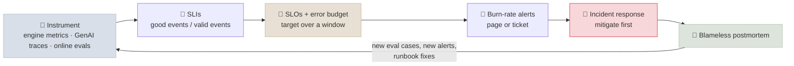
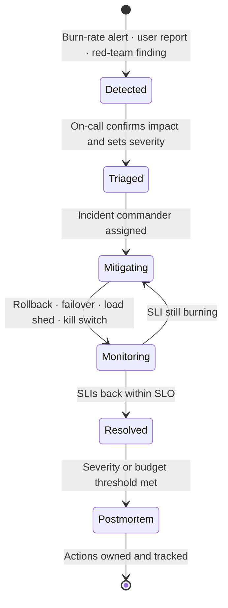

# LLM Observability, SLOs and Incident Response

Running an LLM service means deciding what "working" means in numbers, noticing quickly when it stops being true, and fixing it without guessing. This note covers that operating loop for LLM services: which service-level indicators to measure (latency, goodput, quality, safety and cost), how to turn them into SLOs and error budgets, how to alert on budget burn rather than on noise, and how to run incidents and postmortems when the failure is a model that got quietly worse rather than a server that fell over.

```objectives
time: 55 min
outcomes:
  - Define SLIs for an LLM service across availability, latency, goodput, quality, safety and cost, each as a good-events / valid-events ratio
  - Compute an error budget from an SLO and derive multi-window burn-rate alert thresholds from it
  - Name the LLM-specific incident types (silent quality regression, provider degradation, cost runaway, safety event) with a detection signal and first mitigation for each
  - Run an incident with clear roles and a mitigate-first runbook, and write a blameless postmortem whose actions feed back into the eval set
prerequisites:
  - "[The Modern Serving Stack](../../16-Inference-and-Serving/Notes/07-Modern-Serving-Stack.mdx) - TTFT, TPOT and goodput"
  - "[Model Lifecycle & Rollout](04-Model-Lifecycle-and-Rollout.mdx) - rollback criteria"
  - "[Building Your Own Evals](../../04-Evaluation/Notes/04-Building-Your-Own-Evals.mdx) - eval sets and confidence intervals"
```

## The Operating Loop



The loop is the same one SRE teams run for any service. Two things make LLM services different: **quality is a reliability property** (a service that answers fast and wrong is down for the user), and **many changes are not code deploys** - a prompt edit, a provider's model update or a re-built retrieval index can break the service without anything in your release pipeline moving.

---

## SLIs for an LLM Service

An SLI is best written as a ratio: **good events / valid events**, over a window. That form makes every SLI comparable, gives it a natural 0-100% range and turns directly into an error budget.

| SLI family | Good event (example definition) | Source |
|---|---|---|
| **Availability** | Request returned a non-5xx, non-timeout response | Gateway / load balancer logs |
| **Latency** | TTFT < 1 s **and** TPOT < 50 ms (interactive chat); E2E < 30 s (batch extraction) | Engine histograms, client spans |
| **Goodput** | Request completed **within** the latency SLO - availability and latency in one number | Derived from the two above |
| **Quality** | Sampled response passes the online judge (groundedness, task success, format valid) | Online eval on sampled traffic, user feedback |
| **Safety** | Response did not trigger a confirmed policy violation; benign request was not refused | Guard-model verdicts, refusal classifier, human review |
| **Cost** | Request cost below its budget (e.g. under $0.02 per answered question) | Token counts x price, per request |

Rules that keep SLIs honest:

- **Measure where the user is.** Engine metrics miss gateway queueing, retries and network time. Use client-side or gateway spans for the SLI and engine metrics for diagnosis.
- **Pick percentiles that match the experience** - a p99 TTFT target, not an average. Averages hide the long tail that users notice.
- **Segment by what users experience differently**: model, route, tenant, prompt length bucket. A single global SLI hides a broken tenant.
- **Quality SLIs are statistical.** If you judge 200 sampled responses a day, a 95% pass rate has a confidence interval of roughly ±3 points. Choose windows and sample sizes so a real regression moves the SLI more than noise does (see [Building Your Own Evals](../../04-Evaluation/Notes/04-Building-Your-Own-Evals.mdx)).

---

## Where the Signals Come From

| Layer | What it gives you | Examples |
|---|---|---|
| **Serving engine** (Prometheus) | Server-side latency histograms, queue and cache saturation | vLLM `vllm:time_to_first_token_seconds`, `vllm:inter_token_latency_seconds`, `vllm:num_requests_waiting`, `vllm:kv_cache_usage_perc` |
| **OpenTelemetry GenAI conventions** | Vendor-neutral spans and metrics for model calls, agents and tools | Spans with `gen_ai.operation.name`, `gen_ai.request.model`, `gen_ai.usage.input_tokens`; metrics `gen_ai.client.operation.duration`, `gen_ai.client.operation.time_to_first_chunk`, `gen_ai.server.time_to_first_token`, `gen_ai.server.time_per_output_token` |
| **Application** | What the request was for and whether it succeeded | Route, tenant, prompt and model version, outcome, user feedback, cost |
| **Online evaluation** | Quality and safety verdicts on sampled traffic | LLM-judge scores, guard-model labels, human review queue |

The OpenTelemetry GenAI conventions are still marked *Development* (they moved to their own `semantic-conventions-genai` repository in 2026), so pin the version your instrumentation emits. Agent-level traces - a span per model call, tool call and approval wait - are covered in [Agent Observability](../../15-Production-Agents/Notes/06-Agent-Observability.mdx); the same traces feed the SLIs here.

**Log the versions on every request**: model id (and the provider's dated version, when it has one), prompt template version, retrieval index version, guard-model version. Without them, "quality dropped on Tuesday" cannot be tied to a change.

---

## SLOs and Error Budgets

An **SLO** is a target for an SLI over a window: "99.5% of chat requests meet the latency SLO, measured over 30 days." The **error budget** is what the SLO allows to go wrong: 100% - 99.5% = 0.5% of requests.

**Worked example.** A 99.5% goodput SLO over 30 days:

- Budget = 0.5% of requests. At a steady 20 requests/s, that is `20 x 86,400 x 30 x 0.005 ≈ 259,000` bad requests a month.
- In time terms, it is `30 x 24 x 60 x 0.005 = 216` minutes of total outage.

The budget turns reliability arguments into a policy agreed **before** anything breaks:

| Budget state | Policy |
|---|---|
| Healthy | Ship freely - new prompts, models, features |
| Burning fast | Freeze risky changes until the burn stops |
| Exhausted | Only reliability work and rollbacks ship until the window recovers |

For LLM services, **prompt changes, model swaps, retrieval re-indexes and guardrail changes count as risky changes** under this policy. They need the same canary, the same rollback path and the same budget accounting as code ([Model Lifecycle & Rollout](04-Model-Lifecycle-and-Rollout.mdx)).

Don't set an SLO tighter than your dependencies allow: if your hosted model provider does not offer more than 99.9% availability, a 99.99% availability SLO is a promise you cannot keep without multi-provider failover.

---

## Alerting on Burn Rate

Alerting on a raw threshold ("error rate > 1% for 5 minutes") pages on blips that cost almost no budget and misses slow leaks that cost a lot. Alert instead on **burn rate**: how fast the budget is being spent relative to the rate that would use exactly all of it by the end of the window.

```
burn rate = observed error rate / (1 - SLO)
burn rate needed to spend fraction f of a 30-day budget in window w = f x 720 h / w
```

The Google SRE Workbook's recommended starting points for a 30-day SLO:

| Budget spent | Long window | Short window (1/12) | Burn rate | Action |
|---|---|---|---|---|
| 2% | 1 h | 5 min | 14.4 | Page |
| 5% | 6 h | 30 min | 6 | Page |
| 10% | 3 days | 6 h | 1 | Ticket |

Each alert fires only when **both** the long and short window exceed the burn rate: the long window proves the problem is significant, and the short window makes the alert stop soon after the problem does. For the 99.5% SLO above, the fast-burn page fires at an error rate of `14.4 x 0.5% = 7.2%`.

```yaml
# Prometheus rules - goodput SLI from vLLM's TTFT histogram (pick an `le` that is a real bucket boundary)
groups:
  - name: chat-slo
    rules:
      - record: slo:ttft_good:ratio_rate1h
        expr: |
          sum(rate(vllm:time_to_first_token_seconds_bucket{le="1.0"}[1h]))
          / sum(rate(vllm:time_to_first_token_seconds_count[1h]))
      - record: slo:ttft_good:ratio_rate5m
        expr: |
          sum(rate(vllm:time_to_first_token_seconds_bucket{le="1.0"}[5m]))
          / sum(rate(vllm:time_to_first_token_seconds_count[5m]))
      - alert: ChatLatencyBudgetFastBurn
        expr: |
          (1 - slo:ttft_good:ratio_rate1h) > (14.4 * 0.005)
          and
          (1 - slo:ttft_good:ratio_rate5m) > (14.4 * 0.005)
        labels:
          severity: page
        annotations:
          runbook: https://runbooks.example.internal/chat-latency
```

Two LLM-specific adjustments:

- **Quality SLIs need longer windows.** Online judges sample a small share of traffic, so a 5-minute quality window is mostly noise. Use hours-to-days windows and ticket-level alerts for quality burn, and rely on pre-release eval gates to catch regressions before they ship.
- **Add saturation alerts as early warnings, not SLOs.** A rising `vllm:num_requests_waiting` or KV-cache usage near 100% predicts a latency burn before users feel it - a good trigger for autoscaling ([LLM Serving on Kubernetes](03-LLM-Serving-on-Kubernetes.mdx)), not for a page.

---

## LLM-Specific Incidents

| Incident | Typical cause | Detection signal | First mitigation |
|---|---|---|---|
| **Silent quality regression** | Provider model update, prompt edit, new retrieval index, changed chat template | Online judge pass rate drops; thumbs-down rate rises; no errors at all | Roll back the last prompt/model/index change; pin the provider's dated model version |
| **Provider degradation** | Hosted API outage, rate limiting (429s), regional capacity | Availability SLI, 429/5xx rate by provider, TTFT spike | Fail over to a secondary provider or self-hosted model; shed or queue low-priority traffic |
| **Latency collapse** | Traffic spike, long-prompt surge, KV-cache pressure causing preemption, cold starts | Queue depth, KV-cache usage, TTFT p99 | Scale out; cap max context or output tokens; route long prompts to a separate pool |
| **Cost runaway** | Agent loops, context bloat, prompt-cache miss after a template change, abuse | Tokens and cost per request (p95), daily spend vs forecast | Per-request and per-tenant token caps; step limits; kill switch on the offending route |
| **Safety event** | Jailbreak campaign, data leak in outputs, harmful content reaching users | Guard-model hit rate, user reports, red-team findings | Tighten the guard threshold or block the pattern; disable the affected feature; preserve evidence |
| **Retrieval drift** | Stale or broken index, connector failure, permissions sync lag | Retrieval hit rate, empty-context rate, citation failures | Roll back to the last good index; pause ingestion |

The first row is the one generic monitoring misses: **every dashboard is green while answers get worse.** That is why the quality SLI and the version log are not optional extras.

---

## Running an Incident



**Roles** (from the Google SRE book's incident management model): an **incident commander** who coordinates and decides; an **operations lead** who makes changes to the system; a **communications lead** who updates stakeholders and status pages; and a **scribe** who keeps a timestamped log. In a small team one person holds several roles - but the commander role is never held by the person typing the fixes.

**Mitigate first, diagnose later.** Restoring service beats understanding it. For LLM services, keep these levers ready and rehearsed:

- Roll back the prompt, model, adapter or index version (one command, no code deploy)
- Fail over to a secondary model or provider behind the same gateway
- Degrade gracefully: smaller model, shorter context, retrieval-only answers, or a canned "try again later"
- Cap tokens, steps or concurrency per tenant; shed low-priority traffic
- A **kill switch** per feature or tool that disables it without a deploy

**A runbook entry** has: the alert it answers, what the alert means, the dashboards and queries to check, the mitigations in order of safety, how to verify recovery, and who to escalate to. Link it from the alert annotation, as in the rule above.

---

## Blameless Postmortems

A postmortem is written for incidents that crossed an agreed line - for example, any page-level incident, more than 10% of the monthly budget spent, any confirmed safety or data-exposure event. **Blameless** means it explains how the system let a reasonable action cause harm, rather than who made the mistake; people stop reporting problems in a culture that punishes them.

What it contains:

1. **Summary and impact** - who was affected, for how long, budget consumed
2. **Timeline** - from the scribe's log: detection, key decisions, mitigation, resolution
3. **Root cause and trigger** - for LLM incidents, often a change outside the code pipeline
4. **What went well, what went badly, where we got lucky**
5. **Action items** - each with an owner and a due date, tracked like any other work

Two action items an LLM postmortem should almost always produce:

- **Add the failing conversations to the regression eval set**, so the gate catches this failure before the next release ([Agent Evaluation & Benchmarks](../../15-Production-Agents/Notes/05-Agent-Evaluation-and-Benchmarks.mdx))
- **Close the detection gap** - if users noticed before an alert did, add or retune the SLI that should have caught it

---

## Check Yourself

```quiz
- q: "A chat service has a 99.5% goodput SLO over 30 days. Using the standard fast-burn page (2% of the budget in 1 hour), above what error rate does the page fire?"
  options:
    - "0.5%"
    - "2%"
    - "7.2%"
    - "14.4%"
  answer: 3
  explain: "Burn rate for 2% of a 30-day budget in 1 hour is `0.02 x 720 / 1 = 14.4`. The allowed error rate is `1 - 0.995 = 0.5%`, so the threshold is `14.4 x 0.5% = 7.2%`."
- q: "Why does a multi-window burn-rate alert require both a long and a short window to exceed the threshold?"
  options:
    - "The long window shows the problem is significant; the short window makes the alert stop soon after the problem does"
    - "The short window catches slow leaks; the long window catches spikes"
    - "Prometheus cannot evaluate a single window reliably"
    - "It halves the number of alert rules needed"
  answer: 1
  explain: "A long window alone keeps firing long after recovery (poor reset time). Requiring the short window too - typically 1/12 of the long one - ends the alert within minutes of the errors stopping."
- q: "Every dashboard is green - no errors, latency within SLO - but user thumbs-down rate has doubled since Tuesday. What kind of incident is this, and what is the first thing to check?"
  answer: "A silent quality regression. Check what changed on Tuesday using the version log on each request: the prompt template version, the provider's model version, the retrieval index version, the guard-model version. Roll back the change while you confirm it with the online judge and the regression eval set."
- q: "Why is GPU utilization or queue depth a poor SLI but a good early-warning alert?"
  answer: "Users don't experience utilization or queue depth - they experience latency, errors and answer quality, so SLIs should measure those. Saturation signals do predict a latency burn before it happens, which makes them good triggers for autoscaling or a low-severity warning."
- q: "Which of these changes should go through the error-budget policy and a canary like a code deploy?"
  options:
    - "Only container image changes"
    - "Code changes and model swaps, but not prompt edits"
    - "Code, model swaps, prompt edits, retrieval re-indexes and guardrail changes"
    - "None - error budgets only govern infrastructure changes"
  answer: 3
  explain: "Any of these can break the service for users. Treating prompt, model, index and guardrail changes as releases - versioned, canaried and roll-backable - is what makes LLM incidents diagnosable."
```

## Exercises

```exercise
- title: Budget and alerts for an extraction API
  task: |
    A document-extraction API serves 5 requests/s on average. Its SLO: 99% of requests return valid JSON within 20 s, over 30 days.

    1. How many bad requests does the monthly error budget allow?
    2. What error rate triggers the fast-burn page (2% of budget in 1 hour) and the slow-burn ticket (10% in 3 days)?
    3. Last night a schema change made 30% of responses invalid for 40 minutes before rollback. How much of the monthly budget did that spend?
  hints:
    - "Budget = (1 - SLO) x total requests in the window."
    - "Threshold = burn rate x (1 - SLO)."
  solution: |
    1. Requests per month: `5 x 86,400 x 30 = 12,960,000`. Budget: `1% x 12,960,000 = 129,600` bad requests.
    2. Fast burn: burn rate 14.4, threshold `14.4 x 1% = 14.4%` error rate (over both 1 h and 5 min). Slow burn: burn rate 1, threshold `1%` sustained over 3 days (and 6 h).
    3. Bad requests: `5 x 2,400 s x 0.30 = 3,600`, which is `3,600 / 129,600 ≈ 2.8%` of the monthly budget. The 1-hour window average was `30% x 40/60 = 20%`, above 14.4%, so the fast-burn page should have fired - if it didn't, that is a postmortem action item.
- title: Write the provider-degradation runbook
  task: |
    Your assistant calls a hosted model API, with a self-hosted 8B model as a fallback. Write the runbook entry for the alert `ProviderErrorRateFastBurn`: what it means, what to check, the mitigations in order, how to verify recovery, and when to escalate.
  solution: |
    - **Meaning**: the primary provider's 429/5xx/timeout rate is burning the availability budget at 14.4x or more.
    - **Check**: the provider status page; errors split by status code (429 means rate limiting - check your own traffic spike or quota; 5xx means a provider problem); split by region and model; whether a deploy or prompt change preceded it.
    - **Mitigate, safest first**: (1) retry with backoff is already on - don't add more retries, they amplify load; (2) for 429s, shed low-priority traffic and request a quota increase; (3) switch the gateway route to the fallback model for affected tenants, with the reduced-quality banner on; (4) if the fallback is saturated, degrade to retrieval-only answers.
    - **Verify**: availability SLI back under the burn threshold for both windows; fallback quality checked by the online judge; switch back to primary only after its error rate has been normal for 30 minutes.
    - **Escalate**: to the incident commander if not mitigated in 15 minutes; to the provider's support with request ids; to communications if user-visible for more than 30 minutes.
```

## Study Notes

**Must-know:**
- SLI = good events / valid events; measure at the user (gateway or client), segment by route and tenant, use percentiles
- LLM SLIs include **quality, safety and cost**, not only availability and latency; goodput combines availability and latency
- Error budget = 1 - SLO; a pre-agreed policy says what to freeze when it burns
- Prompt, model, index and guardrail changes are releases - versioned, canaried and logged on every request
- Burn rate = error rate / (1 - SLO); page at 14.4x (1 h + 5 min) and 6x (6 h + 30 min), ticket at 1x (3 d + 6 h)
- Quality SLIs are sampled and noisy - longer windows, ticket alerts, and pre-release eval gates
- Silent quality regression is the signature LLM incident: green dashboards, worse answers
- Incident roles: commander, operations, communications, scribe; mitigate first with rehearsed levers (rollback, failover, degrade, caps, kill switch)
- Blameless postmortems end in owned action items - always including new regression eval cases

## References

- Beyer et al., [Site Reliability Engineering](https://sre.google/sre-book/table-of-contents/) (Google, 2016) - chapters "Service Level Objectives", "Managing Incidents" and "Postmortem Culture"
- Beyer et al., [The Site Reliability Workbook - Alerting on SLOs](https://sre.google/workbook/alerting-on-slos/) (Google, 2018) - multi-window, multi-burn-rate alerts
- OpenTelemetry, [Semantic conventions for generative AI](https://github.com/open-telemetry/semantic-conventions-genai) - spans and [metrics](https://github.com/open-telemetry/semantic-conventions-genai/blob/main/docs/gen-ai/gen-ai-metrics.md) (2026, Development status)
- vLLM, [Production metrics](https://docs.vllm.ai/en/latest/usage/metrics.html) (2026)
- Zhong et al., [DistServe: Disaggregating Prefill and Decoding for Goodput-optimized LLM Serving](https://arxiv.org/abs/2401.09670) (OSDI 2024) - the goodput metric

*Last reviewed: 2026-10*
