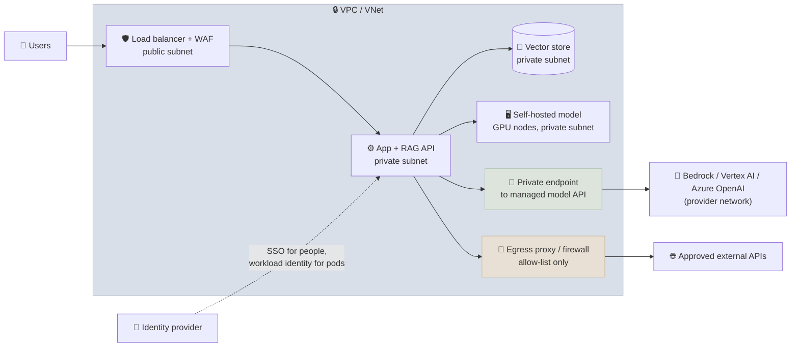

# Cloud Networking and IAM for AI

An AI system moves sensitive data - prompts, retrieved documents, model outputs - between applications, model endpoints, vector stores and third-party APIs. Networking decides which of those paths exist; identity and access management decides who and what may use them. This note covers the cloud patterns that keep those flows private and least-privileged: VPCs and subnets, private endpoints to model services, egress control, workload identity instead of static keys, data perimeters, and how accounts and projects are organized in a landing zone.

```objectives
time: 55 min
outcomes:
  - Lay out a VPC for an LLM application with private subnets, private endpoints to model and data services, and controlled egress
  - Connect privately to managed model services on AWS (PrivateLink), Google Cloud (Private Service Connect) and Azure (Private Link)
  - Grant workloads cloud access through workload identity and least-privilege policies scoped to specific models and data
  - Explain data perimeters (service control policies, VPC Service Controls) and why they matter for model and data exfiltration
  - Organize environments in a landing zone with separate accounts or projects, shared networking and central logging
prerequisites:
  - "[Security & Compliance](06-Security-and-Compliance.mdx) - least privilege, secrets"
  - "[Kubernetes & Helm](02-Kubernetes-and-Helm.mdx)"
```

## The Shape of a Private AI Deployment



The principles: nothing that holds data has a public address; model and data services are reached through **private endpoints**; outbound internet access goes through **one controlled exit**; and every workload authenticates with a **short-lived identity**, not a stored key.

---

## VPCs, Subnets and Security Groups

<div class="audience-biz" markdown="1">

A cloud network is divided into zones that can or cannot be reached from the internet. Only the front door - the load balancer - should be public. The application, the databases holding your documents and the GPU servers sit in private zones, reachable only from inside, so a mistake in one of them doesn't expose your data to the world.

</div>

<div class="audience-tech" markdown="1">

A **VPC** (AWS, Google Cloud) or **VNet** (Azure) is an isolated network. **Public subnets** have a route to an internet gateway; **private subnets** don't, and reach the internet (if at all) through a NAT gateway or proxy. **Security groups** (AWS) and firewall rules or NSGs act as per-resource stateful firewalls: allow the app to reach the vector store on its port, and nothing else. Reference other security groups rather than IP ranges, so rules follow the workloads as they scale.

</div>

Spread subnets across availability zones for resilience, and size address ranges generously - GPU node pools, pod networking and private endpoints all consume IP addresses, and re-addressing a VPC later is painful.

---

## Private Endpoints to Model Services

By default, calls to a managed model API go to a public endpoint. A **private endpoint** puts an address for the service inside your VPC, so traffic stays on the provider's network and you can block public internet access entirely:

| Cloud | Mechanism | AI services that support it |
|---|---|---|
| **AWS** | PrivateLink **interface VPC endpoints** | Amazon Bedrock (`bedrock-runtime`, `bedrock-agent-runtime` and others), SageMaker, S3 (gateway endpoint) |
| **Google Cloud** | **Private Service Connect**, plus **VPC Service Controls** perimeters | Vertex AI / Gemini Enterprise Agent Platform endpoints, Cloud Storage, BigQuery |
| **Azure** | **Private Link** private endpoints, with public network access disabled on the resource | Azure OpenAI and Microsoft Foundry, Azure AI Search, Storage |

On AWS, an endpoint can also carry an **endpoint policy**, and IAM policies can require that calls arrive through it (`aws:SourceVpce`) - so a leaked credential is useless from outside your network. A validated example (OpenTofu 1.13 with the AWS provider 6.67):

```hcl
terraform {
  required_providers {
    aws = { source = "hashicorp/aws", version = "~> 6.0" }
  }
}

variable "region" { default = "eu-west-1" }
variable "vpc_id" { type = string }
variable "private_subnet_ids" { type = list(string) }
variable "model_id" { type = string } # an approved model, e.g. one your model review signed off

provider "aws" { region = var.region }

# Only the application's security group may reach the endpoint, and only on HTTPS.
resource "aws_security_group" "app" {
  name   = "rag-api"
  vpc_id = var.vpc_id
}

resource "aws_security_group" "bedrock_endpoint" {
  name   = "bedrock-endpoint"
  vpc_id = var.vpc_id
  ingress {
    from_port       = 443
    to_port         = 443
    protocol        = "tcp"
    security_groups = [aws_security_group.app.id]
  }
}

# Interface endpoint: Bedrock runtime calls stay on the AWS network, no internet path needed.
resource "aws_vpc_endpoint" "bedrock_runtime" {
  vpc_id              = var.vpc_id
  service_name        = "com.amazonaws.${var.region}.bedrock-runtime"
  vpc_endpoint_type   = "Interface"
  subnet_ids          = var.private_subnet_ids
  security_group_ids  = [aws_security_group.bedrock_endpoint.id]
  private_dns_enabled = true

  # Endpoint policy: only model invocation, and only the approved model, can pass through.
  policy = jsonencode({
    Statement = [{
      Effect    = "Allow"
      Principal = "*"
      Action    = ["bedrock:InvokeModel", "bedrock:InvokeModelWithResponseStream"]
      Resource  = "arn:aws:bedrock:${var.region}::foundation-model/${var.model_id}"
    }]
  })
}

# The workload's role: invoke one model, and only through this VPC endpoint.
data "aws_iam_policy_document" "invoke" {
  statement {
    actions   = ["bedrock:InvokeModel", "bedrock:InvokeModelWithResponseStream"]
    resources = ["arn:aws:bedrock:${var.region}::foundation-model/${var.model_id}"]
    condition {
      test     = "StringEquals"
      variable = "aws:SourceVpce"
      values   = [aws_vpc_endpoint.bedrock_runtime.id]
    }
  }
}

data "aws_iam_policy_document" "pod_identity_trust" {
  statement {
    actions = ["sts:AssumeRole", "sts:TagSession"]
    principals {
      type        = "Service"
      identifiers = ["pods.eks.amazonaws.com"]
    }
  }
}

resource "aws_iam_role" "rag_api" {
  name               = "rag-api"
  assume_role_policy = data.aws_iam_policy_document.pod_identity_trust.json
}

resource "aws_iam_role_policy" "invoke" {
  role   = aws_iam_role.rag_api.id
  policy = data.aws_iam_policy_document.invoke.json
}

# EKS Pod Identity: pods using this Kubernetes service account get the role - no static keys.
resource "aws_eks_pod_identity_association" "rag_api" {
  cluster_name    = "prod"
  namespace       = "rag"
  service_account = "rag-api"
  role_arn        = aws_iam_role.rag_api.arn
}
```

Two details to get right: models invoked through **inference profiles** (common for newer and cross-region models on Bedrock) also need the inference-profile ARN in the resources list; and private DNS on the endpoint makes the normal SDK hostname resolve to the private address, so application code doesn't change.

---

## Egress Control

Outbound traffic is how data leaves. LLM systems have more of it than most applications: calls to third-party model APIs, tool calls from agents, package and model downloads. Control it deliberately:

- **Default deny** outbound from private subnets; allow specific destinations through a **firewall or egress proxy** with an allow-list of domains.
- **Separate egress per workload.** A model server needs the model registry and nothing else at runtime; an agent with a web-browsing tool needs a filtered proxy - and its egress log is a key security signal ([Agent Security](../../15-Production-Agents/Notes/02-Agent-Security.mdx)).
- **Pre-stage model weights** in your own object storage or registry, so production nodes don't download from public hubs at start-up.
- **Log egress** (VPC flow logs, proxy logs) and alert on new destinations.

---

## Workload Identity, Not Keys

Static cloud access keys in environment variables or config files are the most common way cloud accounts are compromised. Give each workload an identity issued by the platform instead, exchanged automatically for short-lived credentials:

| Platform | Mechanism |
|---|---|
| **AWS EKS** | **EKS Pod Identity** (or the older IAM Roles for Service Accounts): a Kubernetes service account maps to an IAM role |
| **Google GKE** | **Workload Identity Federation for GKE**: Kubernetes service accounts act as IAM principals |
| **Azure AKS** | **Microsoft Entra Workload ID**: federated credentials for a managed identity |
| **VMs and serverless** | Instance profiles, attached service accounts, managed identities |

Then scope each identity tightly:

- **Model access per model.** Allow invoking the approved models, not `bedrock:*` or every Vertex AI endpoint. New models then require a deliberate policy change, which doubles as your model-approval gate.
- **Data access per purpose.** The inference service reads model artifacts; the ingestion job reads source documents and writes the index; the eval job reads eval sets. None of them needs the others' permissions ([Security & Compliance](06-Security-and-Compliance.mdx)).
- **People through SSO** with time-limited elevated access for production, never long-lived personal keys.
- **Third-party API keys** (for external model providers) live in a secret manager, fetched at runtime by the workload's identity, and rotated.

---

## Data Perimeters

Even with least privilege, a compromised workload could copy data to an attacker-controlled account using its own valid credentials. **Data perimeters** block that by policy at the organization level:

- **AWS:** service control policies and resource control policies, plus VPC endpoint policies, enforcing "only trusted identities, accessing trusted resources, from expected networks".
- **Google Cloud:** **VPC Service Controls** draw a perimeter around projects so that Vertex AI, Cloud Storage and BigQuery data can't be read or copied out of the perimeter, even by valid credentials.
- **Azure:** Azure Policy to require private endpoints and disable public access, plus network security perimeters for supported services.

For AI systems, perimeters protect the expensive and sensitive artifacts - fine-tuning datasets, model weights, vector indexes (embeddings can be inverted back to text, so treat them as sensitive data) - as well as the source data.

---

## Landing Zones

A **landing zone** is the standard multi-account (AWS), multi-project (Google Cloud) or multi-subscription (Azure) layout an organization deploys into:

- **Separate accounts or projects per environment** (dev, staging, prod) and often per workload - the strongest isolation boundary the cloud offers.
- **Shared networking** in a hub (Transit Gateway, Shared VPC, hub-and-spoke VNets) with central egress and inspection.
- **Central logging and security** accounts that workload teams can write to but not modify.
- **Guardrails as policy** - region restrictions (data residency), required encryption, blocked public endpoints - applied to everything automatically.
- **GPU quotas** are per account or project and per region, and often the real constraint; request them early.

Build all of it as code ([Infrastructure as Code](08-Infrastructure-as-Code.mdx)), so environments are consistent and reviewable.

---

## Check Yourself

```quiz
- q: "Your RAG API calls Amazon Bedrock. Which setup keeps traffic off the public internet and makes a leaked credential useless from outside your network?"
  options:
    - "A NAT gateway with a static IP"
    - "An interface VPC endpoint for bedrock-runtime, plus an IAM condition requiring aws:SourceVpce"
    - "Storing the access key in an environment variable"
    - "A public endpoint with TLS"
  answer: 2
  explain: "The endpoint gives a private path; the aws:SourceVpce condition means even valid credentials can't invoke the model from anywhere else."
- q: "Why prefer workload identity (EKS Pod Identity, GKE Workload Identity Federation, Entra Workload ID) over access keys?"
  options:
    - "It is faster"
    - "Credentials are short-lived and issued automatically, so there are no long-lived secrets to leak or rotate"
    - "It removes the need for IAM policies"
    - "It encrypts traffic"
  answer: 2
  explain: "Static keys leak through code, logs and images and stay valid until rotated. Workload identity exchanges a platform-issued identity for short-lived credentials."
- q: "An agent with a web-browsing tool runs in a private subnet. How should its outbound access be designed?"
  answer: "Default-deny egress, with the agent's traffic going through a filtering proxy (allow-list or category filtering) separate from other workloads' egress, with logging and alerts on new destinations - because the browsing tool is both a prompt-injection entry point and an exfiltration path."
- q: "What does a data perimeter (e.g. VPC Service Controls) protect against that least-privilege IAM alone does not?"
  answer: "A workload with legitimate read access copying data to a resource or account outside the organization using its own valid credentials. The perimeter blocks data movement across the boundary regardless of IAM permissions."
- q: "Why should model weights be pre-staged in your own storage rather than downloaded from a public hub at node start-up?"
  answer: "It removes a public egress dependency from production (better security and allows default-deny egress), pins the exact artifact that was reviewed, avoids hub rate limits and outages, and speeds up cold starts from nearby storage."
```

## Exercises

```exercise
- title: Draw the network for a regulated RAG assistant
  task: |
    A hospital wants a RAG assistant over clinical guidelines, using a managed model on its cloud provider. Requirements: no PHI over the public internet, no access to the model from outside the hospital network, and an audit trail of who queried what. Describe the network and identity design.
  solution: |
    Public subnet: only the load balancer with WAF, reachable from the hospital network via VPN or private connectivity (or private-only if users are all internal). Private subnets: the RAG API, vector store and ingestion jobs. A private endpoint to the managed model service (PrivateLink / Private Service Connect / Private Link) with private DNS; public network access on the model resource disabled where the provider supports it, and IAM requiring calls via the endpoint. Default-deny egress; any required external access through a logging proxy. Workload identity for every service, each scoped to its data and the approved model; staff through SSO, with group-based document access enforced in retrieval. Logging: request logs with user identity and retrieved document ids to a central, tamper-resistant log account, with PHI-handling rules ([Security & Compliance](06-Security-and-Compliance.mdx)). Everything in one dedicated production account or project inside the organization's landing zone, with a data perimeter around it.
- title: Review an IAM policy
  task: |
    A pull request gives the inference service's role `{"Effect": "Allow", "Action": "bedrock:*", "Resource": "*"}` and `s3:*` on all buckets "to get things working". Rewrite it as least privilege.
  solution: |
    Replace with: `bedrock:InvokeModel` and `bedrock:InvokeModelWithResponseStream` on the ARNs of the approved models (and their inference profiles if used), optionally conditioned on `aws:SourceVpce`; `s3:GetObject` on the model-artifact prefix it actually loads (e.g. `arn:aws:s3:::acme-models/prod/*`), plus `s3:ListBucket` on that bucket limited to the prefix; and `kms:Decrypt` on the key that encrypts it. No write permissions, no access to training or eval buckets, no Bedrock management actions. Attach it to the workload identity, not to a user with keys.
```

## Study Notes

**Must-know:**
- Only the load balancer is public; apps, data stores and GPU nodes live in private subnets; security groups reference each other, not IP ranges
- Private endpoints to model services: AWS PrivateLink (Bedrock), Google Private Service Connect + VPC Service Controls (Vertex AI), Azure Private Link (Azure OpenAI / Foundry) with public access disabled
- Endpoint policies and `aws:SourceVpce` make credentials useless outside your network
- Default-deny egress through an allow-listing proxy; separate, logged egress for agents; pre-stage model weights
- Workload identity (EKS Pod Identity, GKE Workload Identity Federation, Entra Workload ID) instead of static keys; scope to specific models and data
- Data perimeters (SCPs/RCPs, VPC Service Controls, Azure Policy) stop exfiltration with valid credentials; embeddings are sensitive data
- Landing zones: account/project per environment, shared networking hub, central logging, policy guardrails, GPU quotas - all as code

## References

- AWS, [Use Amazon Bedrock with interface VPC endpoints (AWS PrivateLink)](https://docs.aws.amazon.com/bedrock/latest/userguide/vpc-interface-endpoints.html) (2026); [What is AWS PrivateLink?](https://docs.aws.amazon.com/vpc/latest/privatelink/what-is-privatelink.html) (2026)
- AWS, [Building a Data Perimeter on AWS](https://docs.aws.amazon.com/whitepapers/latest/building-a-data-perimeter-on-aws/building-a-data-perimeter-on-aws.html) (whitepaper, 2026); [EKS Pod Identity](https://docs.aws.amazon.com/eks/latest/userguide/pod-identities.html) (2026)
- Google Cloud, [Private Service Connect](https://cloud.google.com/vpc/docs/private-service-connect) (2026); [VPC Service Controls with Vertex AI](https://cloud.google.com/vertex-ai/docs/general/vpc-service-controls) (2026); [Workload Identity Federation for GKE](https://cloud.google.com/kubernetes-engine/docs/concepts/workload-identity) (2026)
- Microsoft, [What is Azure Private Link?](https://learn.microsoft.com/en-us/azure/private-link/private-link-overview) (2026); [Configure private link for Microsoft Foundry](https://learn.microsoft.com/en-us/azure/ai-foundry/how-to/configure-private-link) (2026); [Microsoft Entra Workload ID on AKS](https://learn.microsoft.com/en-us/azure/aks/workload-identity-overview) (2026)
- Rose et al., [NIST SP 800-207 Zero Trust Architecture](https://doi.org/10.6028/NIST.SP.800-207) (2020)
- Morris et al., [Text Embeddings Reveal (Almost) As Much As Text](https://arxiv.org/abs/2310.06816) (2023) - embedding inversion

*Last reviewed: 2026-10*
