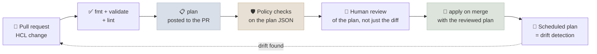

# Infrastructure as Code

Infrastructure as code (IaC) describes cloud resources - networks, clusters, GPU node pools, model endpoints, IAM, storage - in version-controlled files, and lets a tool create and update them to match. For AI systems, whose infrastructure is expensive (GPUs), security-sensitive (private endpoints, IAM) and frequently rebuilt across environments, it is the difference between reviewable, repeatable changes and a console nobody can reproduce. This note covers Terraform and OpenTofu - plan and apply, state and locking, modules and environments - plus GPU capacity as code, CI with plans in pull requests, drift detection, policy as code and where GitOps takes over.

```objectives
time: 55 min
outcomes:
  - Explain the declarative plan/apply model and why remote state with locking is essential for teams
  - Write and review Terraform/OpenTofu for AI infrastructure such as GPU node pools and private model endpoints
  - Structure modules and environments so dev, staging and prod stay consistent
  - Run IaC through CI - format, validate, plan in the pull request, policy checks, apply on merge - and detect drift
  - Decide what IaC owns and what Helm or GitOps (Argo CD, Flux) owns
prerequisites:
  - "[Cloud Networking & IAM for AI](07-Cloud-Networking-and-IAM-for-AI.mdx)"
  - "[Git Workflows for ML](../../01-Python-and-Systems/Notes/03-Git-Workflows-for-ML.mdx)"
```

## Declarative Infrastructure

<div class="audience-biz" markdown="1">

Instead of clicking through a cloud console, the team writes down what the infrastructure should be - "a private network, a cluster, a pool of up to 8 GPU machines" - and a tool makes reality match. Every change is reviewed like code, every environment is built the same way, and rebuilding after a disaster is a command rather than a week of guesswork.

</div>

<div class="audience-tech" markdown="1">

You declare the desired state in HCL; the tool compares it with the recorded **state** and the real cloud, computes a **plan** (create, update in place, replace, destroy) and **applies** it through provider APIs. Resources reference each other (`aws_vpc_endpoint.bedrock_runtime.id`), which gives the tool a dependency graph to order operations.

</div>

**Terraform or OpenTofu?** HashiCorp moved Terraform from the open-source MPL to the Business Source License in August 2023; the Linux Foundation launched **OpenTofu**, an MPL-licensed fork, in September 2023; IBM completed its acquisition of HashiCorp in February 2025. The two remain largely compatible in language and providers for common use, with differences at the edges (for example, OpenTofu's built-in client-side state encryption). Pick one per organization, pin its version, and check licensing if you build a product that embeds it. **Pulumi** and **AWS CDK** are alternatives that use general-purpose languages instead of HCL.

---

## The Workflow



Reviewers should read the **plan**, not only the code diff: a one-line change to a node pool's machine type can show up as "must be replaced", meaning every GPU node is destroyed and recreated.

---

## State and Locking

The state file maps your declared resources to real cloud resource ids. Rules:

- **Remote state, never local**, in a bucket with versioning and encryption (S3, GCS, Azure Blob) or a managed service (HCP Terraform, Spacelift, env0 and others).
- **Locking**, so two applies can't run at once and corrupt state. The S3 backend now supports native locking with `use_lockfile = true` (Terraform 1.10+ and OpenTofu); the older DynamoDB-based locking is deprecated.
- **State contains secrets** - generated passwords, keys, sometimes connection strings - in plain text. Restrict access to the state bucket as tightly as production itself; OpenTofu can also encrypt state client-side.
- **Split state by blast radius**: networking, the cluster and workload resources in separate states, so a mistake in one can't plan a destroy of the others.

```hcl
terraform {
  backend "s3" {
    bucket       = "acme-tfstate-prod"
    key          = "llm-platform/network.tfstate"
    region       = "eu-west-1"
    encrypt      = true
    use_lockfile = true # S3-native state locking
  }
}
```

---

## GPU Capacity as Code

GPU node pools are where IaC pays for itself: expensive, quota-limited and easy to misconfigure by hand. A Google Kubernetes Engine pool of 2x L4 nodes that scales to zero, on spot capacity, with the driver installed by GKE (validated with OpenTofu 1.13 and the Google provider 8.5):

```hcl
terraform {
  required_providers {
    google = { source = "hashicorp/google", version = "~> 8.0" }
  }
  backend "gcs" {
    bucket = "acme-tfstate"
    prefix = "llm-serving/prod"
  }
}

variable "project" { type = string }
variable "region" { default = "us-central1" }

provider "google" {
  project = var.project
  region  = var.region
}

# GPU node pool for vLLM: scales to zero, spot capacity, driver installed by GKE.
resource "google_container_node_pool" "l4_serving" {
  name     = "l4-serving"
  cluster  = "llm-prod"
  location = var.region

  autoscaling {
    total_min_node_count = 0
    total_max_node_count = 8
  }

  node_config {
    machine_type = "g2-standard-24" # 2x NVIDIA L4
    spot         = true
    disk_size_gb = 200

    guest_accelerator {
      type  = "nvidia-l4"
      count = 2
      gpu_driver_installation_config {
        gpu_driver_version = "LATEST"
      }
    }

    workload_metadata_config {
      mode = "GKE_METADATA" # Workload Identity Federation for GKE
    }
    labels = { workload = "llm-serving" }
  }

  management {
    auto_repair  = true
    auto_upgrade = true
  }
}
```

What the reviewer checks: the **maximum** node count (the cost ceiling), spot vs on-demand (spot is cheaper but can be reclaimed - fine for batch and replicated serving, risky for a single-replica endpoint), the region and GPU type against quota, and that the pool is tainted so only GPU workloads land on it (GKE taints GPU nodes automatically; on other platforms you add the taint yourself - [Kubernetes & Helm](02-Kubernetes-and-Helm.mdx)). The private model endpoint, IAM role and Pod Identity association from [Cloud Networking & IAM for AI](07-Cloud-Networking-and-IAM-for-AI.mdx) are the same kind of code.

---

## Modules and Environments

- **Modules** package a reusable unit - "a private GPU node pool", "a model gateway with its IAM" - with input variables and outputs. Keep them small and versioned; pin module versions like any dependency.
- **One root configuration per environment** (`envs/dev`, `envs/staging`, `envs/prod`) calling the same modules with different variables is the clearest layout: separate state, separate credentials, explicit differences. Workspaces are fine for near-identical copies but make it easier to apply to the wrong environment.
- **Promote changes** through dev → staging → prod with the same module version, the way you promote application releases.
- **Import before rebuild.** Resources created by hand can be brought under management with `import` blocks rather than destroyed and recreated.

---

## Drift Detection

Drift is the difference between code and reality - someone resized a node pool in the console during an incident, or a provider changed a default. Run `plan -detailed-exitcode` on a schedule in CI: exit code **0** means no changes, **2** means the plan is not empty (drift or unapplied code), **1** means error. Alert on 2, then either fold the manual change back into code or re-apply to remove it. Emergency console changes are acceptable; leaving them undocumented is not.

---

## Policy as Code

Policies check every plan automatically, so reviewers can focus on intent. Tools include **OPA/Conftest** (Rego policies on the plan JSON), **Checkov** and **Trivy** (static scanning of IaC for misconfigurations) and **Sentinel** (HCP Terraform). A Rego policy that blocks two expensive or dangerous changes, tested with OPA 1.21 against a plan containing one oversized GPU pool and two wildcard IAM policies:

```rego
package main

import rego.v1

# Runs against `tofu show -json plan.out` (the plan's resource_changes).

deny contains msg if {
	rc := input.resource_changes[_]
	rc.type == "google_container_node_pool"
	some accel in rc.change.after.node_config[0].guest_accelerator
	max := rc.change.after.autoscaling[0].total_max_node_count
	max * accel.count > 16
	msg := sprintf("%s: can scale to %d GPUs; more than 16 needs a capacity review", [rc.address, max * accel.count])
}

deny contains msg if {
	rc := input.resource_changes[_]
	rc.type == "aws_iam_role_policy"
	statement := json.unmarshal(rc.change.after.policy).Statement[_]
	some action in as_array(statement.Action)
	endswith(action, ":*")
	msg := sprintf("%s: wildcard action %q is not allowed", [rc.address, action])
}

# IAM allows "Action" to be a single string or a list.
as_array(x) := x if is_array(x)

as_array(x) := [x] if is_string(x)
```

```bash
tofu plan -out plan.out && tofu show -json plan.out > plan.json
conftest test plan.json --policy policy/        # fails the CI job on any deny message
```

On the test plan it returned three denials - the GPU pool ("can scale to 24 GPUs; more than 16 needs a capacity review") and both wildcard policies (`bedrock:*` and `s3:*`) - and passed the compliant `bedrock:InvokeModel` policy.

---

## IaC, Helm and GitOps

| Layer | Owned by | Examples |
|---|---|---|
| Cloud foundations | **IaC** | Accounts/projects, VPCs, private endpoints, IAM, KMS keys, buckets |
| Platform | **IaC** | Kubernetes clusters, GPU node pools, managed databases and vector stores |
| Cluster add-ons | IaC or GitOps | GPU operator, ingress, KServe, observability agents |
| Workloads | **GitOps** with Helm or Kustomize | Model servers, RAG APIs, agents - versioned manifests synced by **Argo CD** or **Flux** |

**GitOps** controllers continuously reconcile the cluster with manifests in Git, which suits frequently changing workloads (new model versions, config tweaks) better than running an IaC apply for each. IaC creates the cluster and the identities the workloads use; GitOps deploys what runs on it. Draw the line once and document it, so no resource is managed by two tools that fight each other.

---

## Check Yourself

```quiz
- q: "A reviewer sees a one-line HCL change to a GPU node pool's machine_type. What should they check before approving?"
  options:
    - "Only that the HCL is formatted"
    - "The plan, to see whether the pool will be updated in place or destroyed and replaced"
    - "That the commit message follows conventions"
    - "Nothing - one-line changes are safe"
  answer: 2
  explain: "Some attribute changes force replacement. The plan shows it; replacing every GPU node can mean downtime and lost capacity if quota or spot availability is tight."
- q: "Why must Terraform/OpenTofu state be stored remotely with locking?"
  options:
    - "Local state is slower"
    - "Teams need one shared source of truth, and locking prevents two concurrent applies from corrupting it"
    - "Providers require it"
    - "It encrypts the cloud resources"
  answer: 2
  explain: "Local state on one laptop diverges from everyone else's; concurrent applies without a lock can corrupt state and orphan or duplicate resources."
- q: "A scheduled `plan -detailed-exitcode` exits with code 2 overnight. What does it mean and what do you do?"
  answer: "The plan is not empty: reality differs from the code (drift, such as a console change during an incident) or code was merged without being applied. Investigate the diff, then either update the code to match an intended manual change or re-apply to revert an unintended one."
- q: "Why is the state file security-sensitive?"
  answer: "It records resource attributes in plain text, including generated secrets, keys and connection details. Anyone who can read it may get credentials, so its bucket needs production-level access control and encryption (and OpenTofu can encrypt it client-side)."
- q: "Which tool should deploy a new version of the vLLM server every few days: IaC or GitOps?"
  options:
    - "IaC, with a terraform apply per release"
    - "GitOps (Argo CD or Flux) syncing Helm or Kustomize manifests from Git"
    - "Manual kubectl apply"
    - "A cron job"
  answer: 2
  explain: "Frequently changing workloads fit GitOps reconciliation; IaC owns the slower-changing cluster, node pools, networking and identities underneath."
```

## Exercises

```exercise
- title: Review the plan
  task: |
    A PR's plan shows: `google_container_node_pool.l4_serving must be replaced` (because `machine_type` changed from `g2-standard-24` to `g2-standard-48`), `autoscaling.total_max_node_count: 8 -> 20`, and `spot: true -> false`. What questions do you ask before approving?
  solution: |
    - **Replacement**: when will nodes be destroyed, and is there a second pool or enough replicas elsewhere to keep serving? Consider creating a new pool alongside and draining the old one instead.
    - **Cost**: 20 on-demand `g2-standard-48` nodes (4x L4 each) is a large jump in the worst-case bill - is there a budget approval, and does the policy check flag it (it should: 80 GPUs)?
    - **Quota**: does the project have L4 quota for 80 GPUs in this region?
    - **Why on-demand**: if it's for reliability, is that worth the price difference versus a mixed spot/on-demand setup?
    - **Rollback**: how do we revert if capacity can't be obtained?
- title: Lay out the repository
  task: |
    Propose a repository layout for IaC covering networking, a GKE cluster with GPU pools, and model-endpoint IAM across dev and prod, with separate state per layer and environment.
  solution: |
    ```
    infra/
      modules/
        network/            # VPC, subnets, private service connect, egress
        gke-cluster/        # cluster, system node pool
        gpu-pool/           # the node pool above, parameterized by GPU type and max nodes
        model-access/       # service accounts, IAM bindings for approved models
      envs/
        dev/  { network/, cluster/, workloads-iam/ }    # each with its own backend prefix
        prod/ { network/, cluster/, workloads-iam/ }
      policy/               # Rego policies run by conftest in CI
    ```
    Each `envs/<env>/<layer>` directory is a root with its own state (backend prefix such as `llm-platform/prod/cluster`), calling pinned module versions. CI runs fmt, validate, plan and conftest for changed roots and posts plans to the PR; prod applies require approval.
```

## Study Notes

**Must-know:**
- Declarative: code → plan → apply; review the plan (watch for "must be replaced"), not just the diff
- Terraform moved to BSL (2023); OpenTofu is the MPL fork under the Linux Foundation; IBM owns HashiCorp (2025)
- Remote, versioned, encrypted state with locking (S3 `use_lockfile`); state holds secrets; split state by blast radius
- GPU pools as code: max nodes = cost ceiling, spot vs on-demand, quota, taints, scale to zero
- Modules + one root per environment; promote module versions dev → staging → prod; import hand-made resources
- CI: fmt, validate, plan in PR, policy as code (OPA/Conftest, Checkov, Trivy, Sentinel), apply on merge; scheduled `plan -detailed-exitcode` for drift (exit 2)
- IaC owns cloud foundations and platform; GitOps (Argo CD, Flux) owns workloads

## References

- HashiCorp, [Terraform S3 backend](https://developer.hashicorp.com/terraform/language/backend/s3) (2026); OpenTofu, [S3 backend](https://opentofu.org/docs/language/settings/backends/s3/) and [State encryption](https://opentofu.org/docs/language/state/encryption/) (2026)
- Linux Foundation, [Linux Foundation Launches OpenTofu](https://linuxfoundation.org/press/announcing-opentofu) (2023); IBM, [IBM Completes Acquisition of HashiCorp](https://newsroom.ibm.com/2025-02-27-ibm-completes-acquisition-of-hashicorp,-creates-comprehensive,-end-to-end-hybrid-cloud-platform) (2025)
- Google Cloud, [Run GPUs in GKE Standard node pools](https://cloud.google.com/kubernetes-engine/docs/how-to/gpus) (2026); [google_container_node_pool](https://registry.terraform.io/providers/hashicorp/google/latest/docs/resources/container_node_pool) (2026)
- [Conftest](https://www.conftest.dev/) (2026); [Checkov](https://www.checkov.io/) (2026)
- [Argo CD documentation](https://argo-cd.readthedocs.io/) (2026)

*Last reviewed: 2026-10*
