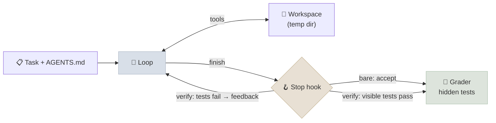

# Code Lab 01 - A Minimal Coding Harness

Build a small coding agent harness - workspace, file and shell tools, output truncation, bounds, an `AGENTS.md` - point it at eight repository tasks, and grade it on hidden tests. Then change harness components one at a time - a **stop hook** that runs the visible tests when the agent claims to be done, and **repeated-call detection** - and measure what each does to the same model's results.

← **Back to Overview:** [Agent Engineering](../INDEX.mdx) · **Concepts:** [Harness Engineering](../Notes/01-Harness-Engineering.mdx) · [Coding Agents](../Notes/04-Coding-Agents.mdx) · [Verifiers, Environments and Agent RL](../Notes/07-Verifiers-Environments-and-Agent-RL.mdx)

```objectives
time: 2 hours
outcomes:
  - Implement a coding-agent harness with workspace isolation, file/edit/shell tools, output truncation and bounds
  - Build repository tasks with visible tests for the agent and hidden tests for grading
  - Add a verification stop hook and repeated-call detection, and measure their effect on pass rate, completion and claimed-but-failed episodes
  - Explain from traces which failures a harness change can and cannot fix
prerequisites:
  - "[Code Lab 13-01: Agent Loop from Scratch](../../13-Agent-Foundations/CodeLabs/01-Agent-Loop-from-Scratch.mdx)"
  - "Python 3.10+; a local OpenAI-compatible model server (see Lab 13) or a hosted API"
```

---

## What's In This Lab

| File | What it does |
|---|---|
| `tasks.py` | Eight small repositories: bug fixes (`moving_average`, `parse_duration`, `inventory`, `merge_intervals`, `word_freq`), a two-file fix (`regional_tax`), and implementations from a docstring or instruction (`slugify`, `roman`). Each has visible tests the agent can run and hidden tests only the grader runs |
| `harness.py` | The harness: a temporary workspace per episode, tools `list_files`, `read_file`, `write_file`, `edit_file` (exact single-match replacement), `run` (shell with a 30 s timeout), `finish`; tool output truncated to 4,000 characters; 25-step bound; `AGENTS.md` in the system prompt; variants `bare`, `verify` (stop hook) and `verify+repeat` (stop hook + repeated-call detection) |
| `requirements.txt` | `openai` |
| Verified | Qwen3-8B (4-bit MLX, thinking off) on `mlx_lm.server`; every task checked to fail before the fix and pass with a reference fix |



`run` executes shell commands in the workspace directory with a stripped environment and a timeout. **That is not a security sandbox** - with a model you don't control, run the lab inside a container or VM.

## Run It

```bash
cd 18-Agent-Engineering/CodeLabs/01-Minimal-Harness
pip install -r requirements.txt
python harness.py --no-thinking --variants bare --trials 1 --limit 2      # smoke test
python harness.py --no-thinking                                           # all three variants, 8 tasks x 3 trials
python harness.py --no-thinking --variants verify --show-failures         # read the failing traces
```

## The Stop Hook

In the `bare` variant, `finish` ends the episode - the agent's claim is accepted. In `verify`, the harness runs the visible tests from its own copy (so editing `tests/test_visible.py` doesn't help) and, if they fail, returns the failure output as the tool result instead of finishing, up to two times:

```python
def stop_hook(ws, task, variant, ep, max_rejections) -> str:
    if variant == "verify" and ep.hook_rejections < max_rejections:
        ok, output = ws.run_python(task.visible)
        if not ok:
            ep.hook_rejections += 1
            return "Not finished: the visible tests fail. Fix the code and call finish again.\n" + output
    ep.finished = True
    return "finished"
```

The system prompt and `AGENTS.md` already tell the agent to run the tests before finishing; the hook makes it a property of the harness instead of a request.

The `verify+repeat` variant adds the repeated-call check from Lab 13: a third identical tool call (same tool, same arguments) isn't executed; the agent is told the effect is already applied and to check the state, change approach, or finish.

## Results

Qwen3-8B (4-bit MLX, thinking off) on `mlx_lm.server`, 8 tasks × 3 trials per variant:

| Task | `bare` | `verify` | `verify+repeat` |
|---|---|---|---|
| moving_average | 3/3 | 3/3 | 3/3 |
| slugify | 0/3 | 1/3 | 1/3 |
| parse_duration | 3/3 | 3/3 | 3/3 |
| inventory | 2/3 | 2/3 | 3/3 |
| roman | 3/3 | 3/3 | 3/3 |
| merge_intervals | 0/3 | 0/3 | 1/3 |
| word_freq | 1/3 | 3/3 | 2/3 |
| regional_tax | 3/3 | 1/3 | 3/3 |
| **Pass rate** | **0.62** | **0.67** | **0.79** |
| Episodes that called `finish` | 0.12 | 0.12 | 0.46 |
| Claimed-but-failed | 0.04 | 0.00 | 0.17 |
| Stop-hook rejections per episode | - | 0.00 | 0.29 |
| Repeated calls blocked per episode | - | - | 1.75 |
| Steps per episode (bound 25) | 22.6 | 23.2 | 20.0 |
| Tokens per episode | 36,400 | 37,700 | 30,000 |

With 24 episodes per variant these differences are suggestive, not conclusive (per task, `verify+repeat` matched or beat `bare` on all eight and was better on four). What the traces show is clearer than the pass rates:

1. **The dominant failure was not premature claiming - it was never stopping.** In `bare` and `verify`, only 12% of episodes ever called `finish`; the rest ran into the 25-step bound. A typical trace: the model fixes the bug, runs the tests (`exit code 0 ok`), then repeats the same `edit_file` call eight times - each failing with "old_text matches 0 times", because the fix is already applied - and never finishes. Correct code usually passed the hidden tests anyway, which is why pass rates were decent.
2. **So the stop hook alone did nothing.** With almost no `finish` calls, there was nothing to check: zero rejections in the `verify` run. The component was sound; it targeted a failure this model rarely had. Measure the failure mode before adding the component.
3. **Repeated-call detection broke the loops.** Refusing a third identical call sent the agent back to check the state; episodes that finished rose from 12% to 46%, tokens fell by about 18%, and pass rate rose. Only then did the stop hook engage (0.29 rejections per episode) - the two components work together.
4. **The hook's limit shows up as claimed-but-failed.** After two rejections the hook accepts `finish` by design, so tasks beyond the model (`slugify`, `merge_intervals`) end as claimed-but-failed rather than timing out. That's a policy choice: escalate to a human instead of accepting, in a real harness.

Lab 13 had repeated-call detection from the start; leaving it out here is what exposed how much a small model depends on it. Infrastructure note: `mlx_lm.server` 0.31 froze for 900 s at a time during long runs with its default prompt cache; restarting it with `--prompt-cache-size 4 --prompt-cache-bytes 2000000000` fixed it.

## Check Yourself

```quiz
- q: "Why are there hidden tests as well as visible ones?"
  options:
    - "Visible tests guide the agent; hidden tests from the same specification catch special-casing and overfitting to the visible examples"
    - "To make tasks harder"
    - "Hidden tests run faster"
    - "The agent can't run tests"
  answer: 1
- q: "The stop hook runs the harness's own copy of the visible tests. Which reward hack does that prevent?"
  options: ["Editing the visible test file so it passes", "Hard-coding the example", "Deleting the source file", "Timing out"]
  answer: 1
- q: "What does the 'claimed-but-failed' column measure?"
  answer: "The share of episodes where the agent called finish but the hidden tests fail - the coding-agent version of Lab 13's claimed actions. A stop hook reduces it, but only if the agent reaches finish at all; what remains are cases where the visible tests pass but hidden ones don't, or where the hook accepted finish after its rejection limit."
- q: "Why did adding the stop hook alone not change the results?"
  options:
    - "The agent almost never called finish - it looped on repeated calls until the step bound - so the hook had nothing to check"
    - "The hook was broken"
    - "The visible tests always passed"
    - "The model ignored tool results"
  answer: 1
```

## Exercises

```exercise
- title: Harden the harness
  task: |
    Add three protections and show each works with a deliberately misbehaving test: (1) the `run` tool refuses commands that write outside the workspace or access the network (or runs inside a container); (2) the grader fails an episode that modified files under tests/; (3) a per-episode token budget.
  solution: |
    (1) Easiest reliable approach: run the tool in a container with no network and only the workspace mounted; string filters on commands are easy to bypass. (2) Hash the tests directory at start and compare at grading. (3) Sum usage tokens per step and stop with status budget_exceeded. Demonstrate each by prompting the agent to violate it and showing the block in the trace.
- title: Ablate a component
  task: |
    Remove one harness component at a time - AGENTS.md, output truncation, edit_file (so only write_file remains) - and measure pass rate for the verify variant over three trials. Which components carry weight for this model?
  solution: |
    Report pass rate and tokens per variant with the per-task table. Components whose removal changes nothing beyond noise are candidates to delete; the exercise is the ablation method from Harness Engineering applied to your own harness.
- title: A skill for the harness
  task: |
    Package "how to fix a failing Python test in this kind of repo" as a SKILL.md, give the harness a `load_skill` tool that returns the skill body when called, and put only the skill's name and description in the system prompt. Does the agent load it, and does it help on the tasks it fails?
  solution: |
    Measure how often the skill is loaded and pass rate on previously failing tasks. Progressive disclosure costs ~100 tokens per episode when unused; whether it helps depends on whether the failure was missing procedure (a skill helps) or model capability on the specific logic (it doesn't).
```

## References

- Anthropic, [Effective harnesses for long-running agents](https://www.anthropic.com/engineering/effective-harnesses-for-long-running-agents) (Nov 2025)
- OpenAI, [Harness engineering](https://openai.com/index/harness-engineering/) (Feb 2026)
- Jimenez et al., [SWE-bench](https://arxiv.org/abs/2310.06770) (2023) - repository tasks graded by hidden tests at scale

*Last reviewed: 2026-09*
