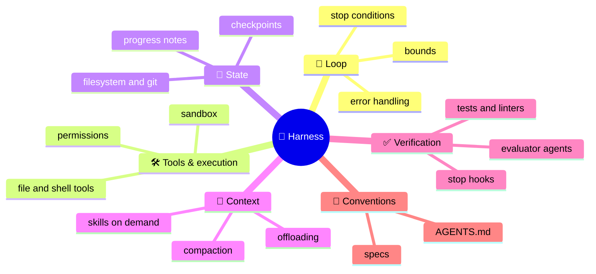

# Harness Engineering

A **harness** is everything in an agent that isn't the model: the loop, the tools and their execution environment, state and storage, context management, verification, permissions and the conventions the agent is given (like `AGENTS.md`). Harness engineering is designing that system so a model does reliable work - and it is where most of the difference between two products built on the same model comes from.

```objectives
time: 50 min
outcomes:
  - Name the responsibilities of an agent harness and the failure you see when each is missing
  - Design state and handoffs for work that spans many context windows (progress files, git, feature lists, initializer and worker sessions)
  - Separate generation from evaluation, and put verification in the harness (stop hooks, tests, evaluator agents) rather than in the prompt
  - Decide which harness components to remove as models improve
prerequisites:
  - "[Anatomy of an AI Agent](../../13-Agent-Foundations/Notes/02-Anatomy-of-an-AI-Agent.mdx)"
  - "[Claude Agent SDK](../../16-Agent-Frameworks/Notes/04-Claude-Agent-SDK.mdx) - a production harness as a library"
```

## Agent = Model + Harness

LangChain's framing (*The Anatomy of an Agent Harness*, 2026) is a useful slogan: the model supplies the intelligence; the harness makes it useful. OpenAI described the same shift from the other side in *Harness engineering* (February 2026): a team that built and shipped a product with roughly a million lines of code written by Codex agents found that the engineers' job became designing the environment - repository structure, documentation for agents, tests, linters and feedback loops - in which the agents could work reliably.



| Responsibility | What it means | Failure when missing |
|---|---|---|
| Loop and bounds | Runs model/tool turns; stops on success, budget or repeated calls | Runaway loops, stuck agents |
| Tools and execution | File, shell, browser and domain tools; a sandbox; permissions | The agent can only describe work, or can do damage |
| State | Durable record of what's done and what's next - files, git, a progress log | Each session re-derives or redoes the work |
| Context | What goes into the window each turn - compaction, offloading, on-demand skills | Context rot; the agent loses the thread |
| Verification | Checks the harness runs, not the model - tests, type checks, evaluators | Claimed completion without working results |
| Conventions | `AGENTS.md`, style guides, specs the agent reads | Repeated avoidable mistakes |

This harness is the execution scaffolding the agent runs *inside*. It is related to, but not the same as, an *evaluation* harness that runs and grades agents ([Evaluation and Benchmarks](../../17-Production-Agents/Notes/05-Agent-Evaluation-and-Benchmarks.mdx)).

## State Across Context Windows

Long tasks outlive a single context window. Anthropic's *Effective harnesses for long-running agents* (November 2025) describes a two-part design for multi-session coding:

- An **initializer** session sets up the environment once: a feature list with explicit pass/fail status, an `init.sh` that starts the app and tests, a progress log (`claude-progress.txt`) and an initial git commit.
- Every later **worker** session starts by reading the progress log and git history, runs the smoke tests, picks *one* unfinished feature, implements and verifies it, commits, and updates the log - leaving the environment clean for the next session.

The general principles: state lives in **files and git**, not in the conversation; each session makes **incremental, verified progress**; and the handoff is **structured** (a list with statuses, a log), so a fresh context can resume without re-deriving everything. Git doubles as the checkpoint system - any step can be diffed, reverted or branched.

## Verification in the Harness

Models are unreliable judges of their own work: they tend to declare success early and rate their own output generously. Lab 13 measured the symptom (claimed actions); the harness fix is to make completion something the harness checks:

- **Stop hooks**: when the agent tries to finish, the harness runs tests, linters or type checks and returns failures instead of accepting the claim ([Claude Agent SDK hooks](../../16-Agent-Frameworks/Notes/04-Claude-Agent-SDK.mdx)). [This module's lab](../CodeLabs/01-Minimal-Harness.mdx) found a hook only helps once the agent reaches `finish`: its small model mostly looped on repeated identical edits instead, and repeated-call detection had to come first.
- **Generator-evaluator separation**: a separate evaluator agent, prompted to be skeptical and given explicit criteria, checks the generator's work. Anthropic's *Harness design for long-running application development* (March 2026) used a planner, a generator and an evaluator that exercised the running app with Playwright, and had generator and evaluator agree a **sprint contract** - testable criteria for "done" - before each chunk of work.
- **External feedback beats self-critique**: tests, execution and tools add information; a model re-reading its own answer mostly doesn't (see the evidence in [Single-Agent Patterns](../../15-Agent-Patterns/Notes/02-Single-Agent-Patterns.mdx) and the Module 15 lab).

## Reassessing the Harness

Harness components often exist to compensate for a model's weaknesses - elaborate output parsers, retry-and-repair loops, rigid step-by-step plans. When the model improves, some become dead weight that adds latency, cost and failure modes. Re-test regularly by **ablation**: remove a component, run the evaluation suite, and keep the component only if removing it hurts. Anthropic's harness-design write-up describes exactly this: after upgrading to a newer model the author removed the sprint construct, which was no longer needed, while keeping the separate evaluator - agents still praised their own mediocre work. Keep the components that encode the task's real structure (verification, state, permissions).

## Check Yourself

```quiz
- q: "Two products use the same model; one completes far more long coding tasks. What most plausibly explains it?"
  options:
    - "Harness differences - state handoffs, verification, context management, tools"
    - "Temperature settings"
    - "The API region"
    - "Prompt length"
  answer: 1
- q: "In the initializer/worker design, what does each worker session do first?"
  options:
    - "Read the progress log and git history and run the smoke tests before choosing one feature"
    - "Re-read the whole conversation from the previous session"
    - "Start implementing the next feature immediately"
    - "Ask the user what to do"
  answer: 1
- q: "Why put verification in a stop hook rather than in the system prompt?"
  answer: "A prompt instruction can be skipped or claimed without being done; a hook runs the check itself and returns real failures to the agent, so completion is verified by the harness regardless of what the model asserts."
- q: "How do you decide whether a harness component is still needed after a model upgrade?"
  answer: "Ablate it: remove the component, run the evaluation suite with enough trials, and keep it only if success, cost or safety measurably worsen without it."
```

## Exercises

```exercise
- title: Design a multi-session harness
  task: |
    Design the state files and session protocol for an agent that migrates a 200-file codebase from one logging library to another over many sessions. What does the initializer create? What does each worker session do? How does a session know it is done?
  solution: |
    Initializer: a migration manifest (file list with status: todo / done / needs-review), a script that runs the tests and a grep for remaining old-library imports, a progress log, an initial commit. Worker: read the log and manifest, run the script, take the next N todo files, migrate, run tests, commit, mark done, append to the log. Done when the manifest has no todo entries and the grep and tests are clean - checked by the harness, not the agent's opinion.
- title: Ablate your harness
  task: |
    In this module's lab, remove one component at a time - AGENTS.md in the prompt, output truncation, the edit_file tool (write_file only) - and measure pass rate over three trials each. Which components are load-bearing for this model?
  solution: |
    Report pass rate with trials per variant. Typically edit_file matters for larger files (rewriting whole files invites mistakes), truncation matters only when outputs are long, and AGENTS.md matters when it contains non-obvious facts (the test command). Components that don't move the metric are candidates for removal.
```

## Study Notes

- Agent = model + harness; harness = loop, tools/execution, state, context, verification, conventions
- Long tasks: state in files and git; initializer sets up feature list, init script, progress log; workers make one verified increment per session
- Verification belongs to the harness: stop hooks, tests, evaluator agents with sprint contracts; external feedback beats self-critique
- Ablate components as models improve; keep what encodes the task's structure

## References

- LangChain, [The Anatomy of an Agent Harness](https://www.langchain.com/blog/the-anatomy-of-an-agent-harness) (2026)
- OpenAI, [Harness engineering: leveraging Codex in an agent-first world](https://openai.com/index/harness-engineering/) (Feb 2026)
- Anthropic, [Effective harnesses for long-running agents](https://www.anthropic.com/engineering/effective-harnesses-for-long-running-agents) (Nov 2025)
- Anthropic, [Harness design for long-running application development](https://www.anthropic.com/engineering/harness-design-long-running-apps) (Mar 2026)
- Huang et al., [Large Language Models Cannot Self-Correct Reasoning Yet](https://arxiv.org/abs/2310.01798) (2023)

*Last reviewed: 2026-09*
