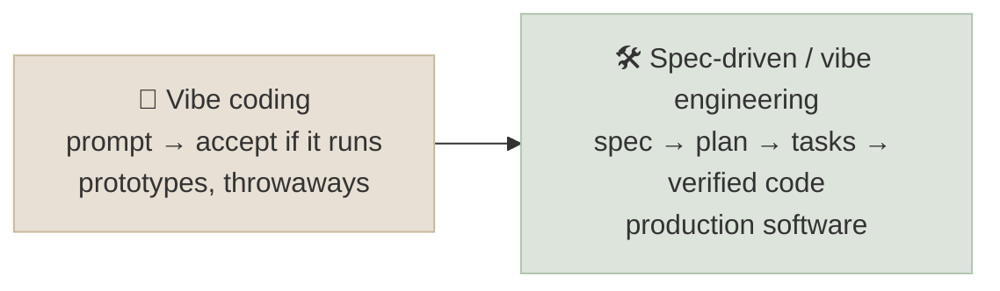
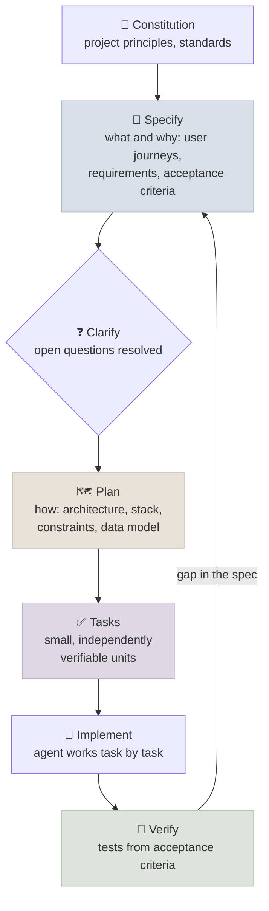

# Spec-Driven Development

When agents write most of the code, the scarce human work moves upstream and downstream of it: stating precisely what should be built, and checking that what was built is right. **Spec-driven development** makes the specification - requirements, acceptance criteria, a technical plan and a task breakdown - the primary artifact that people write and review, with agents implementing against it and tests enforcing it. This chapter covers the workflow, the tooling, and the discipline that separates it from "vibe coding".

```objectives
time: 35 min
outcomes:
  - Distinguish vibe coding from disciplined agent-assisted engineering, and choose between them by risk
  - Write a spec an agent can implement - requirements, acceptance criteria as tests, constraints, a task breakdown
  - Run the specify → plan → tasks → implement workflow with review gates, as in GitHub Spec Kit
  - Place human review where it matters - on the spec, the plan and the verified outcome
prerequisites:
  - "[Coding Agents](04-Coding-Agents.mdx)"
  - "[Verifiers, Environments and Agent RL](07-Verifiers-Environments-and-Agent-RL.mdx)"
```

## Vibe Coding and Vibe Engineering

Andrej Karpathy coined "vibe coding" in February 2025 for building software by prompting and accepting whatever works, without really reading the code - fine for prototypes and throwaway tools. Simon Willison proposed **vibe engineering** (October 2025) for the other end of the scale: experienced engineers using coding agents on production software *with* the practices that make it safe - automated tests, planning, documentation, version control, code review, and good judgement about what to delegate. The difference is not the tool; it is whether the output is specified and verified.



Choose by risk: the more the code will be depended on, the more of the spec-and-verify discipline it needs.

## The Workflow

GitHub's open-source **Spec Kit** (September 2025) packages the workflow for Copilot, Claude Code, Gemini CLI and other agents as a sequence of versioned Markdown artifacts, with a human correcting each before the next is generated. AWS's Kiro IDE (2025) builds a similar requirements → design → tasks flow into the editor.



Why it works with agents: a vague prompt forces the model to guess at many unstated requirements; each artifact removes a class of guesses before code exists, when corrections are cheap. The task breakdown also gives the harness natural checkpoints - each task is one verified increment, like the feature list in [Harness Engineering](01-Harness-Engineering.mdx).

## Writing a Spec an Agent Can Implement

| Section | Contents | Example |
|---|---|---|
| **Goal and context** | The user problem and who has it | "Support agents need to refund a single item of a delivered order" |
| **Requirements** | Behaviour, stated testably | "Refund = quantity × unit price of that line; the order becomes partially refunded" |
| **Acceptance criteria** | Given/when/then cases, including errors and edge cases, that become tests | "Given a pending order, refunding fails with 'only delivered items can be refunded' and nothing changes" |
| **Constraints** | Non-functional requirements, what not to change, dependencies allowed | "No schema migration; p95 < 200 ms; existing API unchanged" |
| **Out of scope** | What the agent must not do | "Partial-quantity refunds" |
| **Plan and tasks** | Components, data flow, then tasks small enough to verify one at a time | "1. Add refund_item to service with tests; 2. Expose endpoint; 3. Update docs" |

Write acceptance criteria as tests where possible - "handle errors gracefully" is unverifiable; a failing test is not.

## Where Humans Review

Review effort goes where errors are cheapest to fix and most consequential:

1. **The spec and the plan** - is this the right thing, built the right way? A correct implementation of a wrong spec is still wrong.
2. **The verifiers** - do the tests actually encode the acceptance criteria? Agents writing their own tests need that reviewed.
3. **The outcome** - behaviour against the acceptance criteria, security-sensitive diffs, and anything touching data or money - not every line of routine code.

And keep the spec alive: when behaviour changes, change the spec and its tests in the same commit, or the next agent will implement against stale intent. This area is young; tools and terminology are still changing, but the core - write intent down precisely, verify mechanically, review at the decision points - is ordinary engineering discipline applied to a new kind of implementer.

## Check Yourself

```quiz
- q: "What distinguishes vibe engineering from vibe coding?"
  options:
    - "Specification, tests, review and version control around agent-written code"
    - "A different AI model"
    - "Writing code without AI"
    - "Using an IDE rather than a terminal"
  answer: 1
- q: "In the Spec Kit workflow, what comes between specify and tasks?"
  options: ["Plan (with clarification of open questions)", "Implement", "Deploy", "Retrospective"]
  answer: 1
- q: "Why write acceptance criteria as given/when/then cases?"
  options:
    - "They translate directly into tests that verify the agent's implementation"
    - "Agents can't read prose"
    - "They are shorter"
    - "Spec Kit requires them"
  answer: 1
- q: "Where should human review concentrate in spec-driven development, and why?"
  answer: "On the spec and plan (cheapest point to fix the wrong thing), on the tests (they are what enforces the spec), and on high-risk outcomes (security, data, money) - rather than line-by-line review of routine generated code."
```

## Exercises

```exercise
- title: Spec a feature
  task: |
    Write a spec for adding "change delivery address" to the Lab 13 shop as an API endpoint: goal, requirements, at least six acceptance criteria (including errors and ownership), constraints, out of scope, and a task list. Hand it to a coding agent and review the result against your criteria.
  solution: |
    Acceptance criteria should cover: success on a pending order; failure on shipped/delivered/cancelled orders with unchanged state; failure for another customer's order; validation of empty or overlong addresses; idempotency for repeated identical requests; audit log entry. Tasks: service function with tests, endpoint with tests, docs. Review whether the agent's tests match each criterion - missing ones show where the spec was ambiguous.
- title: Vibe or spec?
  task: |
    Classify five recent pieces of work as suitable for vibe coding or needing spec-driven development, and justify each by the cost of a defect and how long the code will live.
  solution: |
    Throwaway data exploration, one-off scripts and UI prototypes suit vibe coding; anything that handles user data, money, security, shared libraries or long-lived services needs specs, tests and review. The deciding factors are blast radius and lifetime, not size.
```

## Study Notes

- Vibe coding (Karpathy, Feb 2025) = accept if it runs; vibe engineering (Willison, Oct 2025) = agents plus tests, plans, docs, review
- Spec-driven: constitution → specify → clarify → plan → tasks → implement → verify; artifacts are versioned Markdown (Spec Kit, Sep 2025; Kiro)
- Specs: goal, testable requirements, given/when/then acceptance criteria, constraints, out of scope, plan and tasks
- Review the spec, the tests and high-risk outcomes; update spec and tests together

## References

- Simon Willison, [Vibe engineering](https://simonwillison.net/2025/Oct/7/vibe-engineering/) (Oct 2025)
- GitHub, [Spec-driven development with AI: get started with a new open source toolkit](https://github.blog/ai-and-ml/generative-ai/spec-driven-development-with-ai-get-started-with-a-new-open-source-toolkit/) (Sep 2025) and [Spec Kit documentation](https://github.github.com/spec-kit/) (2026)
- Anthropic, [Effective harnesses for long-running agents](https://www.anthropic.com/engineering/effective-harnesses-for-long-running-agents) (Nov 2025)

*Last reviewed: 2026-09*
