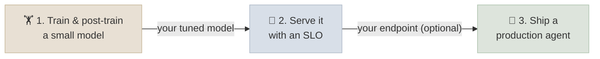

# 18 - Capstones

Three projects that put the course together end to end, each producing something you could show an employer: a model you trained and post-trained yourself, that model served against a stated service-level objective, and a production-grade agent with evaluations and a security review. Each project lists its milestones, deliverables and a grading rubric, and builds on labs you have already run.

```objectives
scope: module
time: 20-40 hours per capstone (plus GPU time for 1 and 2)
outcomes:
  - Train a small language model from scratch, post-train an open base model with SFT and DPO or GRPO, and evaluate both with confidence intervals
  - Serve a model against an explicit latency SLO, measure goodput under realistic load, and justify each serving choice with numbers
  - Build, evaluate, secure and instrument an agent that uses MCP tools, with human approval and durable execution
  - Write the reports that make engineering work credible - method, results with uncertainty, trade-offs and limitations
prerequisites:
  - "Capstone 1: modules 01-06, especially [GPT From Scratch](../02-Prog-Langs/PyTorch/CodeLabs/02-GPT-From-Scratch.mdx), [SFT, DPO and GRPO with TRL](../05-Fine-Tuning-Lab/CodeLabs/02-SFT-DPO-GRPO-with-TRL.mdx) and [Eval Harness](../06-Evaluation/CodeLabs/01-Eval-Harness.mdx)"
  - "Capstone 2: modules 07-08, especially [FastAPI + vLLM Endpoint](../07-Serving-and-Inference/CodeLabs/01-FastAPI-vLLM-Endpoint.mdx)"
  - "Capstone 3: modules 12-17, especially [MCP Server & Agent](../13-MCP-and-A2A/CodeLabs/01-MCP-Server-and-Agent.mdx)"
```

## How the Capstones Fit Together



They chain - the model from capstone 1 is served in capstone 2, and that endpoint can be one of the models behind capstone 3's agent - but each stands alone: you can serve any small open model in capstone 2, or use a hosted API in capstone 3.

| # | Capstone | You deliver | Compute |
|---|---|---|---|
| 1 | [Train and Post-Train a Small Model](Projects/01-Train-and-Post-Train-a-Small-Model.mdx) | A pretrained ~124M GPT, a post-trained 0.6B model, an evaluation report and model cards | One 24 GB GPU for about a day in total (a light track fits a laptop plus a free notebook GPU) |
| 2 | [Serve It with an SLO](Projects/02-Serve-It-with-an-SLO.mdx) | A deployed endpoint, load-test data, and an SLO report comparing serving configurations | One GPU for a few hours; Kubernetes optional |
| 3 | [Ship a Production Agent](Projects/03-Ship-a-Production-Agent.mdx) | An MCP-backed agent with approvals, durable execution, tracing, eval suites, a threat model and a cost model | A laptop plus a local or hosted model |

## Grading

Every capstone uses the same four levels per rubric criterion, and a weighted total out of 100:

| Level | Meaning |
|---|---|
| **Exceeds** (100%) | Everything in *Meets*, plus measured evidence of an improvement or insight beyond the brief |
| **Meets** (75%) | The deliverable is complete, correct and reproducible, and claims are backed by measurements with uncertainty |
| **Partial** (40%) | Present but incomplete, unmeasured, or not reproducible |
| **Missing** (0%) | Not delivered |

A capstone passes at 70. Reproducibility is a gate, not a criterion: if a reviewer cannot re-run your main result from the repository and README, the capstone is returned before grading.

## What Every Submission Includes

- A public or shareable **repository** with pinned dependencies, a README with exact commands, and seeds.
- A **report** (2-5 pages) - question, method, results with confidence intervals or error bars, what didn't work, and limitations.
- The **artifacts** each capstone lists (model cards, dashboards, traces, threat model).
- A **5-minute walkthrough** (recording or live) of the main result.

Honest negative results are fine and often the most instructive part of a report - the labs in this course report several. Unmeasured claims are not.

---

Previous: [17 - Agent Engineering](../17-Agent-Engineering/INDEX.mdx) · Next: [Knowledge Check](../Interview-Questions/INDEX.mdx)
