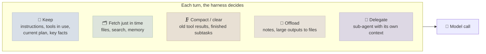

# Context Engineering for Agents

Context engineering is deciding, at every model call, which tokens the model sees - instructions, tools, history, tool results, retrieved data, memory. For a single call that is a prompt-design problem ([Prompt & Context Engineering](../../05-Prompt-Engineering/Notes/06-Context-Engineering.mdx)); for an agent it is a *runtime* problem, because the context grows with every turn and the harness must keep it small, relevant and cache-friendly for hours of work.

```objectives
time: 45 min
outcomes:
  - Explain context rot and why a larger window doesn't remove the need to curate context
  - Choose between just-in-time retrieval and up-front loading for an agent's knowledge
  - Apply compaction, tool-result clearing, offloading to files, structured note-taking and sub-agent isolation, with their trade-offs
  - Keep a long-running agent's context cache-friendly while managing it
prerequisites:
  - "[Context Engineering](../../05-Prompt-Engineering/Notes/06-Context-Engineering.mdx) - the general strategies"
  - "[Harness Engineering](01-Harness-Engineering.mdx)"
```

## Why Agents Need It

Models don't use long contexts uniformly. Liu et al. (2023) found accuracy drops when the relevant information sits in the middle of a long input; Chroma's *Context Rot* report (July 2025) tested 18 models and found performance becoming increasingly unreliable as input length grows, even on simple retrieval and copying tasks and well inside the advertised window. An agent makes this worse by construction: each turn appends tool calls and results, most of which are irrelevant a few turns later. Anthropic's framing (*Effective context engineering for AI agents*, September 2025) is to treat context as a finite resource with diminishing returns - aim for **the smallest set of high-signal tokens** that lets the model take the next step well.



## Just-in-Time vs Up-Front Context

| Approach | How | When |
|---|---|---|
| **Up-front** | Put documents, schemas or retrieved chunks in the prompt before the agent starts | Small, stable, always-relevant knowledge; latency-sensitive single calls |
| **Just-in-time** | Give the agent lightweight references (file paths, queries, URLs) and tools (`grep`, `glob`, `read_file`, search) to load what it needs | Large or changing corpora - codebases, document stores |
| **Hybrid** | Load a small map up front (`AGENTS.md`, a directory overview, an index), fetch details on demand | Most coding and research agents |

Coding agents lean heavily on just-in-time loading: Claude Code, Codex and similar tools read `AGENTS.md`/`CLAUDE.md` up front and then explore with search and file reads rather than pre-indexing the repository into the prompt. The cost is more turns; the gain is context that reflects what the agent actually needs, and metadata (file names, paths, timestamps) that itself guides the search.

## Techniques for Long Runs

| Technique | What it does | Trade-off |
|---|---|---|
| **Tool-result clearing** | Replace old tool outputs with a stub once used ("[result of read_file tests.py cleared]") | Cheapest win; the agent can re-fetch if needed |
| **Compaction** | Summarise the conversation near the limit and continue in a fresh window with the summary plus recent turns | Lossy - tune what to keep (decisions, open issues, file paths) by reading compacted transcripts |
| **Offloading** | Write large outputs (logs, datasets, long results) to files and put the path and a preview in context | Full fidelity kept outside the window; needs file tools |
| **Structured note-taking** | The agent maintains a notes or progress file (to-dos, findings, decisions) that persists across compactions | Survives resets; the agent must keep it current |
| **Sub-agent isolation** | A sub-agent explores in its own context and returns a condensed summary (Anthropic suggests on the order of 1,000-2,000 tokens) | Many more total tokens; far cleaner main context |
| **Progressive disclosure** | Load skills and tool definitions only when relevant (skills, tool search) | Requires packaging knowledge ahead of time ([Skills and Memory](04-Skills-and-Memory.mdx)) |

Compaction and caching interact. Prompt caching rewards an unchanged prefix; compaction rewrites the history and so invalidates the cache after the system prompt and tools. Compact rarely and substantially rather than trimming a little every turn, keep tool definitions and system prompt stable at the front, and clear tool results in batches.

## Tools Shape the Context

Much of an agent's context is tool output, so tool design is context design ([Tool Use](../../10-Agent-Building-Blocks/Notes/01-Tool-Use-and-Function-Calling.mdx)):

- Return **relevant fields and summaries**, with pagination, filters and a `response_format` option ("concise" vs "detailed").
- **Cap and truncate** large outputs with a message telling the agent how to get more (Claude Code caps tool results at 25,000 tokens by default).
- Return **meaningful identifiers** (names, paths) rather than opaque ids the model must look up again.
- Keep the **tool set small and non-overlapping**; bloated, ambiguous tool sets waste context and cause wrong choices.

## Check Yourself

```quiz
- q: "A model has a 1M-token window. Why still curate an agent's context?"
  options:
    - "Performance degrades with length and irrelevant content well within the window (context rot), and cost grows with every turn"
    - "The window is only advertised, never available"
    - "Tool results can't exceed 25,000 tokens"
    - "Caching stops working above 100K tokens"
  answer: 1
- q: "Which technique keeps full fidelity of a 2 MB log while keeping it out of the context?"
  options: ["Offloading to a file with a path and preview in context", "Compaction", "Tool-result clearing", "A larger model"]
  answer: 1
- q: "Why do coding agents usually explore a repository with search and file reads instead of loading it into the prompt?"
  answer: "Just-in-time loading keeps only what the task needs in context, reflects the current state of files, and uses paths and names as signals; up-front loading of a large codebase wastes context and degrades attention."
- q: "How does compaction interact with prompt caching?"
  answer: "Compaction rewrites history, invalidating cached prefixes after the stable system prompt and tools; so compact infrequently and substantially, keep the stable parts at the front, and clear tool results in batches."
```

## Exercises

```exercise
- title: Add context management to the lab harness
  task: |
    In this module's lab, add tool-result clearing: after each turn, replace tool results older than the last four turns with a one-line stub. Measure tokens per episode and pass rate over three trials against the unmodified harness.
  solution: |
    Tokens per episode fall, most on long episodes; pass rate should be unchanged within noise if the stubs name what was cleared (the model can re-read a file). If pass rate drops, the agent was relying on an old result - keep the most recent read of each file instead of a fixed window.
- title: Tune a compaction prompt
  task: |
    Write a compaction prompt for a coding agent. Run a long episode, compact it halfway, and check whether the continuation re-does work or forgets decisions. Revise the prompt until it doesn't.
  solution: |
    A good compaction prompt keeps: the task and acceptance criteria, decisions made and why, files changed, failing tests and their errors, next steps, and unresolved questions - and drops raw tool outputs. Verify by reading the post-compaction turns: no repeated reads of the same files, no reversal of earlier decisions.
```

## Study Notes

- Context is finite with diminishing returns: smallest high-signal set; context rot and lost-in-the-middle apply within advertised windows
- Just-in-time (references + search tools) vs up-front vs hybrid (`AGENTS.md` map + on-demand reads)
- Long runs: clear tool results, compact, offload to files, structured notes, sub-agent isolation, progressive disclosure
- Compaction invalidates caches: compact rarely, keep stable prefix, batch clearing
- Tool design is context design: concise results, caps, meaningful ids, small tool sets

## References

- Anthropic, [Effective context engineering for AI agents](https://www.anthropic.com/engineering/effective-context-engineering-for-ai-agents) (Sep 2025)
- Chroma, [Context Rot: How Increasing Input Tokens Impacts LLM Performance](https://research.trychroma.com/context-rot) (Jul 2025)
- Liu et al., [Lost in the Middle: How Language Models Use Long Contexts](https://arxiv.org/abs/2307.03172) (2023)
- Anthropic, [Writing effective tools for agents](https://www.anthropic.com/engineering/writing-tools-for-agents) (Sep 2025)

*Last reviewed: 2026-09*
