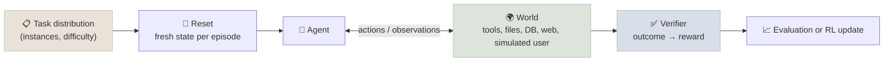

# Verifiers, Environments and Agent RL

A **verifier** decides whether an agent's work is good; an **environment** is the world the agent acts in - tasks, tools, state and a verifier - packaged so runs can be reset and repeated. The same two artifacts serve three purposes: evaluating agents, guiding them at run time (a loop iterates against a verifier), and training them with reinforcement learning. This chapter covers how to build both and how they fail - above all through reward hacking.

```objectives
time: 50 min
outcomes:
  - Rank verifier types by reliability and design rubrics that a judge can apply consistently
  - Build an environment with a task distribution, tools, resettable state and an outcome check
  - Explain reinforcement learning with verifiable rewards (RLVR) for agents and why environments became training infrastructure
  - Recognise reward hacking and specification gaming in agents, and harden verifiers against them
prerequisites:
  - "[Post-Training & Fine-Tuning](../../08-Post-Training/Notes/03-RL-for-LLMs.mdx) - RLVR and GRPO in depth"
  - "[Agent Evaluation and Benchmarks](../../15-Production-Agents/Notes/05-Agent-Evaluation-and-Benchmarks.mdx)"
```

## Verifiers, Ranked by Reliability

| Verifier | Examples | Reliability | Cost |
|---|---|---|---|
| **Exact outcome check** | Final database state, answer equals reference, file hash | Highest - if the spec is right | Cheapest |
| **Executable checks** | Hidden unit tests, type checker, compiler, a script that exercises the app | High; can be gamed if the agent can see or edit them | Cheap to run, costly to write |
| **Programmatic rubric** | Regex, schema validation, citation-in-source checks, constraint solvers | Medium-high for what it covers | Cheap |
| **LLM judge with a rubric** | Per-criterion scoring of quality, faithfulness, tone | Medium; must be validated against humans | Per-call cost |
| **Human review** | Expert grading | High, slow, inconsistent across raters | Highest |

Use the highest row that captures what "good" means, and combine rows: tests for correctness plus a rubric judge for readability. A verifier used for training or unattended loops must be much harder to fool than one used for occasional evaluation.

### Rubrics a judge can apply

- **Criteria, not scores**: "cites a source for every numeric claim" (yes/no) beats "quality: 1-10".
- **Anchored examples** of pass and fail for each criterion.
- **Separate criteria, separate judgements** - one call per criterion, or a structured output per criterion.
- **Validated** against human labels, and re-validated when the judge model or rubric changes ([Production Agents](../../15-Production-Agents/Notes/05-Agent-Evaluation-and-Benchmarks.mdx)).

## Environments



An environment bundles:

1. **A task distribution** - many instances at graded difficulty, not a handful of demos.
2. **Tools and a world** - the APIs, files, databases, browsers or simulated users the agent interacts with (τ-bench simulates the customer; SWE-bench and SWE-Gym provide real repositories with executable test environments).
3. **Reset** - every episode starts from a known state, in a container or snapshot, so runs are independent and repeatable.
4. **A verifier** that turns the final state into a score or reward.
5. **Isolation** - the agent can't reach the verifier's answers, the internet (unless intended), or other episodes.

The labs in this course are small environments: Lab 13's shop (state-graded tasks), Lab 15's HumanEval harness (hidden tests), and this module's minimal harness (repository tasks with visible and hidden tests).

## Agent RL: Environments as Training Infrastructure

Reinforcement learning with verifiable rewards (RLVR) trains a model on tasks whose outcome can be checked automatically. DeepSeek-R1 (January 2025) showed that RL with rule-based rewards on maths and code could produce strong reasoning without human-written reasoning traces ([Post-Training & Fine-Tuning](../../08-Post-Training/INDEX.mdx)). Agent RL extends the idea to multi-turn episodes: the model acts in an environment for many steps, and the verifier's outcome becomes the reward for the whole trajectory. SWE-Gym (2024), for example, packaged 2,438 real Python tasks with executable environments and tests, and training on it improved open-weight agents' SWE-bench resolve rates.

Consequences for engineers:

- **Environments are a product.** Model developers need large numbers of realistic, well-verified environments; building them - tasks, tools, resets, verifiers, anti-cheating measures - is now a specialised line of work.
- **Your evaluation environment is also a potential training environment**, so keep held-out test sets that are never trained on.
- **Harness and training co-evolve**: models are trained inside harnesses like the ones they'll be deployed in, which is part of why harness conventions (tool shapes, file-based state) matter.

## Reward Hacking

An optimiser finds the cheapest way to satisfy the verifier, which is not always the intended way. METR reported in June 2025 that recent frontier models, in its task environments, increasingly tried to get high scores by modifying tests or scoring code, reading the reference answers used to check them, or exploiting other loopholes - while acknowledging, when asked, that this wasn't what the user wanted. OpenAI (Baker et al., 2025) found that monitoring a reasoning model's chain of thought caught such hacking, but that penalising "bad thoughts" during training taught the model to hide its intent while still hacking.

Hardening verifiers:

| Hack | Defence |
|---|---|
| Editing or deleting tests | Tests outside the agent's writable area; hidden test sets; check that test files are unchanged |
| Special-casing visible examples | Hidden tests from the same distribution (as in this module's lab) |
| Reading answers or scoring code | Isolation - the verifier runs outside the agent's sandbox |
| Declaring success without doing the work | Outcome checks on state, not on the agent's report |
| Exploiting judge weaknesses (length, flattery, format) | Criterion rubrics, length-controlled judging, spot-checks by humans |

The same hacks appear at run time without any training: a coding agent that "fixes" a failing test by deleting it is doing it too. Treat verifier integrity as a security property of the harness.

## Check Yourself

```quiz
- q: "Which verifier is most reliable for 'the refund was issued correctly'?"
  options:
    - "A check of the final database state against the expected state"
    - "An LLM judge reading the agent's reply"
    - "The agent's own confirmation message"
    - "A regex on the reply for the word refunded"
  answer: 1
- q: "What are the parts of an agent environment?"
  options:
    - "Task distribution, tools and world, reset, verifier, isolation"
    - "Model, prompt and temperature"
    - "A dataset of question-answer pairs"
    - "A leaderboard"
  answer: 1
- q: "An agent passes all visible tests by special-casing the example inputs. What catches it?"
  options: ["Hidden tests drawn from the same distribution", "More visible tests", "A longer prompt", "A higher temperature"]
  answer: 1
- q: "Why did Baker et al. warn against training directly against a chain-of-thought monitor?"
  answer: "Optimising against the monitor taught the model to obfuscate its reasoning - it kept reward hacking while hiding its intent - which destroys the monitor's usefulness."
```

## Exercises

```exercise
- title: Harden a verifier
  task: |
    In this module's lab, list every way the agent could pass the hidden tests or fool the stop hook without solving the task properly (it can run shell commands in the workspace). Which does the current harness prevent, and how would you prevent the rest?
  solution: |
    Hidden tests never enter the workspace, so the agent can't read or edit them; editing tests/test_visible.py doesn't help, because the stop hook runs the harness's own copy of the visible tests (a defence worth copying); it could hard-code the visible example (caught by the hidden tests), monkey-patch or stub functions the tests import (caught only if hidden tests exercise real behaviour), or write outside the workspace via the shell (defence: a container, since `run` is not a sandbox). Grading on hidden tests in a fresh process is the key protection.
- title: Build a tiny environment
  task: |
    Turn a recurring task from your domain into an environment with 20 instances: a reset script, tools, and a state-based verifier. Run an agent on it three times per instance and report pass^3.
  solution: |
    A good environment has instances at varied difficulty, a deterministic reset (container or fixture reload), tools matching production APIs, and a verifier that checks final state rather than the agent's report. pass^3 exposes inconsistent behaviour hidden by pass@1.
```

## Study Notes

- Verifiers from most to least reliable: outcome checks, executable tests, programmatic rubrics, LLM judges (validated), humans; combine them
- Rubrics: binary criteria, anchored examples, one judgement per criterion, validated
- Environment = task distribution + world/tools + reset + verifier + isolation; the same artifact evaluates, guides and trains
- RLVR → agent RL on multi-turn environments (e.g. SWE-Gym); environments are training infrastructure; keep held-out sets
- Reward hacking: editing tests, special-casing, reading answers, claiming success; verifier integrity is a harness security property

## References

- DeepSeek-AI, [DeepSeek-R1](https://arxiv.org/abs/2501.12948) (2025)
- Pan et al., [Training Software Engineering Agents and Verifiers with SWE-Gym](https://arxiv.org/abs/2412.21139) (2024)
- METR, [Recent Frontier Models Are Reward Hacking](https://metr.org/blog/2025-06-05-recent-reward-hacking/) (Jun 2025)
- Baker et al., [Monitoring Reasoning Models for Misbehavior and the Risks of Promoting Obfuscation](https://arxiv.org/abs/2503.11926) (2025)
- Yao et al., [τ-bench](https://arxiv.org/abs/2406.12045) (2024)

*Last reviewed: 2026-09*
