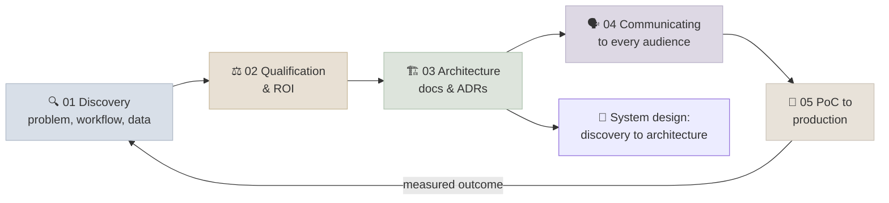

# 19 - Solutions Architecture & Communication

The rest of the course teaches how to build GenAI systems. This module covers the work around the build that decides whether anyone funds, trusts or uses them: finding the real problem, qualifying it and putting a number on its value, writing down the architecture and its trade-offs, explaining it to engineers and executives in their own terms, and taking a pilot into production. Most failed AI projects fail here, not in the model.

```objectives
scope: module
time: 5-6 hours
outcomes:
  - Run a customer discovery conversation that surfaces the workflow, the data, the success metric and the constraints before any solution is proposed
  - Qualify an AI use case on value, feasibility and risk, and build a cost and ROI model a finance reviewer would accept
  - Write an architecture document with C4-style diagrams, ADRs and an explicit trade-off table
  - Present the same system to a technical and an executive audience, including uncertainty and eval results, and handle the common objections
  - Plan a pilot with exit criteria agreed up front, and take it to production with adoption metrics and a handover
prerequisites:
  - "Any build module, ideally [RAG](../12-RAG/INDEX.mdx) or [Production Agents](../17-Production-Agents/INDEX.mdx) - you need a system to architect"
  - "[Building Your Own Evals](../07-Evaluation/Notes/04-Building-Your-Own-Evals.mdx) - success metrics are evals"
```

## Where This Module Fits



## Chapter Map

| # | Chapter | You will learn | Time |
|---|---|---|---|
| 1 | [Customer Discovery for AI Projects](Notes/01-Customer-Discovery-for-AI-Projects.mdx) | Why projects fail at the problem stage, discovery interviews, mapping the workflow, data and process readiness, success metrics | 45 min |
| 2 | [Use-Case Qualification & ROI](Notes/02-Use-Case-Qualification-and-ROI.mdx) | Value/feasibility/risk scoring, when not to use an LLM, unit cost model, ROI with sensitivity, build vs buy vs fine-tune | 50 min |
| 3 | [Architecture Docs & ADRs](Notes/03-Architecture-Docs-and-ADRs.mdx) | Design-doc structure, C4 levels, non-functional requirements for AI, ADRs, trade-off tables, risk register | 45 min |
| 4 | [Communicating to Technical & Executive Audiences](Notes/04-Communicating-to-Technical-and-Executive-Audiences.mdx) | Answer-first structure, one system told two ways, explaining uncertainty, demos, objection handling | 40 min |
| 5 | [PoC to Production](Notes/05-PoC-to-Production.mdx) | PoC vs pilot vs production, exit criteria, staged autonomy, adoption metrics, change management, handover | 45 min |
| 6 | [Q&A Review Bank](Notes/06-Interview-QA-Bank.mdx) | 16 questions across the module | 30 min |

## System Design

| # | Case study | Domain |
|---|---|---|
| 1 | [Discovery to Architecture](SystemDesigns/01-Discovery-to-Architecture.mdx) | Accounts-payable invoice processing at a distributor - from discovery notes to architecture, ADRs, ROI and a pilot plan |

## Resources

- [Module quiz](/quiz/solutions-architecture) - every *Check Yourself* question in this module
- [Readiness Self-Assessment](../Interview-Questions/01-Readiness-Self-Assessment.mdx) - this module covers the "customer discovery and architecture communication" domain
- [Capstones](../20-Capstones/INDEX.mdx) - every capstone now asks for an architecture document, ADRs and a business outcome

## Key Cross-References

- Cost models in depth → [Cost and Latency](../17-Production-Agents/Notes/04-Cost-and-Latency.mdx), [Prompt Caching & Cost](../11-Prompt-Engineering/Notes/07-Prompt-Caching-and-Cost.mdx)
- Choosing a cloud platform → [Platform Comparison Table](../10-Cloud-Platforms/Notes/05-Platform-Comparison-Table.mdx)
- Rollout and rollback mechanics → [Model Lifecycle & Rollout](../09-Production-Engineering/Notes/03-Model-Lifecycle-and-Rollout.mdx)
- Operating what you ship → [LLM Observability, SLOs & Incident Response](../09-Production-Engineering/Notes/06-LLM-Observability-SLOs-and-Incident-Response.mdx)

## Section Appendix

[Summary & Key Terms](APPENDIX.mdx) - a quick recap of this section and its essential vocabulary.

---

## Next Topic

Previous: [18 - Agent Engineering](../18-Agent-Engineering/INDEX.mdx) · Next: [Capstones](../20-Capstones/INDEX.mdx)
