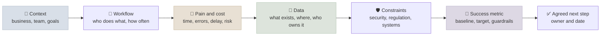
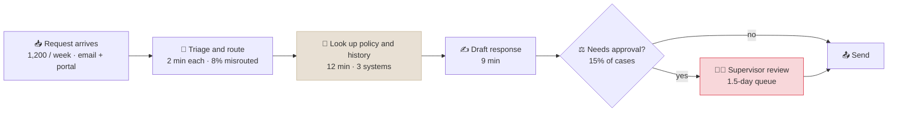

# Customer Discovery for AI Projects

Customer discovery is the structured work of understanding a customer's problem - the workflow, the people, the data, what it costs today and what "better" would mean - before proposing a solution. For AI projects it matters more than usual, because a capable model makes it easy to build a convincing demo of the wrong thing. This note covers why AI projects fail at the problem stage, how to run discovery conversations that produce facts instead of opinions, how to map a workflow and check data readiness, and how to write a success metric everyone agrees to before anything is built.

```objectives
time: 45 min
outcomes:
  - Explain the main non-technical causes of AI project failure and which of them discovery prevents
  - Run a discovery conversation using past-behaviour questions rather than hypothetical ones
  - Map a current-state workflow with volumes, times, error rates and hand-offs, and mark where AI could assist or automate
  - Assess data and process readiness with a checklist, and write a measurable success statement with a baseline and guardrails
prerequisites:
  - "None beyond a working idea of what LLMs can and cannot do - [LLM Fundamentals](../../01-LLM-Foundations/Notes/01-LLM-Fundamentals.mdx)"
```

## Why Projects Fail Before the Model

Three independent sources point the same way:

- **RAND (2024)** interviewed 65 experienced data scientists and engineers. The first of five root causes of AI project failure: stakeholders **misunderstand or miscommunicate the problem**, so models are optimized for the wrong metric or don't fit the workflow. The others: not enough suitable data, chasing technology over the user's problem, weak infrastructure, and problems too hard for current AI.
- **Gartner (July 2024)** predicted at least 30% of generative AI projects would be abandoned after proof of concept by the end of 2025, citing poor data quality, inadequate risk controls, escalating costs and **unclear business value**.
- **MIT NANDA (2025)** reported that most enterprise GenAI pilots in its sample showed no measurable P&L impact, and linked the gap to brittle workflows and poor fit with daily operations rather than model quality. Treat its headline 95% as a finding about its sample, not a universal rate.

The common thread: the failures are about the problem, the data and the workflow. Discovery is the step that addresses all three before money is spent.

---

## The Discovery Arc



Discovery is usually several conversations with different people, not one meeting. The arc is a checklist of what you need to know by the end, not a script.

---

## Asking Good Questions

The most useful rule comes from Rob Fitzpatrick's *The Mom Test*: ask about **specific things that already happened**, not opinions about the future or your idea. People are generous with hypotheticals ("Would you use a tool that...?" - "Definitely!") and accurate about their last Tuesday.

| Instead of | Ask |
|---|---|
| "Would an AI assistant help your team?" | "Walk me through the last case your team handled, start to finish." |
| "Is this a big problem?" | "How many of these came in last month? How long did the last one take? What happened when one was wrong?" |
| "What features do you want?" | "What did you try already to fix this? Why did it stop?" |
| "Would you pay for this?" | "What does this cost you today - people, overtime, penalties, lost customers? Who owns that budget?" |
| "Is your data good?" | "Can you show me five real examples, including a messy one?" |

Habits that keep the conversation honest:

- **Talk less.** If you are explaining your solution, you are not learning about their problem.
- **Ask for the artefact.** Real documents, tickets, emails and screens reveal more than descriptions - and are the seed of your eval set.
- **Find the workaround.** A spreadsheet, macro or shared inbox someone built themselves is strong evidence of real pain.
- **Probe the exceptions.** "What's the hardest version of this?" - exceptions are where AI systems fail and where the human time goes.
- **Separate the buyer from the user.** The person who pays and the person who uses it often want different things; you need both.

---

## Mapping the Workflow

Draw the current-state process with numbers on it. It shows where time and errors actually are, and where AI could fit.



From a map like this, two things become clear. Most handling time is in **lookup** (12 min) - a retrieval and summarization problem. Most of the **delay** is in the approval queue - a capacity and policy problem that AI drafting won't fix on its own. Without the numbers, a team could build a drafting assistant that saves 9 minutes of a 23-minute task and leaves the customer-visible delay unchanged.

For each step, mark the AI role it could take:

| Role | Meaning | Example |
|---|---|---|
| **Inform** | Find and summarize what a person needs | Retrieve policy and case history |
| **Assist** | Draft for a person to edit and approve | Draft the response |
| **Automate with review** | Act, with a person checking a sample or the exceptions | Triage and route, with low-confidence cases to a human |
| **Automate** | Act without review | Only for low-risk, reversible, well-measured steps |

---

## Data and Process Readiness

| Question | Why it matters | Red flag |
|---|---|---|
| **Access** - can we get the data for a pilot, legally and technically? | Weeks of procurement and security review can sink a timeline | "We'll need to ask IT" with no named contact |
| **Volume and coverage** - how many examples, covering which cases? | Eval sets and few-shot examples need the hard cases too | Only "clean" examples available |
| **Ground truth** - is there a record of the correct outcome? | Without it you cannot measure accuracy | Outcomes live in people's heads |
| **Quality and format** - scans, handwriting, tables, multiple languages? | Drives document processing cost and accuracy | "Mostly PDFs" (meaning scanned images) |
| **Freshness** - how often does it change? | Determines indexing and update design | Policies change weekly without versioning |
| **Sensitivity** - PII, PHI, financial, confidential? | Drives hosting, redaction, logging and contracts | Unknown classification |
| **Systems of record** - where must results be written? | Integration is often most of the work | Legacy system with no API |
| **Process owner** - who decides how exceptions are handled? | Someone must own the human side of the workflow | No one owns the end-to-end process |
| **Reviewer capacity** - who reviews AI output, and when? | Human-in-the-loop needs real people with time | "The team will review it" on top of current load |

---

## Defining Success Before Building

Agree on one success statement before the build starts, and **measure the baseline now** - after launch it is too late to know what "before" was.

> Reduce **[metric]** from **[baseline]** to **[target]** for **[population]** by **[date]**, measured by **[method]**, without **[guardrail metric]** getting worse than **[limit]**.

Example: *Reduce median handling time for tier-1 policy questions from 23 to 12 minutes for the UK support team by end of Q2, measured from ticket timestamps, without the reopen rate rising above 6% (baseline 5%).*

Use three kinds of metric together:

- **Business outcome** - what the sponsor cares about: cycle time, cost per case, revenue, compliance findings
- **System quality** - what the team can measure offline and online: accuracy on the eval set, straight-through rate, groundedness ([Building Your Own Evals](../../07-Evaluation/Notes/04-Building-Your-Own-Evals.mdx))
- **Guardrails** - what must not get worse: error severity, complaints, escalations, safety incidents

---

## Stakeholder Map

| Stakeholder | What they need from you | Typical question |
|---|---|---|
| **Economic buyer** (owns the budget) | Value, cost, risk, timeline | "What do we get, for how much, by when?" |
| **Champion** (wants it to happen) | Material to sell it internally | "How do I explain this to my boss?" |
| **End users** | It fits their day and makes it easier | "Will this create more work for me?" |
| **IT and security** | Architecture, data flows, identity, vendor risk | "Where does our data go, and who can see it?" |
| **Legal, risk and compliance** | Regulatory fit, liability, auditability | "Who is accountable when it's wrong?" |
| **Data owners** | Control over access and use | "Why do you need all of it?" |

Find out early who can say **no** - security and compliance reviews late in a project are a common reason pilots stall.

---

## The Discovery Summary

End discovery with a one-page summary the customer confirms in writing:

1. **Problem** in the customer's words, and who has it
2. **Current workflow** with volumes, times and costs (the map)
3. **Success statement** with baseline, target and guardrails
4. **Data** available, its owner and readiness gaps
5. **Constraints** - security, regulatory, systems, budget, timeline
6. **Stakeholders** and decision process
7. **Open questions and risks**
8. **Proposed next step** - usually qualification and a scoped proof of concept ([Use-Case Qualification & ROI](02-Use-Case-Qualification-and-ROI.mdx))

If the customer corrects the summary, that is discovery working.

---

## Check Yourself

```quiz
- q: "According to RAND's 2024 study of AI project failures, what is the first root cause it lists?"
  options:
    - "Models that are not accurate enough"
    - "Stakeholders misunderstanding or miscommunicating the problem to be solved"
    - "GPU shortages"
    - "Lack of open-source models"
  answer: 2
  explain: "RAND's first root cause is misunderstanding or miscommunicating the problem - models optimized for the wrong metric or not fitting the workflow. Data, technology-chasing, infrastructure and problem difficulty follow."
- q: "Which discovery question is most likely to produce reliable information?"
  options:
    - "Would your team use an AI assistant for this?"
    - "How much would you pay for a tool that halves this work?"
    - "Walk me through the last case your team handled, start to finish."
    - "Do you think AI could help here?"
  answer: 3
  explain: "Questions about specific past events produce facts. Hypothetical and opinion questions produce polite, optimistic answers that don't predict behaviour."
- q: "A workflow map shows 9 minutes drafting, 12 minutes lookup and a 1.5-day approval queue. The sponsor's complaint is that customers wait too long. What does this tell you about a drafting assistant?"
  answer: "It addresses the smallest part of handling time and none of the delay customers feel, which sits in the approval queue. The outcome metric (customer wait) would barely move. Look at lookup (retrieval and summarization) for handling time and at approval policy or capacity for the delay."
- q: "Why must the baseline be measured before the build starts?"
  answer: "After launch you can no longer observe the old process cleanly - the people, mix of cases and tools have changed - so any improvement claim has nothing reliable to compare against. A baseline measured the same way as the post-launch metric is what makes the business outcome credible."
```

## Exercises

```exercise
- title: Rewrite the discovery questions
  task: |
    A colleague plans to open a discovery call with a hospital's billing team using these questions. Rewrite each one so it asks about past behaviour or concrete facts.

    1. "Do claim denials cause you problems?"
    2. "Would automating appeals letters be useful?"
    3. "Is your data in good shape?"
    4. "How much time would AI save you?"
  solution: |
    1. "How many claims were denied last month? Walk me through the last denial you worked - what happened, who was involved, how long did it take?"
    2. "How do you write appeals letters today? Can you show me the last three, including one that failed? What happened to it?"
    3. "Where do denial reasons and appeal outcomes get recorded? Can we look at a sample of last quarter's records together, including incomplete ones?"
    4. "How many hours did the team spend on appeals last week? What else would that time go to? What did the last denial that wasn't appealed cost?"
- title: Write the success statement
  task: |
    From discovery: an insurer's claims intake team handles 4,000 emailed first-notice-of-loss reports a month. Keying each into the claims system takes 11 minutes on average; 7% contain keying errors found later, each costing about 40 minutes to fix. Sponsor: Head of Claims Operations. Write a success statement with a business metric, a system quality metric and two guardrails.
  solution: |
    *Reduce average intake handling time for emailed FNOL reports from 11 to 4 minutes for the UK motor claims team by the end of the pilot (12 weeks), measured from claims-system timestamps, without the downstream keying-error rate rising above 7% (baseline) - and with field-level extraction accuracy of at least 97% on a 300-report held-out eval set, and no increase in complaints about claim status.*

    Business metric: handling time (and the cost it implies: `4,000 x 7 min ≈ 467 hours/month` saved at target). System quality: field-level extraction accuracy on a held-out set. Guardrails: downstream error rate and status complaints.
```

## Study Notes

**Must-know:**
- Most AI project failures are about the problem, data and workflow, not the model (RAND 2024; Gartner 2024; MIT NANDA 2025)
- Discovery arc: context, workflow, pain and cost, data, constraints, success metric, agreed next step
- Ask about specific past events, ask for artefacts, find workarounds and exceptions; talk less
- Map the current workflow with volumes, times, error rates and queues - it shows where AI changes the outcome
- AI roles per step: inform, assist, automate with review, automate
- Check data readiness (access, coverage, ground truth, quality, sensitivity, systems of record) and process readiness (owner, reviewer capacity)
- Success statement: metric, baseline, target, population, date, method, guardrails - baseline measured before the build
- Map stakeholders, especially who can say no; end with a written one-page summary the customer confirms

## References

- Ryseff, De Bruhl and Newberry, [The Root Causes of Failure for Artificial Intelligence Projects and How They Can Succeed](https://www.rand.org/pubs/research_reports/RRA2680-1.html) (RAND, 2024)
- Gartner, [Gartner Predicts 30% of Generative AI Projects Will Be Abandoned After Proof of Concept by End of 2025](https://www.gartner.com/en/newsroom/press-releases/2024-07-29-gartner-predicts-30-percent-of-generative-ai-projects-will-be-abandoned-after-proof-of-concept-by-end-of-2025) (2024)
- MIT NANDA, [The GenAI Divide: State of AI in Business 2025](https://nanda.media.mit.edu/ai_report_2025.pdf) (2025)
- Fitzpatrick, [The Mom Test](https://www.momtestbook.com/) (2013)
- Christensen et al., [Know Your Customers' "Jobs to Be Done"](https://hbr.org/2016/09/know-your-customers-jobs-to-be-done) (Harvard Business Review, 2016)
- Google PAIR, [People + AI Guidebook](https://pair.withgoogle.com/guidebook/) (2019, updated 2021)

*Last reviewed: 2026-10*
