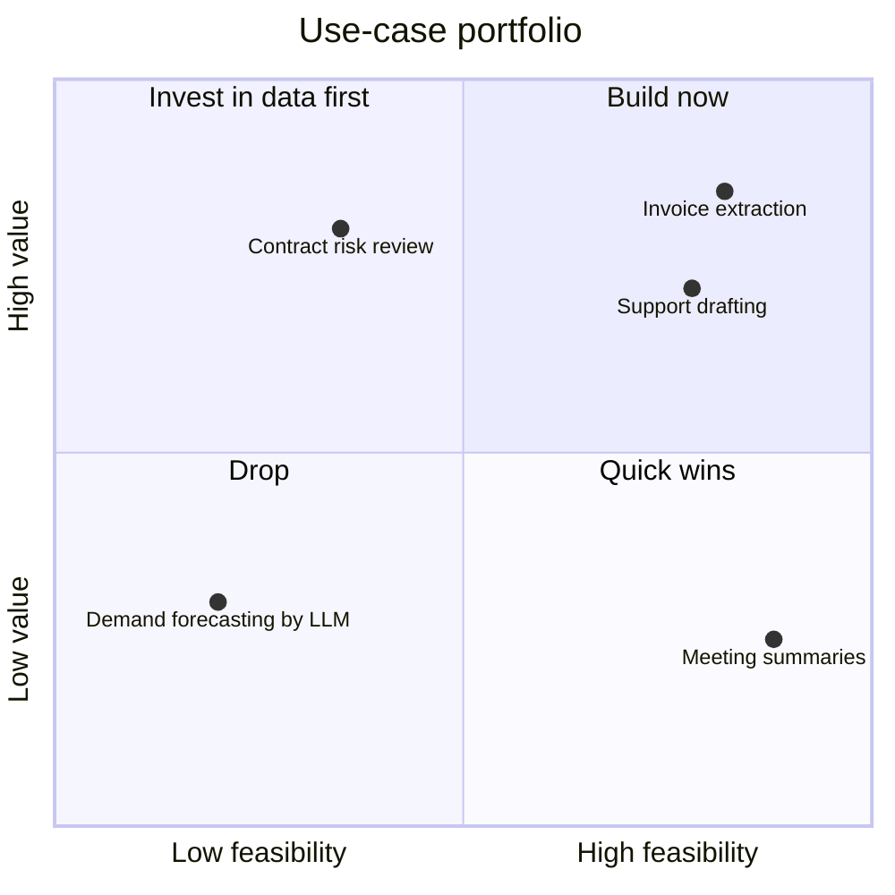
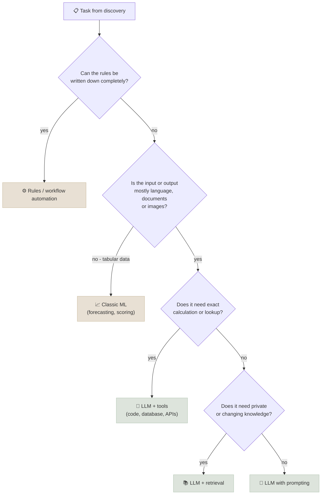

# Use-Case Qualification and ROI

Qualification decides which AI use cases are worth building, and the ROI model says what each one is worth. Both turn discovery findings into a decision a sponsor can make and a finance reviewer can check. This note covers scoring use cases on value, feasibility and risk, recognizing when a problem doesn't need an LLM, building a per-task cost model, turning it into ROI with sensitivity analysis, and choosing between buying, building on APIs and fine-tuning.

```objectives
time: 50 min
outcomes:
  - Score and rank a portfolio of AI use cases on value, feasibility and risk
  - Decide whether a task needs an LLM, classic ML, rules or a different process change
  - Build a per-task cost model that includes model, infrastructure, human review and error costs
  - Compute payback and run a sensitivity analysis on adoption and time saved, and state which savings are cash and which are capacity
  - Choose between buying a product, configuring a platform, building on model APIs and fine-tuning, with reasons
prerequisites:
  - "[Customer Discovery for AI Projects](01-Customer-Discovery-for-AI-Projects.mdx)"
  - "[Cost and Latency](../../17-Production-Agents/Notes/04-Cost-and-Latency.mdx) - token cost mechanics"
```

## Qualify Before You Build

Score each candidate use case 1-5 on three axes, using discovery facts rather than enthusiasm:

| Axis | Score high when | Score low when |
|---|---|---|
| **Value** | High volume x time per case x cost of errors or delay; tied to a metric the sponsor owns | Rare task, small time saving, no owner for the metric |
| **Feasibility** | Language-heavy task that models handle well; data accessible with ground truth; simple integration | Needs exact computation or knowledge nobody wrote down; no ground truth; legacy system with no API |
| **Risk** (score 5 = low risk) | Errors are cheap, visible and reversible; a human reviews before anything consequential | Errors are costly, silent or irreversible; regulated decisions about people |



Risk works as a gate rather than a third axis on the chart: a high-value, feasible use case with a low risk score usually means **change the design** (keep a human in the loop, start with "inform" or "assist" rather than "automate") rather than drop it.

---

## Is It an LLM Problem?



Signs that the answer is **not** an LLM, or not yet:

- The pain is a **process or policy problem** - an approval queue, a missing owner, a broken form. Fix the process first.
- The task is **tabular prediction** with labelled history (churn, fraud scores, demand). Gradient-boosted trees are cheaper, faster and easier to validate.
- The rules are **known and stable**. A rules engine is auditable and free per call.
- **Errors are unacceptable and unverifiable** - there is no way to check the output before it matters.

---

## The Unit Cost Model

Price the system **per task**, because that is how value is earned and how costs scale:

```
cost per task = model cost + infrastructure share + human review time + expected error cost

model cost        = calls per task x (input tokens x input price + output tokens x output price)
infrastructure    = fixed monthly platform cost / tasks per month
human review      = review minutes x loaded cost per minute
expected error    = error rate x average cost of an error that gets through
```

**Worked example.** A support team writes 30,000 email replies a month; each takes 9 minutes at a loaded cost of $45/hour ($0.75/min), so **$6.75 per reply**. The proposed assistant drafts replies from retrieved policy and case history; agents edit and send.

| Component | Assumption | Per reply |
|---|---|---|
| Model | 2 calls, 6,000 input + 500 output tokens in total, at an illustrative $3 / $15 per million tokens | $0.026 |
| Infrastructure | $2,000/month (vector store, tracing, hosting) | $0.067 at 30,000 replies |
| Human review | Agent edits the draft: 3 min instead of 9 | $2.25 |
| **Total** | | **≈ $2.34** |

Two lessons in that table. **Human time dominates** - the model costs under half a cent per minute of agent time saved, so a cheaper model barely matters while a better draft (less editing) matters a lot. And the **error cost** row is missing: it must come from the pilot, by measuring how often a sent reply was wrong and what that cost (reopened tickets, complaints, credits).

Token prices, caching discounts and batch pricing change often; take current prices from the provider's pricing page when you build the model, and use [Prompt Caching & Cost](../../11-Prompt-Engineering/Notes/07-Prompt-Caching-and-Cost.mdx) for the levers.

---

## ROI with Sensitivity

```
monthly benefit = tasks using the system x (old cost per task - new variable cost per task) - fixed monthly cost
payback months  = one-off cost / monthly benefit
```

Continuing the example: one-off build cost $250,000 plus $50,000 for training and change management, and **70% adoption** (21,000 of 30,000 replies drafted by the assistant):

- Variable saving per assisted reply: `$6.75 - ($2.25 + $0.026) ≈ $4.47`
- Monthly benefit: `21,000 x $4.47 - $2,000 ≈ $92,000`
- Payback: `$300,000 / $92,000 ≈ 3.3 months`

A single number invites false confidence. Show how it moves with the assumptions that are least certain:

| Scenario | Adoption | Minutes saved | Monthly benefit | Payback |
|---|---|---|---|---|
| Base case | 70% | 6 | ≈ $92,000 | 3.3 months |
| Low adoption | 40% | 6 | ≈ $52,000 | 5.8 months |
| Weaker drafts | 70% | 3 | ≈ $45,000 | 6.7 months |
| High adoption | 90% | 6 | ≈ $119,000 | 2.5 months |

The pilot's job is to replace the two uncertain assumptions - adoption and minutes saved - with measurements.

**Cash or capacity?** "Hours saved" is not money unless something changes: fewer contractors or overtime, a hiring plan avoided, a backlog cleared that was costing penalties, or people moved to revenue work. Say which one applies. A finance reviewer will discount capacity savings that nobody plans to use, and they are right to.

**Benefits beyond cost** - faster response times, consistency, compliance, staff retention - are real but harder to price. List them separately, with the metric that would show them, rather than adding guessed dollar values to the ROI.

---

## Build vs Buy vs Fine-Tune

| Option | What it means | Choose when | Watch for |
|---|---|---|---|
| **Buy a product** | A SaaS tool built for the use case (support copilots, document AI, coding assistants) | The use case is common and not a differentiator; speed matters most | Data handling terms, lock-in, per-seat costs at scale, limited customization |
| **Configure a platform** | Managed RAG, agent and evaluation services on your cloud ([Cloud Platforms](../../10-Cloud-Platforms/INDEX.mdx)) | You want control of data and prompts without running infrastructure | Platform limits, regional availability, cost visibility |
| **Build on model APIs** | Your own application: prompts, retrieval, tools, evals ([RAG](../../12-RAG/INDEX.mdx), [Production Agents](../../17-Production-Agents/INDEX.mdx)) | The workflow is specific to you, integrations matter, quality needs iteration | You own reliability, evals and operations |
| **Fine-tune or self-host** | Adapt an open model ([Fine-Tuning Lab](../../06-Fine-Tuning-Lab/INDEX.mdx)) and serve it ([Inference & Serving](../../08-Serving-and-Inference/INDEX.mdx)) | Very high volume where per-token cost dominates; strict data residency; a narrow task where a small tuned model matches a large one; latency requirements | Training data, MLOps, GPU capacity and on-call - real ongoing cost |

The usual path is to start with the most managed option that meets the constraints, measure, and move down the table only when a measured limit - cost at volume, quality, latency or data control - justifies it. Record the choice and its reasons in an ADR ([Architecture Docs & ADRs](03-Architecture-Docs-and-ADRs.mdx)).

---

## Check Yourself

```quiz
- q: "In the support-drafting example, which change would improve ROI the most?"
  options:
    - "Switching to a model with half the token price"
    - "Improving drafts so agents edit for 2 minutes instead of 3"
    - "Removing the tracing platform"
    - "Shortening the system prompt by 10%"
  answer: 2
  explain: "Human review time dominates cost per task. Saving one more minute per reply is worth $0.75 per reply; halving the model price saves about $0.013."
- q: "A team says the assistant 'saves 2,100 hours a month, worth $94,500'. What should a reviewer ask?"
  options:
    - "Which model it uses"
    - "Whether the saved hours turn into cash (reduced overtime, avoided hiring, cleared backlog) or remain unused capacity"
    - "How many GPUs it needs"
    - "Whether the prompt is versioned"
  answer: 2
  explain: "Hours saved are only money if something changes. Capacity that nobody plans to use is not a cash saving, and the ROI should say which applies."
- q: "Discovery shows customers wait four days because claims sit in a supervisor approval queue. Is this a good LLM use case?"
  answer: "Not on its own. The delay is a capacity and policy problem - fix the approval rules, thresholds or staffing first. An LLM might help supervisors review faster (summaries, flagged issues), but only after the process change, and the metric should be queue time."
- q: "Why present ROI as a sensitivity table instead of one number?"
  answer: "The key inputs - adoption and time saved per task - are guesses until the pilot measures them. The table shows the decision holds (or doesn't) across plausible values, shows which assumption matters most, and tells the pilot what to measure."
```

## Exercises

```exercise
- title: Cost an extraction use case
  task: |
    An accounts-payable team keys 40,000 invoices a month at 4 minutes each, loaded cost $36/hour. A proposed extraction pipeline makes 1 model call per invoice (3,000 input tokens including the page images' token cost, 400 output tokens) at an illustrative $1 / $4 per million tokens. Fixed platform cost is $3,000/month. 75% of invoices go straight through; the other 25% need a 2-minute human check.

    1. What is the cost per invoice before and after?
    2. What is the monthly benefit at 100% adoption?
    3. With a one-off cost of $180,000, what is the payback period?
  solution: |
    1. Before: `4 min x $0.60/min = $2.40`. After, per invoice: model `3,000 x $1/1M + 400 x $4/1M = $0.0046`; review `25% x 2 min x $0.60 = $0.30`; infrastructure `$3,000 / 40,000 = $0.075`. Total `≈ $0.38`.
    2. `40,000 x ($2.40 - $0.30 - $0.0046) - $3,000 ≈ 40,000 x $2.095 - $3,000 ≈ $80,800` per month.
    3. `$180,000 / $80,800 ≈ 2.2 months`. Before presenting it: measure the straight-through rate and error rate in a pilot (an extraction error that reaches payment is expensive), and say whether the 2,300 hours a month saved will reduce temporary staff (cash) or go to other work (capacity).
- title: Choose the delivery option
  task: |
    A bank wants an assistant that answers relationship managers' questions about internal credit policy (about 2,000 documents, updated monthly). Data must stay in its existing cloud tenant; volume is about 5,000 questions a day. Which option from the build-vs-buy table would you start with, and what measurement would make you move to another?
  solution: |
    Start with **configure a platform** - managed RAG in the bank's existing cloud tenant meets the data-residency constraint without running infrastructure, and 5,000 questions a day is modest volume where per-token cost is small. Move to **build on model APIs** if evaluation shows the managed retrieval can't reach the accuracy target on policy questions (for example, it can't handle table-heavy documents or needs custom permission filtering). Fine-tuning or self-hosting would only be justified by a measured cost or latency problem at much higher volume, or a data-control requirement the managed service can't meet. Record the choice and the trigger for revisiting it in an ADR.
```

## Study Notes

**Must-know:**
- Score use cases on value (volume x time x error/delay cost), feasibility (task fit, data, integration) and risk (cost, visibility and reversibility of errors); risk is a design gate
- Not every problem is an LLM problem: process fixes, rules and classic ML often win
- Cost per task = model + infrastructure share + human review + expected error cost; in assist use cases, human time dominates
- ROI = benefit per task x tasks - fixed cost; payback = one-off cost / monthly benefit; always with a sensitivity table
- Separate cash savings from capacity; list hard-to-price benefits with their metric instead of guessing dollars
- Start with the most managed option that meets the constraints; move down (build, then fine-tune or self-host) only on a measured limit

## References

- AWS, [Well-Architected Framework - Generative AI Lens](https://docs.aws.amazon.com/wellarchitected/latest/generative-ai-lens/generative-ai-lens.html) (2025)
- Gartner, [Gartner Predicts 30% of Generative AI Projects Will Be Abandoned After Proof of Concept by End of 2025](https://www.gartner.com/en/newsroom/press-releases/2024-07-29-gartner-predicts-30-percent-of-generative-ai-projects-will-be-abandoned-after-proof-of-concept-by-end-of-2025) (2024) - cost and unclear value as abandonment causes
- Sculley et al., [Hidden Technical Debt in Machine Learning Systems](https://papers.nips.cc/paper/5656-hidden-technical-debt-in-machine-learning-systems) (NeurIPS 2015) - why the run cost of ML systems exceeds the build cost
- Ryseff, De Bruhl and Newberry, [The Root Causes of Failure for Artificial Intelligence Projects](https://www.rand.org/pubs/research_reports/RRA2680-1.html) (RAND, 2024)

*Last reviewed: 2026-10*
