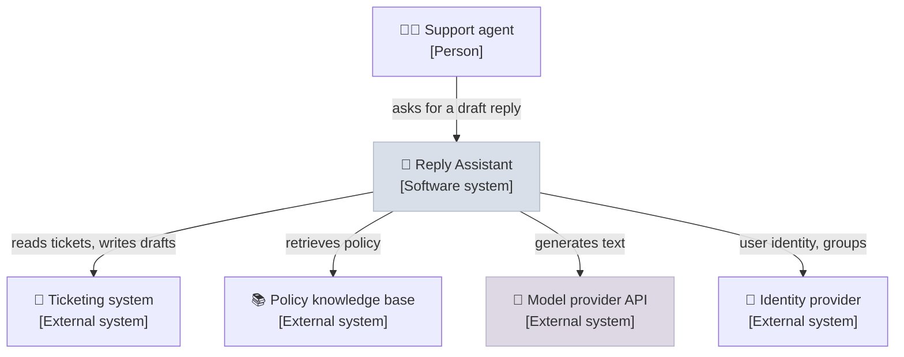
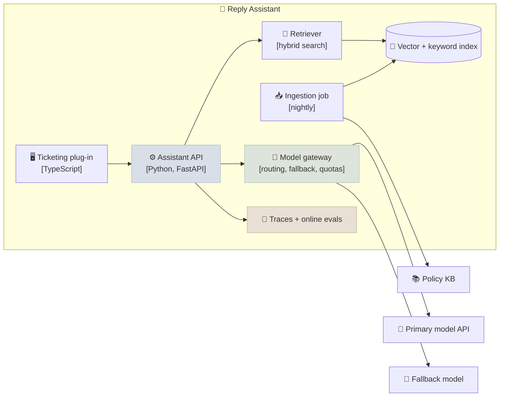

# Architecture Docs and ADRs

An architecture document explains what a system will be, why it is shaped that way, and what was rejected, so reviewers can find problems while they are cheap to fix. Architecture Decision Records (ADRs) keep each significant decision, with its context and consequences, after the document is out of date. This note covers the structure of a design doc for an AI system, C4-style diagrams at the right level of detail, non-functional requirements specific to AI, writing ADRs, honest trade-off tables and a risk register.

```objectives
time: 45 min
outcomes:
  - Structure a design document for an AI system, including goals and non-goals, alternatives, evaluation plan, cost and rollout
  - Draw context and container diagrams (C4 levels 1 and 2) for an LLM application
  - Write non-functional requirements for an AI system - latency, quality, safety, cost, data residency, auditability, model lifecycle
  - Write an ADR in the context / decision / consequences format and know when one is needed
  - Build a trade-off table backed by evidence and a risk register with owners
prerequisites:
  - "[Use-Case Qualification & ROI](02-Use-Case-Qualification-and-ROI.mdx)"
  - "A system you have built or studied, e.g. [RAG System Design](../../12-RAG/Notes/11-RAG-System-Design.mdx)"
```

## Why Write It Down

A design doc is a tool for **deciding**, not a record of what was built. Writing forces the author to find the gaps in their own reasoning, and review spreads the decision to the people who will run, secure and pay for the system. Google's engineering culture uses design docs this way, and Amazon's six-page narratives replace slide decks for the same reason: prose shows whether the argument holds together.

Scale the effort to the decision. A two-week prototype needs a page; a system that will handle regulated data across business units needs a full doc and a review.

---

## Design Doc Structure

| Section | What it answers |
|---|---|
| **Context and scope** | What problem, for whom, and what is out of scope - from the [discovery summary](01-Customer-Discovery-for-AI-Projects.mdx) |
| **Goals and non-goals** | What success is (the success statement) and what this system deliberately won't do |
| **Proposed design** | Context and container diagrams, main flows, data flows, key interfaces |
| **Alternatives considered** | Other designs and why they lost - often the most valuable section for reviewers |
| **Non-functional requirements** | Latency, availability, quality, safety, cost, data, auditability (below) |
| **Evaluation plan** | Eval sets, metrics, thresholds for launch, online monitoring ([Building Your Own Evals](../../07-Evaluation/Notes/04-Building-Your-Own-Evals.mdx)) |
| **Security and privacy** | Data classification, identity, threat model, prompt-injection exposure ([Agent Security](../../17-Production-Agents/Notes/02-Agent-Security.mdx)) |
| **Cost** | The unit cost model and monthly run cost at expected and peak volume |
| **Rollout** | Pilot, staged autonomy, rollback ([PoC to Production](05-PoC-to-Production.mdx)) |
| **Risks and open questions** | The risk register, and what still needs deciding |

**Non-goals** deserve special attention in AI projects. "Will not make credit decisions", "will not answer questions outside HR policy", "will not support languages other than English in phase 1" - each one prevents scope creep and sets expectations for reviewers in risk and compliance.

---

## C4 Diagrams

The C4 model (Simon Brown) describes software at four zoom levels: **Context** (the system and the people and systems around it), **Containers** (deployable or runnable parts: apps, services, databases), **Components** (parts inside a container) and **Code**. For most AI design docs, levels 1 and 2 are enough; draw level 3 only for the part under debate.

**Level 1 - Context:** who uses the system and what it depends on.



**Level 2 - Containers:** what you will build and run, and how the parts talk.



Diagram rules that save review time: label every arrow with what flows; mark what is **yours** versus external; show where **sensitive data** crosses a boundary; and keep one diagram per question - a single diagram that shows everything answers nothing.

---

## Non-Functional Requirements for AI Systems

| Requirement | Write it as | Example |
|---|---|---|
| **Latency** | Percentile targets per interaction type | TTFT under 1.5 s at p95; full draft under 8 s at p95 |
| **Availability** | SLO over a window, plus degraded mode | 99.5% monthly; if the model is down, show retrieved policy without a draft |
| **Quality** | Eval metric and launch threshold on a named set | At least 90% of drafts rated "send with minor edits" on the 300-ticket held-out set |
| **Safety** | Policy categories, ASR and over-refusal limits | No disclosure of other customers' data; prompt-injection ASR under 2% on the attack suite |
| **Cost** | Per task and monthly ceiling | Under $0.05 model cost per draft; alert at 120% of forecast spend |
| **Data** | Residency, retention, training use | EU processing only; prompts not retained by the provider beyond 30 days; no training on customer data |
| **Auditability** | What is logged and for how long | Every draft logged with prompt, model and index versions for 1 year |
| **Model lifecycle** | How model changes are handled | Pin dated model versions; re-run evals before any upgrade; plan for provider deprecation notices |

The last row is easy to forget: hosted models are deprecated on the provider's schedule, often with a few months' notice. The design must make a model swap a tested, routine change ([Observability, SLOs & Incidents](../../09-Production-Engineering/Notes/06-LLM-Observability-SLOs-and-Incident-Response.mdx)).

---

## Architecture Decision Records

An ADR records **one** significant decision. Michael Nygard's original format (2011) is still the common one:

```markdown
# ADR 0004: Use a hosted model API behind a gateway, not self-hosted models

Status: Accepted (2026-10-02). Supersedes: none.

## Context
Pilot volume is ~1,000 drafts/day, rising to ~10,000. The team has no GPU operations
experience. Data may be processed in the EU by providers with a zero-retention agreement.
Quality on the eval set: hosted model A 91%, self-hosted 8B model 78% (300 tickets).

## Decision
Call hosted model A through our model gateway, with model B from a second provider
as fallback. Revisit self-hosting if monthly model spend exceeds $15k or a data
requirement rules out hosted providers.

## Consequences
+ No GPU operations; best measured quality; fallback covers provider outages.
- Per-token cost grows linearly with volume; dependence on provider deprecation schedules.
- Gateway becomes a critical component and needs its own SLO.
```

Rules that keep ADRs useful:

- **Write one when the decision is expensive to reverse** or will be questioned later: model hosting, RAG vs fine-tuning, vector store, agent framework, data residency approach, human-review policy.
- **Keep them in the repository** (for example `docs/adr/0004-hosted-model-api.md`), numbered, next to the code.
- **Never edit an accepted ADR's decision** - write a new one that supersedes it, so the history of reasoning survives.
- **Include the evidence** - eval numbers, cost estimates, benchmarks - and the **trigger to revisit** ("if spend exceeds..."). A decision without its revisit condition hardens into dogma.

---

## Trade-off Tables

A trade-off table compares options on the criteria that matter for **this** decision, with evidence in the cells rather than unexplained scores:

| Criterion | Hosted API (A) | Managed platform (B) | Self-hosted 8B (C) |
|---|---|---|---|
| Quality on eval set | 91% (CI 88-94) | 89% (CI 85-92) | 78% (CI 73-82) |
| Model cost at 10k drafts/day | ≈ $8k/month | ≈ $9k/month | ≈ $6k/month GPU, plus on-call |
| Time to pilot | 3 weeks | 4 weeks | 8+ weeks |
| Data residency | EU region, zero retention | Our tenant | Our tenant |
| Operational burden | Low | Low | High |

Weighted scores (multiply each criterion by a weight and sum) look precise but mostly encode the author's weights. If you use them, show the weights and check whether the winner changes under reasonable alternative weights. Often a table plus one paragraph of judgment is more honest.

---

## Risk Register

| Risk | Likelihood | Impact | Mitigation | Owner |
|---|---|---|---|---|
| Drafts contain wrong policy information | Medium | High | Retrieval with citations; agents review every draft; groundedness online eval | Tech lead |
| Prompt injection via customer email content | Medium | Medium | Treat email as untrusted data; no tools with write access; injection suite in CI | Security |
| Provider deprecates the model | High (over 18 months) | Medium | Pinned versions; eval-gated upgrade path; fallback provider | Platform |
| Low adoption by agents | Medium | High | Co-design with agents; measure edit time; champions in each team | Product owner |
| Spend exceeds forecast | Low | Medium | Per-request token caps; spend alerts; caching | Tech lead |

Every risk has an **owner** - a risk owned by "the team" is owned by no one.

---

## Check Yourself

```quiz
- q: "Which section of a design doc usually gives reviewers the most help in finding a better design?"
  options:
    - "The list of technologies used"
    - "Alternatives considered, with why each lost"
    - "The team roster"
    - "The glossary"
  answer: 2
  explain: "Alternatives show the author's reasoning and let reviewers spot an option that was dismissed for a weak reason, or one that was never considered."
- q: "Six months after accepting ADR 0004 (hosted API), the team decides to self-host. What should happen to ADR 0004?"
  options:
    - "Edit its Decision section to say self-hosting"
    - "Delete it"
    - "Leave it unchanged, mark it superseded, and write a new ADR with the new context and evidence"
    - "Nothing - ADRs are only for the initial design"
  answer: 3
  explain: "ADRs are an append-only history of reasoning. The new ADR explains what changed (volume, cost, a data requirement); the old one shows why the earlier choice was right at the time."
- q: "Why is 'model lifecycle' a non-functional requirement for systems built on hosted models?"
  answer: "Providers deprecate and update models on their own schedule. Unless the design pins versions, re-runs evals before upgrades and can switch models routinely, a deprecation notice becomes an emergency and a silent provider update becomes a quality incident."
- q: "What two things should every ADR include beyond the decision itself?"
  answer: "The context and evidence behind it (constraints, eval results, cost estimates) and its consequences - including a trigger for revisiting it, such as a spend or volume threshold."
```

## Exercises

```exercise
- title: Write the ADR
  task: |
    Your team must choose between RAG over the policy documents and fine-tuning a model on them for an internal HR policy assistant. Facts: 600 documents, updated weekly; answers must cite the policy section; eval set of 200 questions shows RAG at 87% correct and a fine-tuned 8B model at 74%; legal requires answers to reflect the current policy within one day of a change. Write the ADR.
  solution: |
    **ADR 0002: Use retrieval-augmented generation over HR policies, not fine-tuning**

    Status: Accepted.

    **Context:** 600 policy documents, updated weekly; legal requires answers to reflect changes within one day and to cite the policy section. On a 200-question eval set, RAG with a hosted model scored 87%, a fine-tuned 8B model 74%.

    **Decision:** Use RAG with section-level chunking and mandatory citations. Do not fine-tune on policy content.

    **Consequences:** (+) Policy changes take effect after the nightly re-index, inside the one-day requirement; citations come from retrieved sections; higher measured accuracy. (-) Depends on retrieval quality for multi-document questions; per-query retrieval and token cost. Fine-tuning would need retraining weekly and cannot cite sources reliably. Revisit if a style or format requirement emerges that prompting can't meet - fine-tuning for style alongside RAG for facts would then be considered in a new ADR.
- title: Find the missing non-functional requirements
  task: |
    A design doc for a clinical-notes summarizer lists these NFRs: "Fast. Accurate. Secure. Scalable." Rewrite them as measurable requirements and add two the author missed.
  solution: |
    - **Latency:** summary of a 20-page record in under 15 s at p95.
    - **Quality:** at least 95% of summaries rated clinically accurate with no omitted critical item (allergies, active medications) by two clinicians on a 150-record held-out set; zero fabricated medications.
    - **Security and privacy:** PHI processed only in the hospital's cloud tenant; no retention or training by the provider; access limited to the treating care team via the existing identity provider; HIPAA safeguards per [Security & Compliance](../../09-Production-Engineering/Notes/04-Security-and-Compliance.mdx).
    - **Scalability:** 3,000 summaries/day with peaks of 400/hour.
    - **Missed: auditability** - every summary logged with source record version, prompt and model versions, retained per records policy.
    - **Missed: model lifecycle and degraded mode** - pinned model versions with eval-gated upgrades; if the model is unavailable, clinicians see the source record with no summary rather than a stale one.
```

## Study Notes

**Must-know:**
- Design docs are decision tools: context, goals and non-goals, design, alternatives, NFRs, eval plan, security, cost, rollout, risks
- C4: context, containers, components, code - levels 1 and 2 are enough for most AI docs; label arrows, mark sensitive data crossings
- AI NFRs: latency percentiles, availability with degraded mode, quality thresholds on a named eval set, safety limits, cost per task, data residency and retention, auditability, model lifecycle
- ADR = context, decision, consequences, plus evidence and a revisit trigger; one decision each; append-only, superseded not edited
- Trade-off tables carry evidence; weighted scores need visible weights and a sensitivity check
- Risk register: likelihood, impact, mitigation and a named owner

## References

- Nygard, [Documenting Architecture Decisions](https://www.cognitect.com/blog/2011/11/15/documenting-architecture-decisions) (2011); [ADR GitHub organization](https://adr.github.io/) - templates and tooling
- Brown, [The C4 model for visualising software architecture](https://c4model.com/) (2018-2026)
- Ubl, [Design Docs at Google](https://www.industrialempathy.com/posts/design-docs-at-google/) (2020)
- Starke and Hruschka, [arc42 architecture documentation template](https://arc42.org/) (2005-2026)
- Bezos, [2017 Letter to Shareholders](https://www.aboutamazon.com/news/company-news/2017-letter-to-shareholders) (Amazon, 2018) - six-page narrative memos
- AWS, [Well-Architected Generative AI Lens](https://docs.aws.amazon.com/wellarchitected/latest/generative-ai-lens/generative-ai-lens.html) (2025); Microsoft, [Azure Well-Architected Framework - AI workloads](https://learn.microsoft.com/en-us/azure/well-architected/ai/) (2025)

*Last reviewed: 2026-10*
