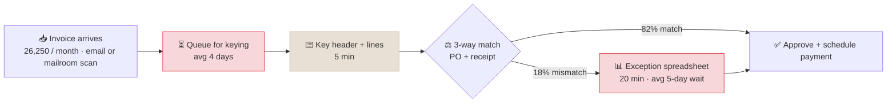
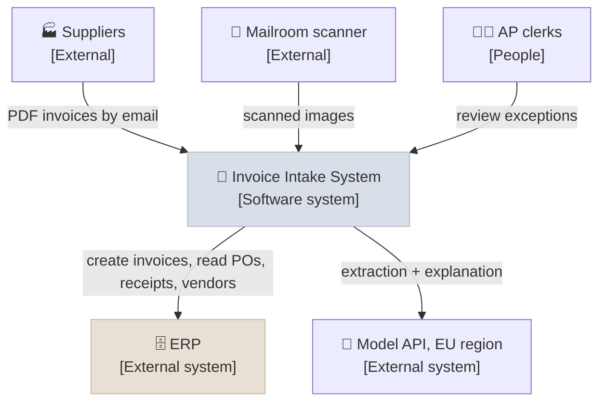
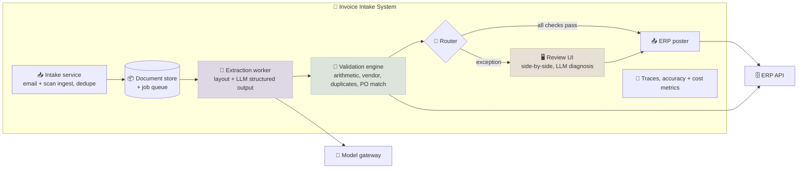
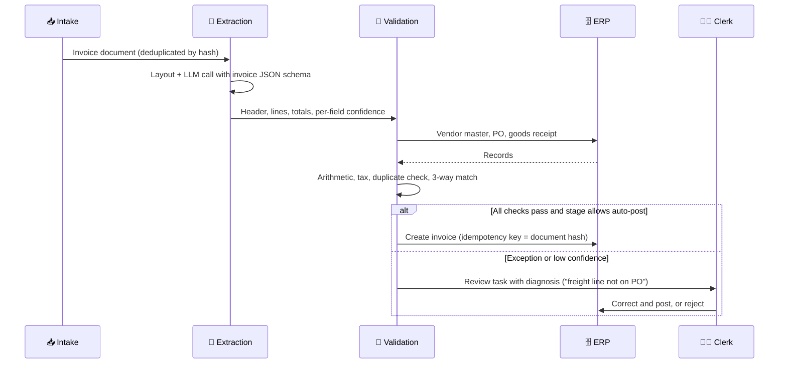

# System Design: Discovery to Architecture

> **Domain:** Finance operations · **Pattern:** Document extraction + deterministic validation + staged autonomy
>
> ← [Back to Solutions Architecture & Communication](../INDEX.mdx)

```objectives
time: 60 min
outcomes:
  - Turn raw discovery notes into a problem statement and a success metric that targets the real source of value
  - Qualify the use case and decide which parts need an LLM and which need deterministic code
  - Produce context and container diagrams, a main-flow sequence diagram and three ADRs for the system
  - Build the unit cost and ROI model, and a pilot plan with staged autonomy and exit criteria
prerequisites:
  - "The five notes in this module, especially [Customer Discovery](../Notes/01-Customer-Discovery-for-AI-Projects.mdx) and [Architecture Docs & ADRs](../Notes/03-Architecture-Docs-and-ADRs.mdx)"
  - "[Structured Outputs](../../11-Prompt-Engineering/Notes/04-Structured-Outputs.mdx) and [Document Processing & Chunking](../../12-RAG/Notes/03-Document-Processing-and-Chunking.mdx)"
```

All company details, volumes and prices in this design are illustrative.

---

## Interview Problem Statement

> **"Our accounts-payable team is drowning in invoices. Can AI help?"**

The request names a solution area, not a problem. The design starts with discovery.

---

## Discovery Notes

Excerpts from four conversations with a wholesale distributor - the AP manager, two AP clerks, the CFO and the ERP lead:

| Source | What they said (facts, not opinions) |
|---|---|
| AP manager | 35,000 supplier invoices a month from about 2,800 suppliers. Team of 14 clerks. "Last month we had 300 overtime hours." |
| AP clerk | Walked through the last invoice: open the email, download the PDF, key header and lines into the ERP (about 5 minutes), then the system runs the 3-way match against PO and goods receipt. "Mismatches go to a spreadsheet and take 20 minutes each." |
| AP manager | Channel split: 25% EDI (already automated end to end), 60% PDF by email, 15% paper scanned in the mailroom. About 18% of invoices fail the 3-way match. |
| CFO | "My real problem is the discounts." About 30% of spend ($180M of $600M a year) is with suppliers offering 2% off for payment within 10 days. Average invoice-to-approval cycle is 12 days, so only 35% of those discounts are captured. |
| ERP lead | Customized ERP with a REST API for creating invoices and reading POs, receipts and the vendor master. Invoices must not be posted without a PO match or an approver. |
| AP clerk | Showed three hard invoices: a multi-page invoice with 140 lines, a scanned one with a handwritten correction, and one whose total included a freight line not on the PO. |

What discovery changed:

- **EDI needs no AI.** The scope is the 75% of invoices that arrive as PDFs or scans - about **26,250 a month**.
- **The biggest value is cycle time, not keying time.** Keying costs roughly $79k a month in clerk time; the uncaptured early-payment discounts are worth about **$2.3M a year** at current capture.
- **Exceptions are where time goes.** 18% of invoices fail matching and take four times as long as keying.
- **Hard rules exist.** No posting without a PO match or approval - the system must keep that control.

---

## Problem and Success Statement

**Problem:** Invoice processing takes 12 days on average, mostly in manual keying queues and exception handling, so the company misses most early-payment discounts and pays overtime to keep up.

**Success statement:** *Reduce invoice-to-approval cycle time for PDF and scanned invoices from 12 days to 4 days (median), and raise early-payment discount capture from 35% to 80%, within two quarters of pilot start, measured from ERP timestamps and the discount ledger, without increasing the payment-error rate (duplicate or wrong-amount payments, baseline 0.4%).*

---

## Workflow Map



The queue before keying and the exception wait account for most of the 12 days. Extraction speeds up keying; **routing exceptions with a diagnosis** attacks the second queue.

---

## Qualification

| Axis | Score | Reason |
|---|---|---|
| Value | 5 | High volume; discount capture tied directly to a CFO-owned metric |
| Feasibility | 4 | Invoice extraction is a well-proven task for vision-capable models with structured output; ground truth exists (every keyed invoice in the ERP for the last 3 years); ERP has an API |
| Risk | 4 | Errors can be costly (wrong payments) but are caught by deterministic matching and approval before payment; nothing is paid on extraction alone |

Which parts need an LLM:

| Step | Approach | Why |
|---|---|---|
| Read the invoice (any layout, scans, multi-page) | **LLM** with vision and structured output | 2,800 supplier layouts; templates don't scale |
| Check arithmetic, totals and tax | **Code** | Exact; must never be "probably right" |
| Match to PO and goods receipt | **Code** (ERP rules) | Existing, audited business rules |
| Explain a mismatch and suggest a resolution | **LLM** | Reading PO lines against invoice lines and summarizing the difference for a clerk |
| Decide to post or pay | **Rules + human approval** | A financial control that must stay deterministic and auditable |

---

## Architecture

**Context:**



**Containers:**



**Main flow:**



---

## ADRs

**ADR 0001 - Build on a model API with our own validation layer, rather than buy an AP automation product.**
*Context:* Discovery quotes for AP automation products came in at about $0.80-1.20 per invoice (illustrative), with limited support for the customized ERP's exception workflow. The extraction eval (500 historical invoices, stratified by channel and supplier size) scored 97.1% field-level accuracy for a hosted vision model with structured output. *Decision:* Build extraction on a hosted model through a gateway; build validation and the review UI in-house. *Consequences:* Lower unit cost and a better fit to the ERP; the team owns the operation. *Revisit* if maintenance exceeds one engineer, or if a product proves equal accuracy and ERP fit in a bake-off.

**ADR 0002 - Deterministic code for arithmetic, matching and posting decisions.**
*Context:* Payments must be exact and auditable; the ERP already holds the matching rules. *Decision:* The LLM only extracts and explains; code validates and decides routing; posting needs either all checks passing (at the auto-post stage) or a clerk. *Consequences:* The worst case of an extraction error is a caught exception, not a wrong payment.

**ADR 0003 - Staged autonomy, with straight-through posting limited to low-risk invoices.**
*Context:* Clerks need to trust the system, and the payment-error guardrail must not move. *Decision:* Shadow for 3 weeks, assist for 6, then auto-post only PO-backed invoices under $5,000 from established suppliers with every check passing. *Consequences:* Slower initial benefit; measured evidence at every step. *Revisit* the $5,000 limit after 3 months of sampled review.

---

## Non-Functional Requirements

| Requirement | Target |
|---|---|
| Throughput | 26,250 invoices/month, peaks of 3,000/day at month end |
| Latency | Extraction and validation within 10 minutes of arrival (batch, not interactive) |
| Quality | At least 97% field-level accuracy on the held-out set; zero auto-posted invoices with a wrong amount in sampled review |
| Data | EU processing; no provider retention or training; invoices retained per finance policy |
| Auditability | Every posting linked to source document, extracted JSON, model and prompt versions, checks run and the human who approved |
| Idempotency | Document-hash idempotency key on every ERP write, so retries never create duplicate invoices |

---

## Cost and ROI

| Per invoice | Assumption | Cost |
|---|---|---|
| Model | 3,000 input + 400 output tokens at an illustrative $1 / $4 per million | $0.005 |
| Layout / OCR service | 2 pages at an illustrative $0.01 per page | $0.02 |
| Infrastructure | $4,000/month over 26,250 invoices | $0.15 |
| Human review | 30% of invoices reviewed for 2 minutes at $36/hour | $0.36 |
| **New total** | | **≈ $0.54** |
| **Today** | 5 minutes keying at $36/hour | **$3.00** |

- **Labour:** `26,250 x ($3.00 - $0.54) ≈ $65,000` a month, about 1,900 clerk hours - mostly **capacity**, which the AP manager plans to use to eliminate overtime (300 hours, a cash saving) and to work exceptions faster.
- **Discounts:** raising capture from 35% to 80% on $180M of eligible spend: `45% x $180M x 2% ≈ $1.6M` a year, or about $135,000 a month - **cash**, and the reason the CFO cares.
- **One-off cost:** $350,000 build plus $60,000 change management and training.

| Scenario | Monthly benefit | Payback |
|---|---|---|
| Base: labour + discounts to 80% | ≈ $200,000 | ≈ 2 months |
| Discounts only reach 60% | ≈ $140,000 | ≈ 3 months |
| Labour only (no cycle-time gain) | ≈ $65,000 | ≈ 6 months |

The business case does not depend on the discount assumption, but it is much stronger with it - so cycle time is the pilot's headline metric.

---

## Pilot Plan

| Phase | Weeks | Scope | Gate to next phase |
|---|---|---|---|
| **Shadow** | 1-3 | All PDF invoices from 300 suppliers; clerks key as usual; extraction compared with what they keyed | Field accuracy at least 97%; no systematic errors on any supplier segment |
| **Assist** | 4-9 | Same suppliers; clerks review pre-filled invoices and exceptions with diagnoses | Review time at or below 2 min median; clerk acceptance at least 85%; payment-error rate at or below 0.4% |
| **Auto-post (limited)** | 10-12 | PO-backed invoices under $5,000, established suppliers, all checks passing | Sampled review (10%) finds no wrong amounts |

**Exit criteria at week 12:** go if median cycle time for pilot suppliers is down at least 50% against matched control suppliers and discount capture on pilot suppliers is above 65%; iterate (one 6-week cycle) if cycle time is down 25-50%; stop below 25% or on any wrong payment caused by the system.

---

## Risks

| Risk | Mitigation | Owner |
|---|---|---|
| Extraction error leads to a wrong payment | Deterministic validation and 3-way match; auto-post limits; sampled review | Finance systems lead |
| Duplicate invoices posted (re-sent PDFs, retries) | Document-hash dedupe at intake; idempotency key on ERP writes; ERP duplicate check | Tech lead |
| Invoice-fraud attempts (altered bank details) | Bank details never taken from invoices - only from the vendor master, changed through a separate verified process | AP manager |
| Prompt injection in invoice text | Model has no tools; output is schema-constrained data validated by code | Security |
| Clerks distrust or bypass the system | Clerks co-design the review UI; champions; time-saved results shared weekly | AP manager |
| Model deprecation | Pinned versions; 500-invoice regression eval before any upgrade | Tech lead |

---

## Production Controls

| Control | Where it's covered |
|---|---|
| Structured output with a JSON schema | [Structured Outputs](../../11-Prompt-Engineering/Notes/04-Structured-Outputs.mdx) |
| Layout-aware parsing of scans and tables | [Document Processing & Chunking](../../12-RAG/Notes/03-Document-Processing-and-Chunking.mdx) |
| Idempotent writes, retries, human approval | [Production Agent Architecture](../../17-Production-Agents/Notes/01-Production-Agent-Architecture.mdx) |
| Eval set with confidence intervals and a CI gate | [Building Your Own Evals](../../07-Evaluation/Notes/04-Building-Your-Own-Evals.mdx) |
| SLOs, alerts and incident runbooks | [Observability, SLOs & Incidents](../../09-Production-Engineering/Notes/06-LLM-Observability-SLOs-and-Incident-Response.mdx) |
| Pilot exit criteria and staged autonomy | [PoC to Production](../Notes/05-PoC-to-Production.mdx) |

---

## References

- Ryseff, De Bruhl and Newberry, [The Root Causes of Failure for Artificial Intelligence Projects](https://www.rand.org/pubs/research_reports/RRA2680-1.html) (RAND, 2024)
- Nygard, [Documenting Architecture Decisions](https://www.cognitect.com/blog/2011/11/15/documenting-architecture-decisions) (2011)
- Brown, [The C4 model](https://c4model.com/) (2018-2026)
- AWS, [Well-Architected Generative AI Lens](https://docs.aws.amazon.com/wellarchitected/latest/generative-ai-lens/generative-ai-lens.html) (2025)

*Last reviewed: 2026-10*
