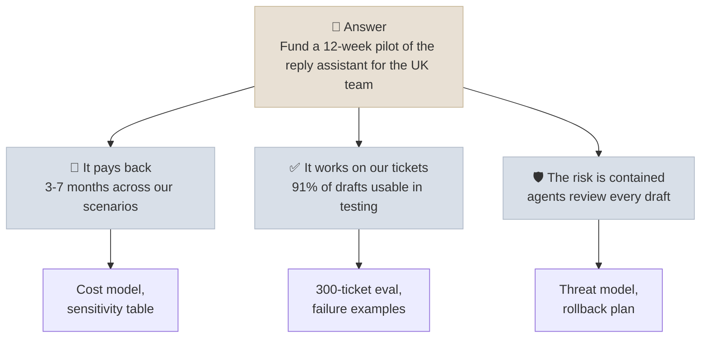

# Communicating to Technical and Executive Audiences

Architecture communication is explaining a system so each audience can make the decision that belongs to them: executives decide whether to fund and accept the risk, engineers and security reviewers decide whether the design is sound, end users decide whether to trust it. This note covers answer-first structure, telling the same system two ways, explaining uncertainty and eval results to non-specialists, whiteboarding a design, demos that build justified trust, and handling the objections every AI project meets.

```objectives
time: 40 min
outcomes:
  - Structure a message answer-first (conclusion, then supporting points, then evidence)
  - Explain the same AI system to an executive and to an engineering reviewer, choosing what each needs
  - Present eval results and uncertainty in plain language without overstating or hiding them
  - Run a whiteboard design discussion and a demo that shows limits as well as strengths
  - Answer the common objections to AI projects with evidence rather than reassurance
prerequisites:
  - "[Architecture Docs & ADRs](03-Architecture-Docs-and-ADRs.mdx)"
  - "[Building Your Own Evals](../../04-Evaluation/Notes/04-Building-Your-Own-Evals.mdx) - confidence intervals"
```

## Lead With the Answer

Barbara Minto's *Pyramid Principle* - and the military's "bottom line up front" - say the same thing: **start with the conclusion**, then the few arguments that support it, then the evidence behind each. Busy readers stop early; give them the part they need first.



| Bottom-up (hard to follow) | Answer-first |
|---|---|
| "We evaluated three models on 300 tickets, built a retrieval index, measured edit times, modelled costs under four scenarios, and therefore we recommend a pilot." | "We recommend a 12-week pilot. It pays back in 3-7 months, drafts were usable 91% of the time on our own tickets, and agents review everything before it is sent. Details follow." |

---

## One System, Two Audiences

| | Executive / sponsor | Engineering / security reviewer |
|---|---|---|
| **Wants to decide** | Fund it? Accept the risk? | Is the design sound, secure and operable? |
| **Cares about** | Outcome, cost, timeline, risk, what happens if it fails | Data flows, failure modes, dependencies, evals, operations |
| **Unit of evidence** | Business metric moved, payback, comparable cases | Eval results with CIs, threat model, load tests, ADRs |
| **Time you get** | 5-10 minutes, often interrupted | An hour, with questions |
| **Avoid** | Jargon, architecture diagrams, model names | Hand-waving, marketing language, untested claims |

Here is the same reply assistant explained both ways. Use the audience toggle at the top of the page to switch views.

<div class="audience-biz" markdown="1">

**For the sponsor:** The assistant writes a first draft of each customer reply using our own policy documents and the customer's history. An agent reads it, edits it and sends it - nothing goes out without a person approving it. In testing on 300 real tickets, about nine in ten drafts needed only small edits, cutting the time per reply from about 9 minutes to about 3. At the adoption we expect, that frees roughly 2,000 agent hours a month and pays back the build in three to seven months. The main risk is a draft with wrong policy information; agents are the check on that, and we measure how often they catch problems. If the pilot doesn't hit its targets after 12 weeks, we stop.

</div>

<div class="audience-tech" markdown="1">

**For the reviewer:** A ticketing plug-in calls an assistant API, which runs hybrid retrieval (BM25 plus dense vectors, reranked) over a nightly-built policy index and the ticket history, then calls a hosted model through our gateway with a fallback provider. Drafts carry citations to policy sections. Customer email content is treated as untrusted data: the model has no write tools, so injection can at worst produce a bad draft that an agent reviews. Evaluation: 300 held-out tickets, 91% "send with minor edits" (95% CI 88-94%), groundedness checked by a judge validated against 100 human labels; the same judge runs online on 5% of traffic. Traces follow OpenTelemetry GenAI conventions; SLOs are TTFT p95 under 1.5 s and 99.5% availability with a retrieval-only degraded mode. Decisions and their revisit triggers are in ADRs 0001-0006.

</div>

---

## Explaining Uncertainty and Eval Results

Executives make decisions under uncertainty every day; what they need is the uncertainty stated plainly, not hidden or drowned in statistics.

| Instead of | Say |
|---|---|
| "91.3% accuracy" | "About 9 in 10 drafts needed only small edits on 300 of our own tickets. The true rate is very likely between 88% and 94%." |
| "Hallucination rate 2.1%" | "About 1 in 50 drafts contained a policy detail that wasn't in our documents. Agents caught all of them in testing; we'll keep measuring that in the pilot." |
| "It's state of the art" | "It beat the other two options we tested on our tickets, and here's how it compares to how our agents do today." |
| "It never makes mistakes" | (Never say this.) |

Practices that keep the message honest:

- **Use natural frequencies** ("1 in 50") rather than percentages for rare events - research by Gigerenzer and Hoffrage shows people reason about them more accurately.
- **Compare with the human baseline.** "Agents mis-quote policy in about 3% of replies today" turns an abstract error rate into a decision.
- **Show real failures.** Two or three actual bad outputs, and how each would be caught, build more trust than a perfect score.
- **Say what you haven't tested** - other languages, rare ticket types, peak load.

---

## Whiteboarding a Design

Whether in an interview or a customer workshop, the same sequence works:

1. **Clarify** - restate the goal, the users, the scale and the constraints; ask what success looks like. Write the numbers on the board.
2. **Draw the context** - users, the system as one box, the systems around it.
3. **Walk the main flow** - one request, end to end, adding containers as you go.
4. **Find the hard part** - usually retrieval quality, an integration, a risk control or a latency budget - and go deep there.
5. **State the trade-offs** - "We could self-host for cost, but at this volume the hosted API is cheaper once you count on-call; I'd revisit at about 10x the volume."
6. **Close with how you'd know it works** - evals, SLOs, the pilot metric.

Think out loud, check in with the room ("does this match how your team works?"), and treat a correction as information, not a defeat.

---

## Demos That Build Trust

A demo should leave the audience with an **accurate** picture, not just a good feeling - an over-sold demo turns into a failed pilot when reality arrives.

- **Use their data** - real, anonymized examples from discovery, including a messy one.
- **Show the human control** - the review step, the approval, the citation the user can click.
- **Show a failure on purpose** - an out-of-scope question, a missing document - and what the system does about it.
- **Be honest about selection** - if examples are hand-picked, say so, and show the eval numbers that describe the typical case.
- **Have a backup** - a recording, in case the live service or network fails.

---

## Handling Objections

| Objection | What's usually behind it | Answer with |
|---|---|---|
| "It makes things up." | Fear of a public, costly error | Measured error rate vs the human baseline, how errors are caught (review, citations, guards), what the system does when unsure |
| "Our data will leak or be used for training." | Security, legal and contractual exposure | Data-flow diagram, provider terms (retention, training use), region, access controls, the threat model |
| "It's too expensive." | Unclear value or unpredictable cost | Unit cost model, payback range, spend caps and alerts, the cheapest option that met quality |
| "It will replace my team." | Job security, loss of control | The workflow role chosen (inform, assist) and why; what the team will do with the time; their involvement in the design and the pilot |
| "We'll be locked in." | Vendor dependence | Model gateway, eval set that makes switching testable, ADR with the revisit trigger |
| "How will we know it still works next month?" | Silent degradation | Online evals, SLOs, version pinning, alerting, incident process |
| "Who is accountable when it's wrong?" | Legal and organizational responsibility | The human decision point, audit logs, the process owner named in discovery |

Answer with **evidence and design**, not reassurance. An objection you can't answer is a risk to add to the register - and saying "we don't know yet, here's how we'll find out" is a credible answer.

---

## Check Yourself

```quiz
- q: "You have 5 minutes with a CFO to get approval for a pilot. What do you say first?"
  options:
    - "The architecture of the retrieval pipeline"
    - "Which models you evaluated and their benchmark scores"
    - "The recommendation, the payback range and the main risk, then details as asked"
    - "The history of the project so far"
  answer: 3
  explain: "Answer first: the decision you want, then the few points that support it. Details are there if asked, in the order the listener wants them."
- q: "Which statement presents an eval result best to a non-technical sponsor?"
  options:
    - "Accuracy is 91.3% with a Wilson 95% CI of [88.1, 94.0]."
    - "About 9 in 10 drafts needed only small edits on 300 of our tickets; the true rate is very likely between 88% and 94%."
    - "The model is highly accurate."
    - "It performs at state-of-the-art level."
  answer: 2
  explain: "Natural frequency, the sample it came from, and the uncertainty in plain words. The first is correct but not accessible; the last two are claims without evidence."
- q: "Why include a deliberate failure in a demo?"
  answer: "It shows how the system behaves at its limits and how failures are caught, which sets accurate expectations. A flawless demo creates expectations the pilot can't meet, and the first real failure then destroys trust."
- q: "A team lead says 'This will replace my team.' What is a good response?"
  answer: "Take it seriously and answer with the design: the role chosen for the AI (for example, drafting for agents to review, not sending on its own), what the freed time is intended for, and how the team is involved in shaping and evaluating the pilot. Don't promise outcomes you don't control; if headcount decisions are part of the business case, that conversation belongs with the sponsor and should be honest."
```

## Exercises

```exercise
- title: Rewrite answer-first
  task: |
    Rewrite this status update for a steering committee, answer-first, in under 80 words:

    "This sprint we finished the ingestion pipeline for the second document source, which took longer than expected because of permission mapping issues. We also re-ran the eval set and accuracy went from 84% to 89% after the reranker change. Latency went up by about 300 ms. We think we'll need another two weeks before the pilot can start, and we need a decision on whether the legal team's documents can be included."
  solution: |
    **Pilot start moves two weeks, to 14 November, and we need one decision: can legal's documents be included?** Progress: accuracy rose from 84% to 89% with a new reranker (latency +300 ms, still inside target). The delay came from mapping document permissions for the second source, now done. Decision needed by 25 October from the General Counsel's office.
- title: Prepare objection answers
  task: |
    You are presenting a contract-review assistant to a law firm's partners. Prepare a one-sentence answer, with the evidence you would bring, for: (1) "It will miss a clause and we'll be liable." (2) "Client documents can't leave our environment."
  solution: |
    1. "It flags clauses for a lawyer to review rather than approving anything, and in our test on 120 past contracts it found 96% of the clauses your associates flagged, plus 9 they missed - here are the misses on both sides." Evidence: the eval with per-clause-type recall, examples of misses, the review workflow.
    2. "Processing runs in your own cloud tenant with no provider retention or training on your data, and here is the data-flow diagram your IT team reviewed." Evidence: data-flow diagram, provider terms, the security review sign-off, access logs.
```

## Study Notes

**Must-know:**
- Answer first (Pyramid Principle / bottom line up front): conclusion, supporting points, evidence
- Executives decide on value, cost and risk; engineers and security decide on soundness - same facts, different selection and order
- Explain uncertainty in natural frequencies, with the sample and the range; compare with the human baseline; show real failures
- Whiteboard sequence: clarify with numbers, context, main flow, hard part, trade-offs, how you'd know it works
- Demos: their data, the human control, a deliberate failure, honest selection, a backup
- Answer objections with evidence and design; an unanswerable objection is a risk for the register

## References

- Minto, [The Pyramid Principle](https://www.barbaraminto.com/) (1987; 3rd ed. 2009)
- Gigerenzer and Hoffrage, [How to Improve Bayesian Reasoning Without Instruction: Frequency Formats](https://doi.org/10.1037/0033-295X.102.4.684) (Psychological Review, 1995)
- Amershi et al., [Guidelines for Human-AI Interaction](https://doi.org/10.1145/3290605.3300233) (CHI 2019)
- Google PAIR, [People + AI Guidebook - Explainability + Trust](https://pair.withgoogle.com/chapter/explainability-trust/) (2021)
- Bezos, [2017 Letter to Shareholders](https://www.aboutamazon.com/news/company-news/2017-letter-to-shareholders) (Amazon, 2018) - narrative memos instead of slides

*Last reviewed: 2026-10*
