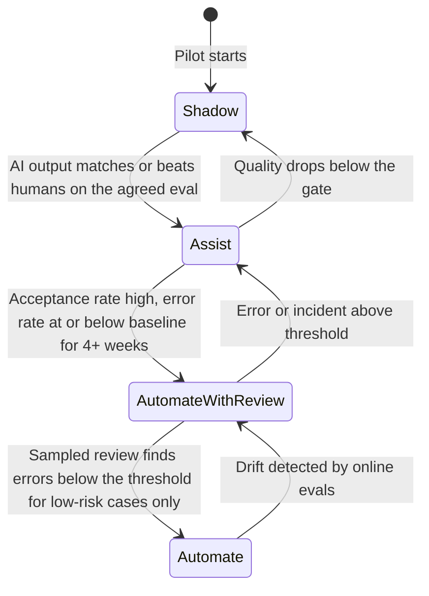

# PoC to Production

A proof of concept shows something **can** work; a pilot shows it **does** work for real users in the real workflow; production makes it dependable, owned and used. Many GenAI projects stall between the first and second step - impressive demos that never earn a production decision. This note covers what each stage must prove, exit criteria agreed before the pilot starts, raising AI autonomy in stages, measuring a pilot against a baseline, the production-readiness checklist, change management and handover.

```objectives
time: 45 min
outcomes:
  - Distinguish proof of concept, pilot and production by purpose, users, data and evidence
  - Write go / iterate / stop exit criteria for a pilot covering outcome, quality, safety, cost and adoption
  - Plan staged autonomy (shadow, assist, automate with review, automate) with a measured gate between stages
  - Design a pilot measurement against a baseline or control group, and choose adoption metrics
  - Run a production-readiness review and a handover that leaves the system with a clear owner
prerequisites:
  - "[Use-Case Qualification & ROI](02-Use-Case-Qualification-and-ROI.mdx)"
  - "[Model Lifecycle & Rollout](../../17-Production-Engineering/Notes/04-Model-Lifecycle-and-Rollout.mdx)"
```

## PoC, Pilot, Production

| | Proof of concept | Pilot | Production |
|---|---|---|---|
| **Question** | Can this work at all? | Does it work for real users, in the real workflow, at acceptable cost and risk? | Can we run it dependably, at scale, with an owner? |
| **Users** | The build team | A defined group of real users | Everyone in scope |
| **Data** | A sample, often cleaned | Real, live data with real permissions | All of it, with full governance |
| **Duration** | 2-6 weeks | 6-12 weeks | Ongoing |
| **Evidence** | Offline eval on a held-out set | Business metric vs baseline, adoption, incidents, measured cost | SLOs, online evals, cost against forecast, outcome tracking |
| **Typical failure** | Demo on hand-picked examples | No agreed success criteria, so no decision ("pilot purgatory") | No owner, so quality decays silently |

Gartner's 2024 prediction that at least 30% of GenAI projects would be abandoned after proof of concept named the causes: poor data quality, inadequate risk controls, escalating costs and unclear business value. Each stage below exists to surface one of those early.

---

## Exit Criteria Agreed Up Front

Write the pilot's exit criteria before it starts, and get the sponsor to sign them. Without them, the end of a pilot becomes a negotiation about what the numbers mean.

| Dimension | Go | Iterate | Stop |
|---|---|---|---|
| **Business outcome** | Handling time down 40% or more vs control | Down 15-40% | Down less than 15% |
| **Quality** | 90% or more drafts "minor edits" (online judge, validated) | 80-90% | Below 80% |
| **Safety and errors** | No severe incident; customer-facing error rate at or below baseline | One severe incident, root-caused and fixed | Repeated severe incidents |
| **Cost** | Within 20% of the model | 20-50% over, with a plan | More than 50% over |
| **Adoption** | 70% or more of eligible tickets use the assistant by week 8 | 40-70% | Below 40% |

"Iterate" needs a limit too - one more cycle with named changes, not an open-ended extension.

---

## Staged Autonomy

Raise the level of AI autonomy in steps, each with a measured gate. This is how a high-risk use case becomes safe to automate, and how a team earns users' trust.



| Stage | What happens | What it proves |
|---|---|---|
| **Shadow** | AI runs on live cases; humans work as before and never see its output; outputs are compared offline | Quality on real traffic, with zero user risk |
| **Assist** | Humans see the AI output and decide what to use | Usefulness, time saved, trust; humans catch errors |
| **Automate with review** | AI acts; humans review a sample or the exceptions (low confidence, high value) | Error rate when humans aren't checking everything |
| **Automate** | AI acts without review, for a defined low-risk segment | Only reached where errors are cheap, visible and reversible |

Not every use case should reach the last stage. For many - medical, legal, credit, anything with irreversible consequences - **assist** is the right end state. The human-in-the-loop patterns are in [Production Agent Architecture](../../15-Production-Agents/Notes/01-Production-Agent-Architecture.mdx).

---

## Measuring the Pilot

**Compare against a control, not a memory.** Seasonality, case mix and staffing change during a pilot; a before/after comparison can show an improvement that has nothing to do with the system. In order of strength:

1. **Randomized** - randomly assign eligible cases (or agents) to with/without the assistant. Strongest evidence; the approach of online controlled experiments.
2. **Parallel groups** - one team uses it, a comparable team doesn't, over the same weeks.
3. **Before/after** - the weakest; at least compare the same weeks of the previous year and adjust for volume.

**Adoption metrics** show whether people actually use it, and how:

| Metric | What it tells you |
|---|---|
| Coverage: share of eligible cases where the AI was used | Real adoption, not log-ins |
| Acceptance rate: share of AI outputs used as-is or with small edits | Usefulness |
| Edit distance or edit time on accepted outputs | How much work remains for the human |
| Override and rejection reasons | Where it fails - feed these to the eval set |
| Repeat use per user over weeks | Whether early enthusiasm lasts (novelty fades) |
| User satisfaction, in their own words | What the numbers miss |

Run the pilot long enough to get past the novelty effect - usually at least 6-8 weeks - and look at the trend, not just the average.

---

## Production Readiness

Before declaring production, check each item has evidence, not just an owner's assurance:

- **Evaluation** - regression eval in CI for prompts, models and indexes; online evals on sampled traffic ([Building Your Own Evals](../../04-Evaluation/Notes/04-Building-Your-Own-Evals.mdx))
- **Safety** - red-team suite run and findings fixed; guardrails tuned for ASR and over-refusal ([Safety Evaluation & Red-Teaming](../../04-Evaluation/Notes/05-Safety-Evaluation-and-Red-Teaming.mdx))
- **Reliability** - SLOs, burn-rate alerts, runbooks, degraded mode, tested rollback ([Observability, SLOs & Incidents](../../17-Production-Engineering/Notes/05-LLM-Observability-SLOs-and-Incident-Response.mdx))
- **Security and privacy** - threat model, security review, data protection impact assessment where required, provider terms on retention and training
- **Cost** - spend forecast, caps and alerts per tenant or route
- **Operations** - on-call rota, support channel for users, escalation path, model and version pinning with an upgrade process
- **Documentation** - architecture doc and ADRs current; user guidance on what the system is and isn't for
- **Compliance** - regulatory classification (for example under the EU AI Act timeline in [Security & Compliance](../../17-Production-Engineering/Notes/06-Security-and-Compliance.mdx)), audit logging

The [Helm Chart & Release Checklist lab](../../17-Production-Engineering/CodeLabs/01-Helm-Chart-and-Release-Checklist.mdx) builds the engineering half of this list as an artefact.

---

## Change Management

The MIT NANDA 2025 study attributed most stalled GenAI pilots to poor fit with how people actually work, not to model quality. A system people don't use has no ROI. Prosci's **ADKAR** model is a useful checklist for what each user needs:

| Stage | The user needs | What you do |
|---|---|---|
| **Awareness** | To know why the change is happening | Explain the problem it solves, in their terms |
| **Desire** | A reason to want it | Involve users in design and the pilot; show what's in it for them |
| **Knowledge** | To know how to use it | Short training on real cases, including when not to trust it |
| **Ability** | To use it in their real work | Floor support in the first weeks; champions in each team |
| **Reinforcement** | Reasons to keep using it | Share results; act visibly on their feedback; align targets and incentives |

Watch for incentives that work against adoption - a team measured on cases closed per hour may skip a tool that slows them down in its first weeks, even if it improves quality.

---

## Handover

A system without an owner decays: prompts drift from policy, the eval set goes stale, the provider deprecates the model. Hand over explicitly:

- **Named owners** - product owner (outcomes and roadmap), technical owner (system and on-call), data owner (sources and permissions)
- **The eval set** - who adds new cases from incidents and feedback, and how often it's reviewed
- **Model lifecycle** - who watches provider deprecation notices and runs the upgrade evals
- **Budget** - run cost forecast and who approves increases
- **Outcome tracking** - the business metric keeps being reported after the project team leaves, so the ROI claim stays true or gets corrected

---

## Check Yourself

```quiz
- q: "What most often turns a pilot into 'pilot purgatory'?"
  options:
    - "Choosing the wrong model"
    - "No exit criteria agreed before the pilot started, so its results don't lead to a decision"
    - "Running the pilot for too few users"
    - "Using a managed platform"
  answer: 2
  explain: "Without agreed go/iterate/stop thresholds, any result can be argued either way, and the pilot is extended instead of decided."
- q: "A use case drafts responses to insurance complaints. Which stage should the pilot start at?"
  options:
    - "Automate"
    - "Automate with review"
    - "Shadow, then assist"
    - "Production"
  answer: 3
  explain: "Start where users carry no risk (shadow) to measure quality on real traffic, then move to assist with humans approving every response. Complaints are sensitive; automation would need strong evidence over time, if ever."
- q: "Handling time fell 30% during a pilot that ran from November to January. Why is that not yet strong evidence?"
  answer: "Before/after comparisons are confounded by seasonality, case mix, staffing and novelty. Without a control group (randomized cases or a parallel team over the same weeks), the drop could be caused by something else, such as lower holiday volume or simpler cases."
- q: "Name three things that must have a named owner at handover, and why."
  answer: "Any three of: the business outcome and roadmap (product owner) - so value keeps being tracked; the system and on-call (technical owner) - so incidents are handled; data sources and permissions (data owner) - so access stays correct; the eval set - so it keeps up with new failures; model lifecycle - so deprecations and upgrades are handled; budget - so spend is controlled. Unowned, each decays silently."
```

## Exercises

```exercise
- title: Write the exit criteria
  task: |
    A retailer is piloting an assistant that answers store staff's questions about returns policy (pilot: 40 stores, 10 weeks). Baseline: staff phone a central help desk for about 6,000 policy questions a month, average 7 minutes per call including wait; 4% of answers given are later found wrong. Write go / iterate / stop criteria for four dimensions.
  solution: |
    | Dimension | Go | Iterate | Stop |
    |---|---|---|---|
    | Business outcome: help-desk calls from pilot stores vs control stores | Down 50% or more | Down 20-50% | Down less than 20% |
    | Quality: answers judged correct on weekly sample of 200, validated judge | 96% or more (at least matching the help desk's 4% error) | 92-96% | Below 92% |
    | Adoption: share of pilot-store staff asking at least 2 questions/week by week 6 | 60% or more | 30-60% | Below 30% |
    | Safety: wrong answers that led to a customer refund dispute or complaint | No more than control stores | Up to 2x control, root-caused | More than 2x control |

    Plus: one iterate cycle of at most 6 weeks with named changes, and cost within 20% of forecast as a gate.
- title: Design the pilot measurement
  task: |
    For the retailer pilot above, describe how you would assign stores, what you would compare, and two adoption metrics beyond usage counts.
  solution: |
    Pair the 80 candidate stores by size and region, then randomly assign one of each pair to pilot and one to control (40 each). Compare help-desk calls per store per week, wrong-answer rate (from help-desk audits and complaint logs) and refund disputes over the same 10 weeks, with the 4 weeks before the pilot as a covariate. Adoption beyond usage: **repeat use per staff member** by week (to see if novelty fades) and **escalation rate** - questions where staff still phoned the help desk after asking the assistant, with reasons, which feed the eval set.
```

## Study Notes

**Must-know:**
- PoC proves it can work; pilot proves it does work for real users at acceptable cost and risk; production makes it dependable and owned
- Exit criteria (go / iterate / stop) across outcome, quality, safety, cost and adoption, signed before the pilot; "iterate" is time-boxed
- Staged autonomy: shadow, assist, automate with review, automate - measured gates, and the right end state may be assist
- Measure against a control (randomized or parallel group) rather than before/after; run past the novelty effect
- Adoption metrics: coverage, acceptance, edit time, override reasons, repeat use, satisfaction
- Production readiness: evals in CI, safety, SLOs and runbooks, security, cost controls, operations, docs, compliance
- Change management (ADKAR) and aligned incentives; handover with named owners for outcome, system, data, eval set, model lifecycle and budget

## References

- Gartner, [Gartner Predicts 30% of Generative AI Projects Will Be Abandoned After Proof of Concept by End of 2025](https://www.gartner.com/en/newsroom/press-releases/2024-07-29-gartner-predicts-30-percent-of-generative-ai-projects-will-be-abandoned-after-proof-of-concept-by-end-of-2025) (2024)
- MIT NANDA, [The GenAI Divide: State of AI in Business 2025](https://nanda.media.mit.edu/ai_report_2025.pdf) (2025)
- Kohavi, Tang and Xu, [Trustworthy Online Controlled Experiments](https://experimentguide.com/) (Cambridge University Press, 2020)
- Prosci, [The ADKAR Model](https://www.prosci.com/methodology/adkar) (2026)
- Amershi et al., [Guidelines for Human-AI Interaction](https://doi.org/10.1145/3290605.3300233) (CHI 2019)
- Sculley et al., [Hidden Technical Debt in Machine Learning Systems](https://papers.nips.cc/paper/5656-hidden-technical-debt-in-machine-learning-systems) (NeurIPS 2015)

*Last reviewed: 2026-10*
