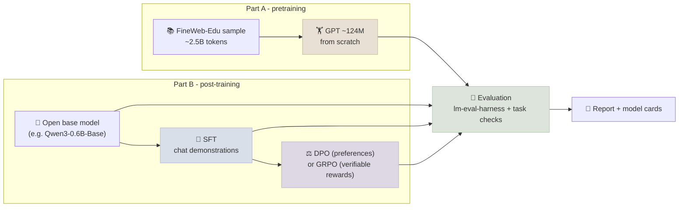

# Capstone 1 - Train and Post-Train a Small Model

Take a language model through every stage the course covers: pretrain a small GPT from scratch at a compute-optimal scale, post-train an open base model into an assistant with supervised fine-tuning and then preference optimization or reinforcement learning with verifiable rewards, and evaluate both honestly. The deliverable is not a state-of-the-art model - it is a reproducible pipeline and a report whose every claim is measured.

← **Back to Overview:** [Capstones](../INDEX.mdx)

```objectives
time: 30-40 hours (plus about a day of GPU time)
outcomes:
  - Pretrain a ~124M-parameter decoder-only model on ~2.5B tokens, choosing size and data with the Chinchilla rule of thumb and measuring MFU
  - Post-train a small open base model with SFT and then DPO or GRPO, with loss masking, held-out validation and a documented data pipeline
  - Evaluate base, SFT and final models with lm-evaluation-harness and task-specific checks, reporting confidence intervals and paired comparisons
  - Write model cards and a report covering data, compute, results, contamination checks and limitations
prerequisites:
  - "[GPT From Scratch](../../06-PyTorch/CodeLabs/02-GPT-From-Scratch.mdx), [Scaling Laws](../../07-Pretraining/INDEX.mdx) and [GPU & Hardware](../../07-Pretraining/Notes/02-GPU-and-Hardware.mdx)"
  - "[SFT, DPO and GRPO with TRL](../../08-Post-Training/CodeLabs/02-SFT-DPO-GRPO-with-TRL.mdx) and [Post-Training & Fine-Tuning](../../08-Post-Training/INDEX.mdx)"
  - "[Eval Harness](../../04-Evaluation/CodeLabs/01-Eval-Harness.mdx)"
```

## The Pipeline



Pretraining your own model teaches the mechanics of scale; post-training a stronger open base model teaches the mechanics of alignment. Post-training your own 124M model is allowed as a stretch goal, but at that size the results are hard to interpret.

## Part A - Pretraining (about 40%)

1. **Size the run.** Scale the [GPT From Scratch](../../06-PyTorch/CodeLabs/02-GPT-From-Scratch.mdx) model to about 124M parameters (for example 12 layers, d_model 768, 12 query heads with grouped-query attention, a GPT-2-sized vocabulary with tied embeddings). At about 20 tokens per parameter, Chinchilla's rule of thumb gives ~2.5B tokens and a budget of `6 × N × D ≈ 1.9 × 10¹⁸` FLOPs - roughly 1.5 hours on one H100 or 8-10 hours on an RTX 4090 at 30-40% MFU.
2. **Prepare data.** Stream a sample of FineWeb-Edu (the `sample-10BT` subset is more than enough), tokenize to a flat token file, and hold out a validation split. Record exact dataset versions and token counts.
3. **Train.** bf16 mixed precision, `torch.compile`, a warmup-stable-decay or cosine schedule, gradient clipping, checkpoints you can resume from. Log training and validation loss, tokens/s and **MFU** throughout.
4. **Evaluate.** Validation loss and perplexity; zero-shot HellaSwag and ARC-Easy with lm-evaluation-harness against the random baseline (25%); samples at several checkpoints.

**Light track** (no large GPU): a ~20M-parameter model on ~400M tokens (about 5 × 10¹⁶ FLOPs - tens of minutes on a consumer GPU or a free notebook GPU). Same deliverables, smaller numbers.

## Part B - Post-Training (about 40%)

Start from a small open **base** (not instruct) model such as `Qwen/Qwen3-0.6B-Base`, using the [TRL lab](../../08-Post-Training/CodeLabs/02-SFT-DPO-GRPO-with-TRL.mdx) scripts as a starting point, with LoRA or full fine-tuning.

1. **SFT** on a public chat dataset (for example a subset of `HuggingFaceTB/smoltalk`) with the model's chat template and loss masked to assistant tokens. Hold out a validation set; show the loss curves.
2. **Then choose one:**
   - **DPO** on preference pairs (for example `HuggingFaceH4/ultrafeedback_binarized`) - report reward margins and win rate against the SFT model with a validated judge; or
   - **GRPO** with a verifiable reward on math word problems (for example GSM8K's training split) - report reward curves, answer accuracy and response length over training, and look for reward hacking (format gaming, truncation).
3. **Document the data**: sources, licences, filtering, how you checked that evaluation items are not in your training data.

## Part C - Evaluation and Report (about 20%)

- Evaluate **base → SFT → DPO/GRPO** on the same suite: an instruction-following benchmark (IFEval), a knowledge benchmark (ARC or MMLU subset), GSM8K if you ran GRPO, and 30-50 hand-written prompts from a use case you care about, judged with a rubric you validated on 20 human labels.
- Report scores with confidence intervals and **paired** comparisons between stages ([Eval Harness lab](../../04-Evaluation/CodeLabs/01-Eval-Harness.mdx)). Note any regressions - the "alignment tax" is a result, not a failure.
- Write a **model card** for each released model: intended use, training data, evaluation, limitations, licence.

## Deliverables

| # | Deliverable |
|---|---|
| 1 | Repository: data prep, pretraining, post-training and evaluation scripts; pinned requirements; a README that reproduces every table |
| 2 | Pretraining log: loss curves (train and validation), tokens/s, MFU, compute used, final checkpoint |
| 3 | Post-training log: SFT and DPO/GRPO curves, data documentation, final adapter or weights |
| 4 | Evaluation table: every model × every benchmark with 95% CIs, plus paired stage-to-stage differences |
| 5 | Model cards for the pretrained and post-trained models |
| 6 | Report (3-5 pages) and a 5-minute walkthrough |
| 7 | Architecture document with ADRs (e.g. model size vs compute budget, SFT then DPO vs GRPO) and a business outcome: a target use for the post-trained model, its unit cost against a hosted API, and when self-training would pay off |

## Rubric

| Criterion | Weight | *Meets* looks like |
|---|---|---|
| Pretraining run | 20 | Model sized with a stated compute budget; converging loss with validation; MFU measured and explained |
| Post-training | 20 | Correct chat template and loss masking; SFT then DPO or GRPO with curves and held-out checks; failure modes (overfitting, reward hacking) looked for |
| Evaluation rigour | 25 | Same suite for every stage; CIs and paired comparisons; judge validated; contamination checked |
| Data and model documentation | 10 | Data sources, licences, filtering and counts documented; complete model cards |
| Report quality | 5 | Claims tied to numbers; limitations and negative results stated |
| Engineering | 10 | Resumable checkpoints, seeds, pinned versions, one-command reproduction |
| Architecture and business outcome | 10 | ADRs for the main choices with evidence and revisit triggers; a credible use case with unit cost compared with a hosted alternative and a stated break-even volume |

*Exceeds* examples: a small scaling study (three model sizes on the same data, fitted loss curve); an ablation of one post-training choice (LoRA rank, β, group size) with CIs; a contamination analysis with n-gram overlap statistics.

## Pitfalls

- Evaluating the instruct stage with the base model's prompt format, or vice versa - use the chat template consistently.
- Reporting a 1-2 point benchmark gain on a few hundred items without a confidence interval.
- Letting GRPO learn to game a lenient answer parser - inspect samples, not just reward.
- Training on data that contains your evaluation questions - check before you report.

## References

- Hoffmann et al., [Training Compute-Optimal Large Language Models (Chinchilla)](https://arxiv.org/abs/2203.15556) (2022)
- Penedo et al., [The FineWeb Datasets](https://arxiv.org/abs/2406.17557) (2024)
- Rafailov et al., [Direct Preference Optimization](https://arxiv.org/abs/2305.18290) (2023)
- Shao et al., [DeepSeekMath (GRPO)](https://arxiv.org/abs/2402.03300) (2024)
- Gao et al., [lm-evaluation-harness](https://github.com/EleutherAI/lm-evaluation-harness) (2021-2026)
- Mitchell et al., [Model Cards for Model Reporting](https://arxiv.org/abs/1810.03993) (2019)

*Last reviewed: 2026-09*
