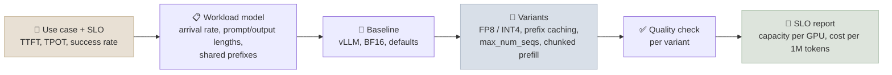

# Capstone 2 - Serve It with an SLO

Serve a model - ideally the one you post-trained in Capstone 1 - behind an OpenAI-compatible endpoint, define a service-level objective for a realistic use case, and find the serving configuration that meets it most cheaply. The deliverable is an SLO report: the objective, how you measured against it, what each configuration change bought, and the capacity you can promise.

← **Back to Overview:** [Capstones](../INDEX.mdx)

```objectives
time: 20-30 hours (plus a few GPU hours)
outcomes:
  - Define an SLO in terms of TTFT, time per output token and success rate at a stated request mix, and derive a goodput target from it
  - Load-test a vLLM deployment with open-loop (Poisson) arrivals and realistic prompt and output lengths, reporting p50/p95/p99 latencies and goodput
  - Measure the effect of at least three serving choices - precision (BF16 vs FP8 or INT4), prefix caching, batch limits - on goodput and quality
  - Deploy with health checks and a rollout plan, and state capacity per GPU with the evidence behind it
prerequisites:
  - "[FastAPI + vLLM Endpoint](../../16-Inference-and-Serving/CodeLabs/01-FastAPI-vLLM-Endpoint.mdx) and [Inference & Serving](../../16-Inference-and-Serving/INDEX.mdx)"
  - "[Helm Chart & Release Checklist](../../17-Production-Engineering/CodeLabs/01-Helm-Chart-and-Release-Checklist.mdx) for the optional Kubernetes deployment"
```

## The Work



1. **Pick a use case and write the SLO.** For example, a support chat assistant: *p95 TTFT < 500 ms and p95 time per output token < 50 ms for 99% of requests, at the peak arrival rate, with no quality loss beyond an agreed threshold*. Justify each number from the user experience ([Streaming & TTFT](../../16-Inference-and-Serving/Notes/05-Streaming-and-TTFT.mdx)).
2. **Model the workload.** Prompt and output length distributions (from real data if you have it, otherwise a stated synthetic mix), the share of requests with a common system prompt, and a peak arrival rate.
3. **Baseline.** Serve with vLLM's OpenAI-compatible server at defaults (BF16). Load-test with **open-loop** Poisson arrivals at increasing rates - `vllm bench serve` or your own client from the [lab](../../16-Inference-and-Serving/CodeLabs/01-FastAPI-vLLM-Endpoint.mdx) - and record TTFT, TPOT and end-to-end latency percentiles, throughput and errors. Closed-loop "N users in a loop" tests hide queueing; report which you used.
4. **Vary one thing at a time**, at least three of:
   - precision: BF16 vs FP8 (on GPUs with FP8 support) or a 4-bit weight format - with a quality check on your evaluation set, not only latency;
   - automatic prefix caching on vs off, with and without a shared system prompt;
   - `max_num_seqs` / `max_num_batched_tokens` and chunked prefill;
   - speculative decoding, if your model has a supported draft method;
   - replicas vs larger batches at a fixed GPU budget.
5. **Find the knee.** For each configuration, the highest arrival rate at which the SLO still holds - that rate times the success fraction is the **goodput**. Plot latency percentiles against arrival rate.
6. **Deploy and operate.** Health and readiness probes, a canary or blue/green rollout plan with rollback criteria, and dashboards for the SLO metrics. Kubernetes with the Production Engineering Helm chart and autoscaling on queue depth is optional (*Exceeds*).

## Deliverables

| # | Deliverable |
|---|---|
| 1 | Repository: serving configs, load generator, analysis notebook, pinned versions; README with exact commands |
| 2 | Raw load-test results for every configuration and arrival rate |
| 3 | Quality results for every precision variant on your evaluation set |
| 4 | SLO report (2-4 pages): the SLO and why; method; latency-vs-rate plots; goodput table; recommended configuration; capacity per GPU and cost per million output tokens; limitations |
| 5 | Operations sheet: probes, dashboards, alert thresholds, rollout and rollback plan |
| 6 | Architecture document with ADRs (engine, precision, parallelism, hosting) and a business outcome: the product the endpoint serves, cost per request at the recommended configuration, and comparison with a hosted API |
| 7 | 5-minute walkthrough |

## Rubric

| Criterion | Weight | *Meets* looks like |
|---|---|---|
| SLO and workload definition | 15 | SLO in measurable terms tied to the use case; workload model stated and justified |
| Load-testing method | 20 | Open-loop arrivals; warm-up excluded; percentiles not averages; enough duration per point; test client not the bottleneck |
| Configuration experiments | 20 | At least three variables changed one at a time; goodput knee found for each; results explained with KV-cache and batching mechanics |
| Quality guardrail | 10 | Every quantized or otherwise changed configuration re-evaluated on quality with a stated tolerance |
| Recommendation and capacity | 15 | A configuration recommended with capacity per GPU, headroom and cost per 1M tokens, backed by the data |
| Operability | 10 | Probes, dashboards, alerts and a rollout/rollback plan that match the SLO |
| Architecture and business outcome | 10 | ADRs for serving choices backed by the load-test data; cost per request and capacity tied to a stated product and volume; hosted-vs-self-hosted break-even argued |

*Exceeds* examples: autoscaling on queue depth demonstrated under a traffic ramp; a multi-LoRA deployment serving two adapters from one base; disaggregated prefill/decode or KV-aware routing compared with the baseline.

## Pitfalls

- Averages instead of percentiles; testing at a single arrival rate.
- Measuring throughput with a closed-loop client and calling it capacity.
- Quantizing without re-checking quality - especially for structured or precise outputs.
- Ignoring the first-request warm-up, or letting the load generator run on the same GPU host and compete for CPU.

## References

- Kwon et al., [Efficient Memory Management for Large Language Model Serving with PagedAttention](https://arxiv.org/abs/2309.06180) (2023)
- Zhong et al., [DistServe: Disaggregating Prefill and Decoding for Goodput-optimized LLM Serving](https://arxiv.org/abs/2401.09670) (2024)
- [vLLM documentation](https://docs.vllm.ai/) - OpenAI-compatible server, benchmarking, quantization, prefix caching (2026)
- Google SRE Book, [Service Level Objectives](https://sre.google/sre-book/service-level-objectives/) (2016)

*Last reviewed: 2026-09*
