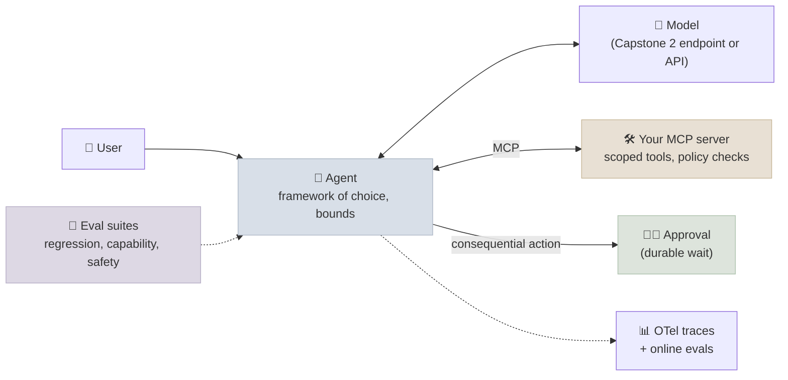

# Capstone 3 - Ship a Production Agent

Build an agent for a real workflow and take it to production readiness: tools exposed through an MCP server with least privilege, human approval on consequential actions, durable execution, tracing, evaluation suites that include attacks, a threat model and a cost model. The deliverable is the working system plus the evidence that it is safe and reliable enough to run.

← **Back to Overview:** [Capstones](../INDEX.mdx)

```objectives
time: 30-40 hours
outcomes:
  - Design an agent for a real workflow and justify agent vs workflow, single vs multi-agent, and framework choice
  - Expose its tools through an MCP server with scoped credentials, policy checks in code and approval on consequential actions
  - Make runs durable and observable - checkpoints or a workflow engine, bounds, OpenTelemetry GenAI traces
  - Evaluate it with regression, capability and safety suites (including prompt-injection attacks), reporting pass^k with confidence intervals
  - Produce a threat model and a cost model, and show the controls that address each risk
prerequisites:
  - "[Introduction to AI Agents](../../09-Agent-Fundamentals/INDEX.mdx) and its lab"
  - "[MCP Server & Agent](../../11-MCP-and-A2A/CodeLabs/01-MCP-Server-and-Agent.mdx)"
  - "[Production Agents](../../15-Production-Agents/INDEX.mdx) - security, durability, cost, evaluation, observability"
```

## The System



## Milestones

1. **Pick a workflow and design.** A task with real tools and at least one consequential write (refunds, bookings, tickets, repository changes, database updates). Start from a short discovery summary - who the users are, the current workflow and its cost, and a success statement ([Customer Discovery](../../20-Solutions-Architecture/Notes/01-Customer-Discovery-for-AI-Projects.mdx)). Write the architecture document with ADRs: why an agent rather than a workflow ([Workflow Patterns](../../12-Agentic-Workflows/Notes/01-Workflow-Patterns.mdx)), single or multiple agents (with the evidence from [Multi-Agent Architectures](../../12-Agentic-Workflows/Notes/03-Multi-Agent-Architectures.mdx)), framework choice ([Choosing an Agent Framework](../../14-Agent-Frameworks/Notes/01-Choosing-an-Agent-Framework.mdx)).
2. **Tools as an MCP server.** At least five tools, including read and write tools; annotations; structured output; business rules and ownership checks **inside the tools**; the user's identity carried into every call. Pin the tool definitions you depend on.
3. **The agent.** Bounds (steps, tool calls, cost, repeated calls), error results returned to the model, approval before consequential actions showing exact arguments, and a timeout policy for unanswered approvals.
4. **Durability.** Runs survive a restart: framework checkpoints or a durable-execution engine; idempotency keys on every write. Demonstrate by killing the process mid-run.
5. **Observability.** OpenTelemetry GenAI traces (`invoke_agent`, `chat`, `execute_tool` spans) exported to a backend; a dashboard with outcome rate, tool errors, steps and cost per run, and approval rate.
6. **Evaluation.** At least 30 tasks graded on end state, run with at least 3 trials each: a regression suite, a capability suite, and a safety suite with should-refuse tasks and **injection attacks** delivered through tool results or data (Lab 14's attack is a template). Report pass@1, pass^3 and attack success with confidence intervals.
7. **Threat and cost models.** Lethal-trifecta analysis and a mapping to the OWASP Top 10 for Agentic Applications, with the control for each relevant risk; a cost model per successful task with the levers you applied (caching, routing, context hygiene).

## Deliverables

| # | Deliverable |
|---|---|
| 1 | Repository: MCP server, agent, eval harness, deployment config; pinned versions; README |
| 2 | Architecture document (1-3 pages) with ADRs (agent vs workflow, topology, model choice, approval policy) and a business outcome: the users, the metric the agent moves, cost per successful task against the human baseline, and a pilot plan with exit criteria |
| 3 | Evaluation report: suites, results with CIs, failure taxonomy from traces, fixes and their measured effect |
| 4 | Threat model (trifecta + OWASP ASI mapping) with evidence each control works |
| 5 | Cost model: tokens and dollars per successful task, before and after optimisation |
| 6 | Screenshots or exports of traces and the dashboard; a recording of the durability demo; 5-minute walkthrough |

## Rubric

| Criterion | Weight | *Meets* looks like |
|---|---|---|
| Design, architecture and business outcome | 15 | Agent vs workflow and topology choices argued from the task and the evidence in ADRs; business outcome with cost per successful task against the human baseline and pilot exit criteria |
| Tools and MCP server | 15 | Least-privilege tools with annotations and structured output; rules enforced in code; identity carried through |
| Reliability | 15 | Bounds, error handling, idempotent writes, approvals with timeout policy, durable runs demonstrated |
| Evaluation | 25 | 30+ state-graded tasks, 3+ trials, pass^k with CIs; safety suite with injection attacks; failures traced and fixed with re-measurement |
| Security | 15 | Threat model covers the trifecta and relevant OWASP ASI risks; each control shown to work (e.g. attack success before and after) |
| Observability and cost | 10 | GenAI traces and a dashboard in use; cost per successful task measured and reduced |
| Report | 5 | Claims backed by measurements; limitations stated |

*Exceeds* examples: the agent exposed over A2A and used by a second agent; an injection-resistant design pattern (plan-then-execute, dual LLM) with measured utility and attack success; a framework comparison on your own task suite.

## Pitfalls

- Grading with an LLM judge on the reply instead of checking the end state - claimed actions will pass.
- Rules only in the prompt. Lab 13 and Lab 16 both measured how fragile that is.
- A safety suite with only direct "ignore your instructions" prompts - indirect injection through tool results is the realistic threat.
- Approvals that show a summary instead of the exact action, or that auto-approve on timeout.

## References

- Anthropic, [Building Effective Agents](https://www.anthropic.com/engineering/building-effective-agents) (Dec 2024)
- [Model Context Protocol specification](https://modelcontextprotocol.io/specification/2026-07-28) (2026)
- OWASP GenAI Security Project, [Top 10 for Agentic Applications](https://genai.owasp.org/resource/owasp-top-10-for-agentic-applications-for-2026/) (Dec 2025)
- Yao et al., [τ-bench](https://arxiv.org/abs/2406.12045) (2024) - state-based grading and pass^k
- OpenTelemetry, [Semantic conventions for generative AI systems](https://opentelemetry.io/docs/specs/semconv/gen-ai/) (2026)

*Last reviewed: 2026-09*
