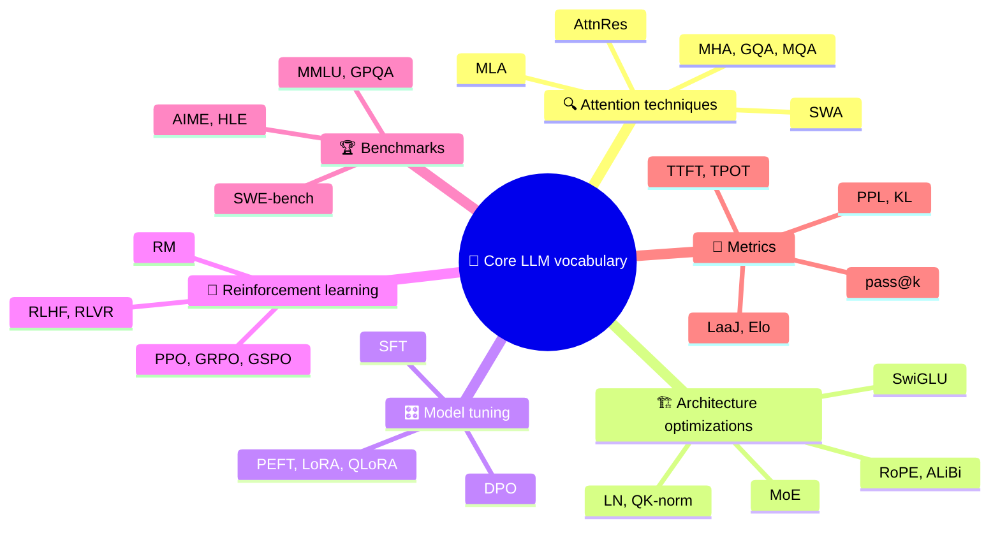

# Glossary of Terms & Concepts

The course's vocabulary on one page: first the core LLM terms you will hear in almost every model card, paper and interview, grouped by topic, then an A-Z list of every key term from each module's Summary & Key Terms page.

```objectives
scope: page
time: Reference - use as needed
outcomes:
  - Expand and define the core LLM acronyms across attention, architecture, tuning, RL, benchmarks and metrics
  - Find the page where any term is taught, and go there to rebuild the full explanation
  - Use the A-Z list to check your recall of a module's vocabulary before taking its quiz
prerequisites:
  - None - use it as a reference at any point in the course
```

## Core LLM Vocabulary at a Glance

These six groups cover the terms that come up in nearly every discussion of how a modern LLM is built, trained, tested and served. If you can explain each one in a sentence and say why it matters, you have the core vocabulary of the field.



### 🔍 Attention techniques

| Term | Meaning | Where it's taught |
|---|---|---|
| **MHA** | Multi-Head Attention: several attention heads in parallel, each with its own Q, K and V projections. | [Attention Mechanisms](../03-Foundation-Models/Notes/04-Attention-Mechanisms.mdx#multi-head-attention) |
| **MQA** | Multi-Query Attention: all query heads share a single K/V head, shrinking the KV cache by the head count. | [Attention Mechanisms](../03-Foundation-Models/Notes/04-Attention-Mechanisms.mdx#multi-query-attention-mqa-and-grouped-query-attention-gqa) |
| **GQA** | Grouped-Query Attention: groups of query heads share a K/V head - the middle ground most open models use. | [Attention Mechanisms](../03-Foundation-Models/Notes/04-Attention-Mechanisms.mdx#multi-query-attention-mqa-and-grouped-query-attention-gqa), [KV Cache](../16-Inference-and-Serving/Notes/01-KV-Cache-and-Inference-Optimization.mdx#mha-vs-mqa-vs-gqa) |
| **MLA** | Multi-head Latent Attention: caches a compressed low-rank latent per token instead of full keys and values (DeepSeek). | [Modern Architectures](../03-Foundation-Models/Notes/06-Modern-Architectures.mdx#multi-head-latent-attention-mla) |
| **SWA** | Sliding Window Attention: each token attends only to the nearest W tokens, bounding compute and KV cache. | [Attention Mechanisms](../03-Foundation-Models/Notes/04-Attention-Mechanisms.mdx#sliding-window-attention-mistral) |
| **AttnRes** | Attention Residuals: replace the fixed residual sum with learned attention over earlier layers' outputs. | [Modern Architectures](../03-Foundation-Models/Notes/06-Modern-Architectures.mdx#attention-residuals-attnres) |

### 🏗️ Architecture optimizations

| Term | Meaning | Where it's taught |
|---|---|---|
| **MoE** | Mixture of Experts: a router sends each token to a few expert FFNs, so compute follows active parameters and memory follows total parameters. | [Model Architecture Types](../03-Foundation-Models/Notes/05-Model-Architecture-Types.mdx#mixture-of-experts-moe), [Modern Architectures](../03-Foundation-Models/Notes/06-Modern-Architectures.mdx#mixture-of-experts-2025-edition) |
| **RoPE** | Rotary Position Embeddings: rotate Q and K by position so attention scores depend on relative distance. | [Transformer Architecture](../03-Foundation-Models/Notes/03-Architecture.mdx#3-rotary-position-embeddings---rope-llama-gemma-mistral) |
| **ALiBi** | Attention with Linear Biases: add a distance penalty to attention scores instead of position embeddings. | [Transformer Architecture](../03-Foundation-Models/Notes/03-Architecture.mdx#4-alibi---attention-with-linear-biases-mpt-bloom) |
| **LN** | Layer Normalization: normalize each token's activations; modern models use Pre-LN, usually as RMSNorm. | [Transformer Architecture](../03-Foundation-Models/Notes/03-Architecture.mdx#layer-normalization-and-residual-connections) |
| **QK-norm** | Normalize queries and keys before the dot product to stop attention logits from blowing up. | [Modern Architectures](../03-Foundation-Models/Notes/06-Modern-Architectures.mdx#qk-norm-and-other-stability-tricks), [Training Stability](../07-Pretraining/Notes/06-Training-Stability-and-Optimizers.mdx) |
| **SwiGLU** | Swish-Gated Linear Unit: the gated FFN activation used by Llama, Qwen, Mistral and most modern LLMs. | [Transformer Architecture](../03-Foundation-Models/Notes/03-Architecture.mdx#feed-forward-network-ffn) |

### 🎛️ Model tuning

| Term | Meaning | Where it's taught |
|---|---|---|
| **SFT** | Supervised Fine-Tuning: train on examples of the desired responses. | [Fine-Tuning & Alignment](../08-Post-Training/Notes/01-Fine-Tuning-and-Alignment.mdx#supervised-fine-tuning-sft) |
| **PEFT** | Parameter-Efficient Fine-Tuning: adapt a model by training a small fraction of its parameters. | [Fine-Tuning & Alignment](../08-Post-Training/Notes/01-Fine-Tuning-and-Alignment.mdx#parameter-efficient-fine-tuning-peft) |
| **LoRA** | Low-Rank Adaptation: freeze the base weights and train a low-rank update `BA` beside them. | [Fine-Tuning & Alignment](../08-Post-Training/Notes/01-Fine-Tuning-and-Alignment.mdx#lora---low-rank-adaptation), [LoRA & QLoRA Hands-On](../08-Post-Training/Notes/06-LoRA-and-QLoRA-Hands-On.mdx) |
| **QLoRA** | Quantized LoRA: LoRA on a 4-bit (NF4) quantized base model, so large models fit on one GPU. | [Fine-Tuning & Alignment](../08-Post-Training/Notes/01-Fine-Tuning-and-Alignment.mdx#qlora---quantized-lora) |
| **DPO** | Direct Preference Optimization: learn from chosen/rejected pairs with a classification-style loss, no reward model or RL loop. | [Preference Optimization](../08-Post-Training/Notes/02-Preference-Optimization.mdx#direct-preference-optimization-dpo) |

### 🎯 Reinforcement learning

| Term | Meaning | Where it's taught |
|---|---|---|
| **RLHF** | RL from Human Feedback: train a reward model on human preferences, then optimize the policy against it. | [RL for LLMs](../08-Post-Training/Notes/03-RL-for-LLMs.mdx#ppo-based-rlhf) |
| **RLVR** | RL with Verifiable Rewards: the reward is a program (exact-match answer, unit tests) rather than a learned model. | [RL for LLMs](../08-Post-Training/Notes/03-RL-for-LLMs.mdx#grpo-drop-the-critic) |
| **RM** | Reward Model: predicts a scalar preference score, usually trained with the Bradley-Terry pairwise loss. | [Preference Optimization](../08-Post-Training/Notes/02-Preference-Optimization.mdx#reward-models-and-bradley-terry) |
| **PPO** | Proximal Policy Optimization: clipped policy updates with a learned value critic and a KL penalty. | [RL for LLMs](../08-Post-Training/Notes/03-RL-for-LLMs.mdx#ppo-based-rlhf) |
| **GRPO** | Group Relative Policy Optimization: sample a group of answers and use each one's reward relative to the group as the advantage - no critic. | [RL for LLMs](../08-Post-Training/Notes/03-RL-for-LLMs.mdx#grpo-drop-the-critic) |
| **GSPO** | Group Sequence Policy Optimization: GRPO with a sequence-level importance ratio and clipping, for stabler RL on large and MoE models. | [RL for LLMs](../08-Post-Training/Notes/03-RL-for-LLMs.mdx#fixes-that-followed) |

### 🏆 Benchmarks

| Term | Meaning | Where it's taught |
|---|---|---|
| **MMLU** | Massive Multitask Language Understanding: 57-subject multiple-choice knowledge test; saturated at the frontier. | [What Benchmarks Measure](../04-Evaluation/Notes/01-What-Benchmarks-Measure.mdx#a-map-of-common-benchmarks) |
| **GPQA** | Graduate-level Google-Proof Q&A: expert-written science questions; the Diamond subset is the usual report. | [What Benchmarks Measure](../04-Evaluation/Notes/01-What-Benchmarks-Measure.mdx#a-map-of-common-benchmarks) |
| **AIME** | American Invitational Mathematics Examination: 30 integer-answer olympiad-qualifier problems a year. | [What Benchmarks Measure](../04-Evaluation/Notes/01-What-Benchmarks-Measure.mdx#a-map-of-common-benchmarks) |
| **HLE** | Humanity's Last Exam: hard expert questions across many fields, built to stay unsaturated. | [What Benchmarks Measure](../04-Evaluation/Notes/01-What-Benchmarks-Measure.mdx#a-map-of-common-benchmarks) |
| **SWE-bench** | Resolve real GitHub issues so hidden tests pass; Verified is the 500-task human-checked subset. | [What Benchmarks Measure](../04-Evaluation/Notes/01-What-Benchmarks-Measure.mdx#a-map-of-common-benchmarks), [Agent Evaluation](../15-Production-Agents/Notes/05-Agent-Evaluation-and-Benchmarks.mdx) |

### 📏 Metrics

| Term | Meaning | Where it's taught |
|---|---|---|
| **PPL** | Perplexity: `exp(cross-entropy loss)` - how many tokens the model is, on average, choosing between. | [Probability & Information Theory](../02-Math-for-ML/Notes/02-Probability-and-Information-Theory.mdx#likelihood-and-the-training-loss) |
| **KL** | Kullback-Leibler divergence: how far one distribution is from another; the penalty that keeps a tuned policy near its reference. | [Probability & Information Theory](../02-Math-for-ML/Notes/02-Probability-and-Information-Theory.mdx#entropy-cross-entropy-and-kl-divergence) |
| **LaaJ** | LLM-as-a-Judge: a model grades outputs against a rubric; validate it against human labels before trusting it. | [LLM-as-Judge](../04-Evaluation/Notes/03-LLM-as-Judge.mdx) |
| **pass@k** | Probability that at least one of k sampled attempts is correct. | [What Benchmarks Measure](../04-Evaluation/Notes/01-What-Benchmarks-Measure.mdx#passk-and-passk), [Statistics for Evaluation](../02-Math-for-ML/Notes/04-Statistics-for-Evaluation.mdx#passk-and-non-determinism) |
| **Elo** | Pairwise rating scale from chess; on arena leaderboards a 100-point gap ≈ 64% expected win rate. | [Contamination & Leaderboards](../04-Evaluation/Notes/02-Contamination-and-Leaderboards.mdx#preference-arenas) |
| **TTFT** | Time To First Token: queueing plus prefill - what makes a chat feel responsive. | [Streaming & TTFT](../16-Inference-and-Serving/Notes/05-Streaming-and-TTFT.mdx#ttft-vs-total-generation-time) |
| **TPOT** | Time Per Output Token: the decode-step gap between tokens; dominates long answers. | [Modern Serving Stack](../16-Inference-and-Serving/Notes/07-Modern-Serving-Stack.mdx#metrics-that-define-an-slo) |

## A-Z Glossary

<!-- glossary:start - generated by `npm run build:glossary`, do not edit by hand -->

297 terms from the Summary & Key Terms page of every module. Where a term appears in more than one module, the meaning shown is from the first module that defines it.

### A

| Term | Meaning | Module |
|---|---|---|
| **A2A** | Agent2Agent: protocol for communication and task exchange between agents. | [11 Agent Protocols: MCP & A2A](../11-MCP-and-A2A/APPENDIX.mdx) |
| **Ablation / baseline** | Remove a component to measure its value / reference system for comparison. | [12 Agentic Workflows & Multi-Agent Systems](../12-Agentic-Workflows/APPENDIX.mdx) |
| **Acceptance criteria** | Observable conditions that define whether a requirement is satisfied. | [19 Agent Engineering](../19-Agent-Engineering/APPENDIX.mdx) |
| **ACL / CDC** | Access Control List / Change Data Capture: permissions / source change tracking. | [13 RAG Systems](../13-RAG/APPENDIX.mdx) |
| **Activation checkpointing** | Recomputes intermediate activations during backward to save memory. | [06 PyTorch Fundamentals](../06-PyTorch/APPENDIX.mdx) |
| **Active recall** | Retrieve an answer from memory before checking the notes. | [22 Review & Readiness](../22-Review/APPENDIX.mdx) |
| **Adapter merge** | Combines learned adapter updates with base weights for deployment. | [08 Post-Training & Fine-Tuning](../08-Post-Training/APPENDIX.mdx) |
| **ADKAR** | Awareness, Desire, Knowledge, Ability, Reinforcement: a change-management model. | [20 Solutions Architecture](../20-Solutions-Architecture/APPENDIX.mdx) |
| **Adoption / capacity savings** | Actual sustained use / freed time that is not automatically cash savings. | [20 Solutions Architecture](../20-Solutions-Architecture/APPENDIX.mdx) |
| **ADR** | Architecture Decision Record: context, decision and consequences of one choice. | [20 Solutions Architecture](../20-Solutions-Architecture/APPENDIX.mdx) |
| **ADR / ROI** | Architecture Decision Record / Return On Investment: design rationale / business value measure. | [21 Capstones](../21-Capstones/APPENDIX.mdx) |
| **ADR / SLO / ROI** | Architecture Decision Record / Service Level Objective / Return On Investment. | [22 Review & Readiness](../22-Review/APPENDIX.mdx) |
| **Agent / workflow** | Model-directed action selection / predefined execution path. | [09 Introduction to AI Agents](../09-Agent-Fundamentals/APPENDIX.mdx) |
| **Agent Card** | Describes an A2A agent's capabilities and connection details. | [11 Agent Protocols: MCP & A2A](../11-MCP-and-A2A/APPENDIX.mdx) |
| **AGENTS.md / SKILL.md** | Repository instructions / a reusable skill's instructions and trigger metadata. | [19 Agent Engineering](../19-Agent-Engineering/APPENDIX.mdx) |
| **AIME / HLE** | American Invitational Mathematics Examination problems / Humanity's Last Exam (frontier expert questions). | [04 Evaluation & Benchmarks](../04-Evaluation/APPENDIX.mdx) |
| **ALiBi** | Attention with Linear Biases: a distance penalty added to attention scores instead of position embeddings. | [03 Foundation Models](../03-Foundation-Models/APPENDIX.mdx) |
| **AMP / BF16** | Automatic Mixed Precision / Brain Floating Point 16: mixed dtypes / a wide-range 16-bit format. | [06 PyTorch Fundamentals](../06-PyTorch/APPENDIX.mdx) |
| **ANN / HNSW** | Approximate Nearest Neighbor / Hierarchical Navigable Small World: fast approximate search / a graph index. | [13 RAG Systems](../13-RAG/APPENDIX.mdx) |
| **API / SDK** | Application Programming Interface / Software Development Kit: service contract / client tooling. | [01 Python & Systems](../01-Python-and-Systems/APPENDIX.mdx) |
| **ASR** | Attack Success Rate: successful attacks divided by evaluated attacks. | [04 Evaluation & Benchmarks](../04-Evaluation/APPENDIX.mdx) |
| **asyncio** | Python's cooperative concurrency system for overlapping I/O waits. | [01 Python & Systems](../01-Python-and-Systems/APPENDIX.mdx) |
| **AttnRes** | Attention Residuals: replace the fixed residual sum with learned attention over earlier layers' outputs. | [03 Foundation Models](../03-Foundation-Models/APPENDIX.mdx) |
| **AWS / GCP** | Amazon Web Services / Google Cloud Platform: cloud infrastructure and managed services. | [18 Cloud AI Platforms](../18-Cloud-Platforms/APPENDIX.mdx) |

### B

| Term | Meaning | Module |
|---|---|---|
| **Backpressure / jitter** | Slowing intake when overloaded / randomizing retry delays. | [01 Python & Systems](../01-Python-and-Systems/APPENDIX.mdx) |
| **Batch / epoch** | Examples in one step / one pass through the training data. | [06 PyTorch Fundamentals](../06-PyTorch/APPENDIX.mdx) |
| **BF16 / FP8** | Brain Floating Point 16 / 8-bit Floating Point: lower-precision numerical formats. | [07 Pretraining at Scale](../07-Pretraining/APPENDIX.mdx) |
| **BM25** | Lexical ranking using term frequency, document frequency and length normalization. | [13 RAG Systems](../13-RAG/APPENDIX.mdx) |
| **Bootstrap / paired test** | Resampling to estimate uncertainty / comparing systems on the same items. | [02 Math for ML](../02-Math-for-ML/APPENDIX.mdx) |
| **BPE** | Byte Pair Encoding: builds tokens by repeatedly merging frequent adjacent pairs. | [03 Foundation Models](../03-Foundation-Models/APPENDIX.mdx) |

### C

| Term | Meaning | Module |
|---|---|---|
| **C4** | Context, Containers, Components, Code: levels for architecture diagrams. | [20 Solutions Architecture](../20-Solutions-Architecture/APPENDIX.mdx) |
| **Canary / shadow rollout** | Limited live release / test new behavior alongside the live system. | [17 Production Engineering](../17-Production-Engineering/APPENDIX.mdx) |
| **Capstone** | An integrated project demonstrating skills across multiple course sections. | [22 Review & Readiness](../22-Review/APPENDIX.mdx) |
| **Chaining / routing** | Sequential dependent steps / selecting a path for a request. | [12 Agentic Workflows & Multi-Agent Systems](../12-Agentic-Workflows/APPENDIX.mdx) |
| **Chat template** | Formats conversation roles and separators into the model's expected token sequence. | [08 Post-Training & Fine-Tuning](../08-Post-Training/APPENDIX.mdx) |
| **Checkpoint** | Saved weights and run state, including optimizer, scheduler and randomness for resumption. | [06 PyTorch Fundamentals](../06-PyTorch/APPENDIX.mdx) |
| **Checkpoint / session** | Saved execution state / conversation-associated state. | [14 Agent Frameworks](../14-Agent-Frameworks/APPENDIX.mdx) |
| **Chunk / overlap** | Retrieval-sized text unit / content shared between neighboring units. | [13 RAG Systems](../13-RAG/APPENDIX.mdx) |
| **CI / paired bootstrap** | Confidence Interval / resampling matched items to estimate comparison uncertainty. | [04 Evaluation & Benchmarks](../04-Evaluation/APPENDIX.mdx) |
| **CI / pass^k** | Confidence Interval / success across all k repeated trials. | [21 Capstones](../21-Capstones/APPENDIX.mdx) |
| **CI / PR** | Continuous Integration / Pull Request: automated checks / a reviewable change proposal. | [01 Python & Systems](../01-Python-and-Systems/APPENDIX.mdx) |
| **CI / SE** | Confidence Interval / Standard Error: uncertainty range / estimated sampling variability. | [02 Math for ML](../02-Math-for-ML/APPENDIX.mdx) |
| **Circuit breaker** | Temporarily blocks calls to a repeatedly failing dependency. | [15 Production Agents](../15-Production-Agents/APPENDIX.mdx) |
| **Citation / abstention** | Traceable source reference / declining an unsupported answer. | [13 RAG Systems](../13-RAG/APPENDIX.mdx) |
| **Claude Agent SDK** | Programmable access to an agent harness with tools and permission controls. | [14 Agent Frameworks](../14-Agent-Frameworks/APPENDIX.mdx) |
| **CLM / MLM** | Causal / Masked Language Modeling: predict the next token / selected hidden tokens. | [07 Pretraining at Scale](../07-Pretraining/APPENDIX.mdx) |
| **Cohen's kappa** | Judge agreement corrected for agreement expected by chance. | [02 Math for ML](../02-Math-for-ML/APPENDIX.mdx) |
| **Compaction / offloading** | Compress context / move details to external storage. | [19 Agent Engineering](../19-Agent-Engineering/APPENDIX.mdx) |
| **Concurrency / batch size** | Requests in flight / requests processed together in a model step. | [16 Inference & Serving](../16-Inference-and-Serving/APPENDIX.mdx) |
| **Confused deputy** | A privileged service is tricked into acting for an unauthorized party. | [11 Agent Protocols: MCP & A2A](../11-MCP-and-A2A/APPENDIX.mdx) |
| **Constrained decoding** | Restricts allowed next tokens to enforce an output grammar or schema. | [05 Prompt & Context Engineering](../05-Prompt-Engineering/APPENDIX.mdx) |
| **Contamination / leakage** | Evaluation content in training / test information influencing development. | [04 Evaluation & Benchmarks](../04-Evaluation/APPENDIX.mdx) |
| **Context engineering** | Selects and organizes instructions, evidence, history and tool results. | [05 Prompt & Context Engineering](../05-Prompt-Engineering/APPENDIX.mdx) |
| **Context isolation** | Keeps unrelated worker details out of other agents' contexts. | [12 Agentic Workflows & Multi-Agent Systems](../12-Agentic-Workflows/APPENDIX.mdx) |
| **Continuous batching** | Adds and removes requests as generation proceeds. | [16 Inference & Serving](../16-Inference-and-Serving/APPENDIX.mdx) |
| **Core-domain threshold** | The course target of no core readiness score below 2. | [22 Review & Readiness](../22-Review/APPENDIX.mdx) |
| **Cost per successful task** | Total evaluated cost divided by successful task completions. | [15 Production Agents](../15-Production-Agents/APPENDIX.mdx) |
| **CoT / ReAct** | Chain of Thought / Reasoning and Acting: intermediate reasoning / reasoning interleaved with tools. | [05 Prompt & Context Engineering](../05-Prompt-Engineering/APPENDIX.mdx) |
| **CoT / test-time compute** | Chain of Thought / inference work spent reasoning, searching or checking. | [08 Post-Training & Fine-Tuning](../08-Post-Training/APPENDIX.mdx) |
| **CP / EP** | Context / Expert Parallelism: split sequences / distribute MoE experts. | [07 Pretraining at Scale](../07-Pretraining/APPENDIX.mdx) |
| **CrewAI crew / flow** | Role/task-based team / explicit event-driven control flow. | [14 Agent Frameworks](../14-Agent-Frameworks/APPENDIX.mdx) |
| **CUDA / kernel fusion** | NVIDIA's GPU computing platform / combining operations to cut launches and memory traffic. | [07 Pretraining at Scale](../07-Pretraining/APPENDIX.mdx) |

### D

| Term | Meaning | Module |
|---|---|---|
| **Dataset / DataLoader** | Sample-access interface / batching, shuffling and loading machinery. | [06 PyTorch Fundamentals](../06-PyTorch/APPENDIX.mdx) |
| **DBU** | Databricks Unit: a platform usage unit used in pricing. | [18 Cloud AI Platforms](../18-Cloud-Platforms/APPENDIX.mdx) |
| **DDP / FSDP** | Distributed Data Parallel / Fully Sharded Data Parallel: replicate / shard model state across workers. | [06 PyTorch Fundamentals](../06-PyTorch/APPENDIX.mdx) |
| **Deduplication / decontamination** | Remove repeated data / evaluation overlap from training data. | [07 Pretraining at Scale](../07-Pretraining/APPENDIX.mdx) |
| **Deferred tool approval** | Pauses a tool request until an explicit decision is supplied. | [14 Agent Frameworks](../14-Agent-Frameworks/APPENDIX.mdx) |
| **Delta Lake** | Table format and tooling for reliable, transactional data-lake tables. | [18 Cloud AI Platforms](../18-Cloud-Platforms/APPENDIX.mdx) |
| **Dependency injection** | Supplies tools with external services or configuration through a typed context. | [14 Agent Frameworks](../14-Agent-Frameworks/APPENDIX.mdx) |
| **Disaggregated serving** | Runs prefill and decode on separate resources. | [16 Inference & Serving](../16-Inference-and-Serving/APPENDIX.mdx) |
| **Discovery / baseline** | Investigating the real problem / measured starting performance. | [20 Solutions Architecture](../20-Solutions-Architecture/APPENDIX.mdx) |
| **Distillation** | Trains a smaller or cheaper model using a stronger model's outputs. | [08 Post-Training & Fine-Tuning](../08-Post-Training/APPENDIX.mdx) |
| **Docker / Kubernetes / Helm** | Container packaging / workload orchestration / templated Kubernetes releases. | [17 Production Engineering](../17-Production-Engineering/APPENDIX.mdx) |
| **DOM / accessibility tree** | Document Object Model / semantic UI representation used for automation. | [19 Agent Engineering](../19-Agent-Engineering/APPENDIX.mdx) |
| **Dot product / cosine similarity** | Vector alignment / alignment after removing magnitude differences. | [02 Math for ML](../02-Math-for-ML/APPENDIX.mdx) |
| **DP / TP / PP** | Data / Tensor / Pipeline Parallelism: split batches / layer computations / model stages. | [07 Pretraining at Scale](../07-Pretraining/APPENDIX.mdx) |
| **DPO** | Direct Preference Optimization: learns from preferred/rejected pairs without an explicit RL rollout loop. | [08 Post-Training & Fine-Tuning](../08-Post-Training/APPENDIX.mdx) |
| **DSPy** | Framework for declarative model programs and metric-driven optimization. | [05 Prompt & Context Engineering](../05-Prompt-Engineering/APPENDIX.mdx) |
| **Durability / idempotency** | Resume after interruption / retries preserve one intended effect. | [21 Capstones](../21-Capstones/APPENDIX.mdx) |
| **Durable execution** | Persists progress so a run can resume after failures or long waits. | [15 Production Agents](../15-Production-Agents/APPENDIX.mdx) |

### E

| Term | Meaning | Module |
|---|---|---|
| **Elicitation** | A server requests additional user input through the client. | [11 Agent Protocols: MCP & A2A](../11-MCP-and-A2A/APPENDIX.mdx) |
| **Elo / Bradley-Terry** | Rating scale where a 100-point gap ≈ 64% win rate / the pairwise model arenas fit to all votes. | [04 Evaluation & Benchmarks](../04-Evaluation/APPENDIX.mdx) |
| **Embedding / vector search** | Numeric representation of meaning / search by vector similarity. | [13 RAG Systems](../13-RAG/APPENDIX.mdx) |
| **End-to-end project** | A complete system with code, metrics, architecture and an explained outcome. | [22 Review & Readiness](../22-Review/APPENDIX.mdx) |
| **Environment / reset** | Task world, tools and feedback / return that world to a known starting state. | [19 Agent Engineering](../19-Agent-Engineering/APPENDIX.mdx) |
| **Episodic / semantic / procedural memory** | Past experiences / stored facts / reusable procedures. | [10 Agent Building Blocks](../10-Agent-Building-Blocks/APPENDIX.mdx) |
| **Error budget / burn rate** | Allowed failures / speed at which that allowance is consumed. | [17 Production Engineering](../17-Production-Engineering/APPENDIX.mdx) |
| **Eval** | A repeatable procedure for measuring system behavior or task success. | [22 Review & Readiness](../22-Review/APPENDIX.mdx) |
| **Eval / benchmark** | A measurement procedure / a standardized task set and scoring protocol. | [04 Evaluation & Benchmarks](../04-Evaluation/APPENDIX.mdx) |
| **Evaluator-optimizer** | An evaluator supplies feedback to an iterative improvement step. | [12 Agentic Workflows & Multi-Agent Systems](../12-Agentic-Workflows/APPENDIX.mdx) |
| **Evidence / baseline** | Demonstrable work or measurements / reference used for comparison. | [22 Review & Readiness](../22-Review/APPENDIX.mdx) |
| **Exit criteria** | Pre-agreed evidence for proceeding, iterating or stopping a pilot. | [20 Solutions Architecture](../20-Solutions-Architecture/APPENDIX.mdx) |

### F

| Term | Meaning | Module |
|---|---|---|
| **Fan-out / fan-in** | Dispatching independent work / collecting and combining its results. | [12 Agentic Workflows & Multi-Agent Systems](../12-Agentic-Workflows/APPENDIX.mdx) |
| **FlashAttention** | Exact attention computed with less intermediate memory and data movement. | [03 Foundation Models](../03-Foundation-Models/APPENDIX.mdx) |
| **FLOPs** | Floating-Point Operations: a count of numerical work. | [02 Math for ML](../02-Math-for-ML/APPENDIX.mdx) |
| **Freshness / lineage** | How current indexed data is / its source and transformation history. | [13 RAG Systems](../13-RAG/APPENDIX.mdx) |

### G

| Term | Meaning | Module |
|---|---|---|
| **GKE / TPU** | Google Kubernetes Engine / Tensor Processing Unit: managed Kubernetes / Google's ML accelerator. | [18 Cloud AI Platforms](../18-Cloud-Platforms/APPENDIX.mdx) |
| **Google ADK** | Agent toolkit with composition, runners and session management. | [14 Agent Frameworks](../14-Agent-Frameworks/APPENDIX.mdx) |
| **GPT / CNN** | Generative Pre-trained Transformer / Convolutional Neural Network: text decoder / convolution-based model. | [06 PyTorch Fundamentals](../06-PyTorch/APPENDIX.mdx) |
| **GPTQ / AWQ** | Post-training weight quantization / Activation-aware Weight Quantization methods. | [16 Inference & Serving](../16-Inference-and-Serving/APPENDIX.mdx) |
| **GPU / CUDA** | Graphics Processing Unit / Compute Unified Device Architecture: accelerator / NVIDIA's GPU computing platform. | [01 Python & Systems](../01-Python-and-Systems/APPENDIX.mdx) |
| **Gradient / backpropagation** | Loss derivatives / efficient chain-rule computation through a model. | [02 Math for ML](../02-Math-for-ML/APPENDIX.mdx) |
| **Gradient accumulation** | Adds gradients across micro-batches before one optimizer update. | [06 PyTorch Fundamentals](../06-PyTorch/APPENDIX.mdx) |
| **Gradient clipping / warmup** | Caps gradient size / gradually raises the initial learning rate. | [07 Pretraining at Scale](../07-Pretraining/APPENDIX.mdx) |
| **GraphRAG / agentic RAG** | Graph-based evidence retrieval / an agent-controlled retrieval loop. | [13 RAG Systems](../13-RAG/APPENDIX.mdx) |
| **Grounding / faithfulness** | Tying claims to evidence / consistency of the answer with that evidence. | [13 RAG Systems](../13-RAG/APPENDIX.mdx) |
| **GRPO** | Group Relative Policy Optimization: uses group-relative rewards without a separate value critic. | [08 Post-Training & Fine-Tuning](../08-Post-Training/APPENDIX.mdx) |
| **GSPO** | Group Sequence Policy Optimization: GRPO with a sequence-level importance ratio and clipping, for more stable RL. | [08 Post-Training & Fine-Tuning](../08-Post-Training/APPENDIX.mdx) |
| **Guardrail / agent runtime** | Content/action checks / infrastructure that executes agent runs. | [18 Cloud AI Platforms](../18-Cloud-Platforms/APPENDIX.mdx) |
| **Guardrail / stop condition** | Checks around behavior / rule that terminates execution. | [09 Introduction to AI Agents](../09-Agent-Fundamentals/APPENDIX.mdx) |

### H

| Term | Meaning | Module |
|---|---|---|
| **Hallucination / sycophancy** | Unsupported output / agreeing with the user over correctness. | [03 Foundation Models](../03-Foundation-Models/APPENDIX.mdx) |
| **Handoff / agent-as-tool** | Transfers control / calls an agent and returns its result. | [14 Agent Frameworks](../14-Agent-Frameworks/APPENDIX.mdx) |
| **Harness** | Code that runs tasks, prompts models and computes scores. | [04 Evaluation & Benchmarks](../04-Evaluation/APPENDIX.mdx), [19 Agent Engineering](../19-Agent-Engineering/APPENDIX.mdx) |
| **HBM / SRAM** | High Bandwidth Memory / Static RAM: accelerator main memory / fast on-chip memory. | [07 Pretraining at Scale](../07-Pretraining/APPENDIX.mdx) |
| **Held-out set** | Data reserved for validation or testing rather than fitting the model. | [08 Post-Training & Fine-Tuning](../08-Post-Training/APPENDIX.mdx) |
| **HF Hub** | Hugging Face Hub: versioned storage and sharing for models and datasets. | [08 Post-Training & Fine-Tuning](../08-Post-Training/APPENDIX.mdx) |
| **HITL** | Human In The Loop: a person reviews, corrects or approves selected steps. | [09 Introduction to AI Agents](../09-Agent-Fundamentals/APPENDIX.mdx), [15 Production Agents](../15-Production-Agents/APPENDIX.mdx) |
| **Host / client / server** | Application / its protocol connector / capability provider. | [11 Agent Protocols: MCP & A2A](../11-MCP-and-A2A/APPENDIX.mdx) |
| **HPA / GPU** | Horizontal Pod Autoscaler / Graphics Processing Unit: replica scaling / accelerator resource. | [17 Production Engineering](../17-Production-Engineering/APPENDIX.mdx) |
| **Hybrid retrieval / RRF** | Combines lexical and semantic search / Reciprocal Rank Fusion combines ranked lists. | [13 RAG Systems](../13-RAG/APPENDIX.mdx) |

### I

| Term | Meaning | Module |
|---|---|---|
| **I/O / GIL** | Input/Output / Global Interpreter Lock: external waiting / a constraint on Python thread execution. | [01 Python & Systems](../01-Python-and-Systems/APPENDIX.mdx) |
| **IaC / GitOps** | Infrastructure as Code / reconciling deployed configuration from Git. | [17 Production Engineering](../17-Production-Engineering/APPENDIX.mdx) |
| **IAM / RBAC** | Identity and Access Management / Role-Based Access Control: identity permissions / permissions by role. | [17 Production Engineering](../17-Production-Engineering/APPENDIX.mdx) |
| **ICL** | In-Context Learning: adapting behavior from examples in the prompt without weight updates. | [05 Prompt & Context Engineering](../05-Prompt-Engineering/APPENDIX.mdx) |
| **Idempotency** | Repeated requests have the same intended effect as one request. | [01 Python & Systems](../01-Python-and-Systems/APPENDIX.mdx), [12 Agentic Workflows & Multi-Agent Systems](../12-Agentic-Workflows/APPENDIX.mdx) |
| **Idempotency key** | Identifies an operation so retries do not duplicate its intended effect. | [15 Production Agents](../15-Production-Agents/APPENDIX.mdx) |
| **Instruction hierarchy** | Rules for resolving conflicting instructions by source priority. | [05 Prompt & Context Engineering](../05-Prompt-Engineering/APPENDIX.mdx) |

### J

| Term | Meaning | Module |
|---|---|---|
| **JSON / SSE** | JavaScript Object Notation / Server-Sent Events: structured data / one-way HTTP streaming. | [01 Python & Systems](../01-Python-and-Systems/APPENDIX.mdx) |
| **JSON Schema** | Specifies the expected structure and types of JSON data. | [05 Prompt & Context Engineering](../05-Prompt-Engineering/APPENDIX.mdx) |
| **JSON-RPC** | JavaScript Object Notation Remote Procedure Call: structured request/response message format. | [11 Agent Protocols: MCP & A2A](../11-MCP-and-A2A/APPENDIX.mdx) |

### K

| Term | Meaning | Module |
|---|---|---|
| **KL divergence** | Kullback-Leibler divergence: an asymmetric measure of distribution mismatch. | [02 Math for ML](../02-Math-for-ML/APPENDIX.mdx) |
| **KL penalty** | Kullback-Leibler divergence penalty: discourages a policy from drifting away from a reference distribution. | [08 Post-Training & Fine-Tuning](../08-Post-Training/APPENDIX.mdx) |
| **KV cache** | Key-Value cache: saves attention state so earlier tokens need not be recomputed. | [16 Inference & Serving](../16-Inference-and-Serving/APPENDIX.mdx) |

### L

| Term | Meaning | Module |
|---|---|---|
| **Lakehouse** | Data architecture combining lake storage with warehouse-style management. | [18 Cloud AI Platforms](../18-Cloud-Platforms/APPENDIX.mdx) |
| **LangChain / LangGraph** | Model/tool integration layer / stateful graph orchestration. | [14 Agent Frameworks](../14-Agent-Frameworks/APPENDIX.mdx) |
| **Lethal trifecta** | Private data, untrusted input and outbound communication in one agent context. | [15 Production Agents](../15-Production-Agents/APPENDIX.mdx) |
| **LFS / DVC** | Large File Storage / Data Version Control: version large artifacts / datasets. | [01 Python & Systems](../01-Python-and-Systems/APPENDIX.mdx) |
| **LLM** | Large Language Model: a model that learns patterns in token sequences. | [03 Foundation Models](../03-Foundation-Models/APPENDIX.mdx) |
| **LLM-as-judge (LaaJ)** | A model grades outputs using an explicit rubric. | [04 Evaluation & Benchmarks](../04-Evaluation/APPENDIX.mdx) |
| **LN / Pre-LN** | Layer Normalization / normalizing before each sublayer (modern) rather than after the residual add (original Post-LN). | [03 Foundation Models](../03-Foundation-Models/APPENDIX.mdx) |
| **Lockfile** | Records resolved dependencies to reproduce an environment. | [01 Python & Systems](../01-Python-and-Systems/APPENDIX.mdx) |
| **Loop / graph** | Repeat actions until a condition holds / explicit steps and transitions. | [19 Agent Engineering](../19-Agent-Engineering/APPENDIX.mdx) |
| **LoRA / QLoRA** | Low-Rank Adaptation / Quantized LoRA: train low-rank updates / do so on a quantized base. | [08 Post-Training & Fine-Tuning](../08-Post-Training/APPENDIX.mdx) |
| **Loss masking** | Excludes selected tokens, such as prompts or padding, from the training objective. | [08 Post-Training & Fine-Tuning](../08-Post-Training/APPENDIX.mdx) |
| **Lost in the middle** | Reduced use of relevant information buried inside a long context. | [03 Foundation Models](../03-Foundation-Models/APPENDIX.mdx) |

### M

| Term | Meaning | Module |
|---|---|---|
| **Managed service** | Provider operates a capability; the customer still owns configuration and application behavior. | [18 Cloud AI Platforms](../18-Cloud-Platforms/APPENDIX.mdx) |
| **MAST** | Multi-Agent System Failure Taxonomy: categories for diagnosing coordination failures. | [12 Agentic Workflows & Multi-Agent Systems](../12-Agentic-Workflows/APPENDIX.mdx) |
| **MCP** | Model Context Protocol: standard interface for tools and context exposed to model applications. | [11 Agent Protocols: MCP & A2A](../11-MCP-and-A2A/APPENDIX.mdx) |
| **MCP / HITL** | Model Context Protocol / Human In The Loop: tool integration / human review boundary. | [21 Capstones](../21-Capstones/APPENDIX.mdx) |
| **Medallion architecture** | Bronze raw, silver cleaned and gold consumption-ready data layers. | [18 Cloud AI Platforms](../18-Cloud-Platforms/APPENDIX.mdx) |
| **Memory poisoning** | Untrusted content written to memory that steers later runs. | [10 Agent Building Blocks](../10-Agent-Building-Blocks/APPENDIX.mdx) |
| **MFU** | Model FLOPs Utilization: useful model compute relative to accelerator peak compute. | [07 Pretraining at Scale](../07-Pretraining/APPENDIX.mdx), [21 Capstones](../21-Capstones/APPENDIX.mdx) |
| **MHA / MQA / GQA** | Multi-Head / Multi-Query / Grouped-Query Attention: independent / shared / grouped K/V heads. | [03 Foundation Models](../03-Foundation-Models/APPENDIX.mdx) |
| **Microsoft Agent Framework** | Agent and workflow abstractions for orchestration. | [14 Agent Frameworks](../14-Agent-Frameworks/APPENDIX.mdx) |
| **Middleware / hook / callback** | Extension points around model or agent execution. | [14 Agent Frameworks](../14-Agent-Frameworks/APPENDIX.mdx) |
| **MinHash / LSH** | Similarity sketch / Locality-Sensitive Hashing: find likely near-duplicate documents. | [07 Pretraining at Scale](../07-Pretraining/APPENDIX.mdx) |
| **MLA / SSM** | Multi-head Latent Attention / State-Space Model: compressed attention state / recurrent sequence state. | [03 Foundation Models](../03-Foundation-Models/APPENDIX.mdx) |
| **MLflow / MLOps** | Experiment and model lifecycle tooling / Machine Learning Operations. | [18 Cloud AI Platforms](../18-Cloud-Platforms/APPENDIX.mdx) |
| **MMLU / GPQA** | Massive Multitask Language Understanding (57-subject knowledge) / Graduate-level Google-Proof Q&A (expert science). | [04 Evaluation & Benchmarks](../04-Evaluation/APPENDIX.mdx) |
| **Model card** | Documents intended use, training, evaluation and limitations of a model. | [21 Capstones](../21-Capstones/APPENDIX.mdx) |
| **Model catalog / endpoint** | Available model inventory / deployed model access interface. | [18 Cloud AI Platforms](../18-Cloud-Platforms/APPENDIX.mdx) |
| **MoE** | Mixture of Experts: routes tokens to a subset of expert networks. | [03 Foundation Models](../03-Foundation-Models/APPENDIX.mdx) |
| **MQA / GQA** | Multi-Query / Grouped-Query Attention: share K/V heads to shrink the KV cache. | [16 Inference & Serving](../16-Inference-and-Serving/APPENDIX.mdx) |

### N

| Term | Meaning | Module |
|---|---|---|
| **nDCG** | Normalized Discounted Cumulative Gain: ranking quality with relevance and position weighting. | [13 RAG Systems](../13-RAG/APPENDIX.mdx) |
| **NF4** | NormalFloat 4: a 4-bit format used to quantize base weights in QLoRA. | [08 Post-Training & Fine-Tuning](../08-Post-Training/APPENDIX.mdx) |
| **NFR** | Non-Functional Requirement: quality, latency, availability, security or other operating constraint. | [20 Solutions Architecture](../20-Solutions-Architecture/APPENDIX.mdx) |
| **NLL / cross-entropy** | Negative Log-Likelihood / prediction loss; equivalent for observed target labels. | [02 Math for ML](../02-Math-for-ML/APPENDIX.mdx) |
| **Node / edge / state** | Execution step / transition / data carried through a graph. | [14 Agent Frameworks](../14-Agent-Frameworks/APPENDIX.mdx) |

### O

| Term | Meaning | Module |
|---|---|---|
| **OAuth / PKCE** | Authorization framework / Proof Key for Code Exchange: protects authorization-code flows. | [11 Agent Protocols: MCP & A2A](../11-MCP-and-A2A/APPENDIX.mdx) |
| **Observation / trajectory** | Result returned from an action / sequence of steps in a run. | [09 Introduction to AI Agents](../09-Agent-Fundamentals/APPENDIX.mdx) |
| **OOM / VRAM** | Out Of Memory / Video Random Access Memory: allocation failure / GPU memory. | [06 PyTorch Fundamentals](../06-PyTorch/APPENDIX.mdx) |
| **Open-loop load test** | Schedules arrivals independently of response completion to expose queueing. | [21 Capstones](../21-Capstones/APPENDIX.mdx) |
| **OpenAI Agents SDK** | Agent framework with tools, handoffs, guardrails and tracing. | [14 Agent Frameworks](../14-Agent-Frameworks/APPENDIX.mdx) |
| **Orchestrator-workers** | A coordinator delegates scoped tasks and integrates worker results. | [12 Agentic Workflows & Multi-Agent Systems](../12-Agentic-Workflows/APPENDIX.mdx) |
| **OTel** | OpenTelemetry: standard instrumentation for traces, metrics and logs. | [17 Production Engineering](../17-Production-Engineering/APPENDIX.mdx) |
| **OTel / trace / span** | OpenTelemetry / end-to-end run record / timed operation within that record. | [15 Production Agents](../15-Production-Agents/APPENDIX.mdx) |
| **Outcome / trajectory evaluation** | Checks final task success / checks the actions used to reach it. | [09 Introduction to AI Agents](../09-Agent-Fundamentals/APPENDIX.mdx) |
| **Over-refusal** | Rejecting benign requests that should be answered. | [04 Evaluation & Benchmarks](../04-Evaluation/APPENDIX.mdx) |
| **Overfitting / quality delta** | Learning training-specific patterns / measured change from the baseline. | [08 Post-Training & Fine-Tuning](../08-Post-Training/APPENDIX.mdx) |

### P

| Term | Meaning | Module |
|---|---|---|
| **p95 / p99** | Latency thresholds below which 95% / 99% of observations fall. | [16 Inference & Serving](../16-Inference-and-Serving/APPENDIX.mdx) |
| **PA / audit trail** | Prior Authorization / record of actions, decisions and responsible identities. | [15 Production Agents](../15-Production-Agents/APPENDIX.mdx) |
| **PagedAttention** | Stores KV state in blocks to reduce wasted memory and support sharing. | [16 Inference & Serving](../16-Inference-and-Serving/APPENDIX.mdx) |
| **pass@k** | Probability of at least one correct solution in k attempts. | [04 Evaluation & Benchmarks](../04-Evaluation/APPENDIX.mdx) |
| **pass@k / pass^k** | At least one success in k attempts / success on every one of k trials. | [02 Math for ML](../02-Math-for-ML/APPENDIX.mdx), [09 Introduction to AI Agents](../09-Agent-Fundamentals/APPENDIX.mdx) |
| **pass^k** | Repeated-run reliability: success on all k trials. | [15 Production Agents](../15-Production-Agents/APPENDIX.mdx) |
| **PCIe / NVLink** | Peripheral Component Interconnect Express / NVIDIA GPU interconnect: device communication links. | [07 Pretraining at Scale](../07-Pretraining/APPENDIX.mdx) |
| **PEFT** | Parameter-Efficient Fine-Tuning: adapting a model with few trainable parameters. | [08 Post-Training & Fine-Tuning](../08-Post-Training/APPENDIX.mdx) |
| **Perplexity** | Exponential of average token NLL in nats; depends on the tokenizer. | [02 Math for ML](../02-Math-for-ML/APPENDIX.mdx) |
| **PII / PHI** | Personally Identifiable Information / Protected Health Information. | [15 Production Agents](../15-Production-Agents/APPENDIX.mdx), [17 Production Engineering](../17-Production-Engineering/APPENDIX.mdx) |
| **Plan-and-execute** | Creates a plan, executes steps and revises from feedback. | [10 Agent Building Blocks](../10-Agent-Building-Blocks/APPENDIX.mdx) |
| **PoC / pilot / production** | Proof of Concept / real-user trial / dependable operated system. | [20 Solutions Architecture](../20-Solutions-Architecture/APPENDIX.mdx) |
| **PPL** | Perplexity: exponentiated average negative log-likelihood; unusually low PPL on test items hints at contamination. | [04 Evaluation & Benchmarks](../04-Evaluation/APPENDIX.mdx) |
| **PPO** | Proximal Policy Optimization: constrains policy updates during reward optimization. | [08 Post-Training & Fine-Tuning](../08-Post-Training/APPENDIX.mdx) |
| **Precision / recall / F1** | Correctness among positives / coverage of positives / their harmonic mean. | [04 Evaluation & Benchmarks](../04-Evaluation/APPENDIX.mdx) |
| **Prefill / decode** | Prompt processing / subsequent token generation. | [16 Inference & Serving](../16-Inference-and-Serving/APPENDIX.mdx) |
| **Prefix caching** | Reuses cached computation for an identical leading token sequence. | [16 Inference & Serving](../16-Inference-and-Serving/APPENDIX.mdx) |
| **Progressive disclosure** | Loads a resource's details only when they are needed. | [19 Agent Engineering](../19-Agent-Engineering/APPENDIX.mdx) |
| **Prompt caching** | Reuses computation for a matching prompt prefix. | [05 Prompt & Context Engineering](../05-Prompt-Engineering/APPENDIX.mdx) |
| **Prompt chaining** | Passes one model step's output into the next step. | [05 Prompt & Context Engineering](../05-Prompt-Engineering/APPENDIX.mdx) |
| **Prompt injection** | Untrusted content attempts to redirect a model's instructions or actions. | [04 Evaluation & Benchmarks](../04-Evaluation/APPENDIX.mdx), [05 Prompt & Context Engineering](../05-Prompt-Engineering/APPENDIX.mdx) |
| **Prompt injection / memory poisoning** | Redirecting instructions through input / planting harmful persistent context. | [15 Production Agents](../15-Production-Agents/APPENDIX.mdx) |
| **Prompt optimization / overfitting** | Search for better prompt behavior / tailoring it too closely to development cases. | [05 Prompt & Context Engineering](../05-Prompt-Engineering/APPENDIX.mdx) |
| **Protocol version** | Agreed message rules; verify compatibility rather than assuming older features remain supported. | [11 Agent Protocols: MCP & A2A](../11-MCP-and-A2A/APPENDIX.mdx) |
| **PydanticAI** | Typed agent framework with validated outputs and dependency injection. | [14 Agent Frameworks](../14-Agent-Frameworks/APPENDIX.mdx) |

### Q

| Term | Meaning | Module |
|---|---|---|
| **Q/K/V** | Query, Key, Value: attention matches queries to keys and combines values. | [03 Foundation Models](../03-Foundation-Models/APPENDIX.mdx) |
| **Q&A** | Questions and Answers: prompts and explanations for review practice. | [22 Review & Readiness](../22-Review/APPENDIX.mdx) |
| **QK-norm** | Normalizes queries and keys before the dot product to keep attention logits bounded in large runs. | [03 Foundation Models](../03-Foundation-Models/APPENDIX.mdx) |
| **Quantization** | Stores or computes values at lower precision to reduce resource use. | [16 Inference & Serving](../16-Inference-and-Serving/APPENDIX.mdx) |

### R

| Term | Meaning | Module |
|---|---|---|
| **RAG** | Retrieval-Augmented Generation: answer using retrieved source material. | [18 Cloud AI Platforms](../18-Cloud-Platforms/APPENDIX.mdx) |
| **RAG / CAG** | Retrieval-Augmented / Cache-Augmented Generation: retrieved evidence / cached knowledge context. | [13 RAG Systems](../13-RAG/APPENDIX.mdx) |
| **Rank** | Number of independent directions represented by a matrix. | [02 Math for ML](../02-Math-for-ML/APPENDIX.mdx) |
| **Rank / alpha** | Adapter update size / its scaling parameter. | [08 Post-Training & Fine-Tuning](../08-Post-Training/APPENDIX.mdx) |
| **ReAct** | Reasoning and Acting: alternates reasoning, actions and observations. | [10 Agent Building Blocks](../10-Agent-Building-Blocks/APPENDIX.mdx) |
| **Readiness score** | 0: cannot explain; 1: follow a tutorial; 2: build independently; 3: design and debug. | [22 Review & Readiness](../22-Review/APPENDIX.mdx) |
| **Recall@k / MRR** | Relevant-item coverage in top k / Mean Reciprocal Rank of the first relevant result. | [13 RAG Systems](../13-RAG/APPENDIX.mdx) |
| **Red-teaming / jailbreak** | Adversarial testing / an attempt to bypass model safeguards. | [04 Evaluation & Benchmarks](../04-Evaluation/APPENDIX.mdx) |
| **Reflection** | The agent critiques its own output; helps mainly when it gets new information such as test results. | [10 Agent Building Blocks](../10-Agent-Building-Blocks/APPENDIX.mdx) |
| **Regression** | Loss of a previously working behavior or capability. | [22 Review & Readiness](../22-Review/APPENDIX.mdx) |
| **Regression / capability / safety suite** | Protect known behavior / measure new ability / test unacceptable behavior. | [15 Production Agents](../15-Production-Agents/APPENDIX.mdx) |
| **Regression suite** | Repeatable tests for behavior that should remain correct. | [04 Evaluation & Benchmarks](../04-Evaluation/APPENDIX.mdx) |
| **Replay / checkpoint** | Rebuild state from recorded events / restore a saved execution state. | [15 Production Agents](../15-Production-Agents/APPENDIX.mdx) |
| **Reproducibility** | Enough versioned code, data, configuration and environment detail to repeat the work. | [21 Capstones](../21-Capstones/APPENDIX.mdx) |
| **Reranker** | Rescores retrieved candidates for query relevance. | [13 RAG Systems](../13-RAG/APPENDIX.mdx) |
| **Reward hacking** | Exploits a scoring mechanism without achieving the intended goal. | [19 Agent Engineering](../19-Agent-Engineering/APPENDIX.mdx) |
| **Reward hacking / forgetting** | Exploiting the reward without solving the task / losing earlier capabilities. | [08 Post-Training & Fine-Tuning](../08-Post-Training/APPENDIX.mdx) |
| **Reward model (RM)** | Predicts preference or quality to supply a training signal. | [08 Post-Training & Fine-Tuning](../08-Post-Training/APPENDIX.mdx) |
| **Risk register** | Tracked risks with impact, mitigations and owners. | [20 Solutions Architecture](../20-Solutions-Architecture/APPENDIX.mdx) |
| **RL / RLHF** | Reinforcement Learning / RL from Human Feedback: learn from rewards / human-derived preferences. | [08 Post-Training & Fine-Tuning](../08-Post-Training/APPENDIX.mdx) |
| **RLVR** | Reinforcement Learning with Verifiable Rewards: trains against checkable outcomes. | [08 Post-Training & Fine-Tuning](../08-Post-Training/APPENDIX.mdx), [19 Agent Engineering](../19-Agent-Engineering/APPENDIX.mdx) |
| **RMSNorm / FFN** | Root Mean Square Normalization / Feed-Forward Network: normalize activations / transform each token. | [03 Foundation Models](../03-Foundation-Models/APPENDIX.mdx) |
| **ROI / TCO** | Return On Investment / Total Cost of Ownership: value relative to investment / all ownership costs. | [20 Solutions Architecture](../20-Solutions-Architecture/APPENDIX.mdx) |
| **Roofline model** | Estimates performance limits from compute capacity and memory bandwidth. | [07 Pretraining at Scale](../07-Pretraining/APPENDIX.mdx) |
| **RoPE** | Rotary Position Embeddings: rotations that encode token position in attention. | [03 Foundation Models](../03-Foundation-Models/APPENDIX.mdx) |
| **Rubric / calibration** | Scoring criteria / checking scores against trusted labels. | [04 Evaluation & Benchmarks](../04-Evaluation/APPENDIX.mdx) |
| **Runbook / postmortem** | Incident procedure / review of causes, impact and corrective actions. | [17 Production Engineering](../17-Production-Engineering/APPENDIX.mdx) |

### S

| Term | Meaning | Module |
|---|---|---|
| **Sandbox / least privilege** | Restricted execution environment / minimum necessary permissions. | [15 Production Agents](../15-Production-Agents/APPENDIX.mdx) |
| **SBOM** | Software Bill of Materials: inventory of software components and dependencies. | [17 Production Engineering](../17-Production-Engineering/APPENDIX.mdx) |
| **Scaling law** | Empirical relationship between loss, model size, data and compute. | [07 Pretraining at Scale](../07-Pretraining/APPENDIX.mdx) |
| **Scope / token audience** | Granted permissions / the service a token is intended for. | [11 Agent Protocols: MCP & A2A](../11-MCP-and-A2A/APPENDIX.mdx) |
| **SDK / ADK** | Software Development Kit / Agent Development Kit: tooling for building applications / agents. | [14 Agent Frameworks](../14-Agent-Frameworks/APPENDIX.mdx) |
| **SDPA** | Scaled Dot-Product Attention: the attention operation, with optimized PyTorch backends. | [06 PyTorch Fundamentals](../06-PyTorch/APPENDIX.mdx) |
| **Sensitivity analysis** | Tests how a conclusion changes when assumptions change. | [20 Solutions Architecture](../20-Solutions-Architecture/APPENDIX.mdx) |
| **SFT** | Supervised Fine-Tuning: training on examples of desired responses. | [08 Post-Training & Fine-Tuning](../08-Post-Training/APPENDIX.mdx) |
| **SFT / DPO / GRPO** | Supervised Fine-Tuning / Direct Preference Optimization / Group Relative Policy Optimization. | [21 Capstones](../21-Capstones/APPENDIX.mdx) |
| **SGD / AdamW** | Stochastic Gradient Descent / adaptive optimizer with decoupled weight decay. | [02 Math for ML](../02-Math-for-ML/APPENDIX.mdx) |
| **Shadow / assist / automate** | Observe without acting / support a human / execute workflow actions. | [20 Solutions Architecture](../20-Solutions-Architecture/APPENDIX.mdx) |
| **Shared state / ledger** | Common mutable information / recorded actions and ownership. | [12 Agentic Workflows & Multi-Agent Systems](../12-Agentic-Workflows/APPENDIX.mdx) |
| **SIGTERM / SIGKILL** | Graceful termination request / immediate forced process termination. | [01 Python & Systems](../01-Python-and-Systems/APPENDIX.mdx) |
| **SLI / SLO / SLA** | Service Level Indicator / Objective / Agreement: measurement / target / commitment. | [17 Production Engineering](../17-Production-Engineering/APPENDIX.mdx) |
| **SLO / goodput** | Service Level Objective / work completed within defined service targets. | [21 Capstones](../21-Capstones/APPENDIX.mdx) |
| **SLO / SSE** | Service Level Objective / Server-Sent Events: service target / HTTP streaming format. | [16 Inference & Serving](../16-Inference-and-Serving/APPENDIX.mdx) |
| **Softmax** | Converts logits into probabilities that sum to one. | [02 Math for ML](../02-Math-for-ML/APPENDIX.mdx) |
| **Spark / PySpark** | Distributed data processing engine / its Python interface. | [18 Cloud AI Platforms](../18-Cloud-Platforms/APPENDIX.mdx) |
| **Spec-driven development** | Builds from explicit requirements, plans, tasks and verification. | [19 Agent Engineering](../19-Agent-Engineering/APPENDIX.mdx) |
| **Speculative decoding** | Proposes tokens cheaply, then verifies them with the target model. | [16 Inference & Serving](../16-Inference-and-Serving/APPENDIX.mdx) |
| **SSH** | Secure Shell: encrypted remote terminal access. | [01 Python & Systems](../01-Python-and-Systems/APPENDIX.mdx) |
| **stdio / HTTP** | Standard input/output / Hypertext Transfer Protocol: local process / network transport. | [11 Agent Protocols: MCP & A2A](../11-MCP-and-A2A/APPENDIX.mdx) |
| **Stop hook** | A check triggered before the harness permits a run to finish. | [19 Agent Engineering](../19-Agent-Engineering/APPENDIX.mdx) |
| **Strict schema** | Constrained decoding that guarantees tool arguments match the JSON Schema. | [10 Agent Building Blocks](../10-Agent-Building-Blocks/APPENDIX.mdx) |
| **Sub-agent / handoff** | Delegated worker under a parent / transfer of control to another agent. | [12 Agentic Workflows & Multi-Agent Systems](../12-Agentic-Workflows/APPENDIX.mdx) |
| **Supervisor / peer network** | Central coordinator / agents coordinating directly with one another. | [12 Agentic Workflows & Multi-Agent Systems](../12-Agentic-Workflows/APPENDIX.mdx) |
| **SVD** | Singular Value Decomposition: factors a matrix into rotations and singular-value scaling. | [02 Math for ML](../02-Math-for-ML/APPENDIX.mdx) |
| **SWA** | Sliding Window Attention: each token attends only to the nearest W tokens. | [03 Foundation Models](../03-Foundation-Models/APPENDIX.mdx) |
| **SWE-bench** | Resolve real GitHub issues so the repository's tests pass; the standard coding-agent benchmark. | [04 Evaluation & Benchmarks](../04-Evaluation/APPENDIX.mdx) |
| **SwiGLU** | Swish-Gated Linear Unit: the gated FFN activation used by most modern LLMs. | [03 Foundation Models](../03-Foundation-Models/APPENDIX.mdx) |

### T

| Term | Meaning | Module |
|---|---|---|
| **Task / artifact** | Tracked unit of agent work / output produced by that work. | [11 Agent Protocols: MCP & A2A](../11-MCP-and-A2A/APPENDIX.mdx) |
| **Task contract** | Goal, inputs, constraints and expected output for delegated work. | [12 Agentic Workflows & Multi-Agent Systems](../12-Agentic-Workflows/APPENDIX.mdx) |
| **Temperature / top-p** | Controls sampling sharpness / limits sampling to a probability mass. | [03 Foundation Models](../03-Foundation-Models/APPENDIX.mdx) |
| **Tensor / autograd** | Multidimensional array / automatic differentiation through recorded operations. | [06 PyTorch Fundamentals](../06-PyTorch/APPENDIX.mdx) |
| **Terraform state / drift** | Record of managed resources / mismatch between declared and actual resources. | [17 Production Engineering](../17-Production-Engineering/APPENDIX.mdx) |
| **Threat model** | Maps attackers, assets, entry points and controls. | [21 Capstones](../21-Capstones/APPENDIX.mdx) |
| **Throughput / goodput** | Work completed per time / work completed within the specified targets. | [16 Inference & Serving](../16-Inference-and-Serving/APPENDIX.mdx) |
| **Token / context window** | A model input unit / the token budget available to a request. | [03 Foundation Models](../03-Foundation-Models/APPENDIX.mdx) |
| **Tool / function calling** | A model requests a structured operation; application code executes it. | [09 Introduction to AI Agents](../09-Agent-Fundamentals/APPENDIX.mdx), [10 Agent Building Blocks](../10-Agent-Building-Blocks/APPENDIX.mdx) |
| **Tool / resource / prompt** | Callable operation / readable context / reusable message template. | [11 Agent Protocols: MCP & A2A](../11-MCP-and-A2A/APPENDIX.mdx) |
| **Tool poisoning / SSRF** | Malicious tool metadata / Server-Side Request Forgery targeting unintended services. | [11 Agent Protocols: MCP & A2A](../11-MCP-and-A2A/APPENDIX.mdx) |
| **Tool search** | Loading tool definitions on demand instead of sending every tool on every call. | [10 Agent Building Blocks](../10-Agent-Building-Blocks/APPENDIX.mdx) |
| **Tool-call ID** | Connects a tool result to the model request that produced it. | [09 Introduction to AI Agents](../09-Agent-Fundamentals/APPENDIX.mdx), [10 Agent Building Blocks](../10-Agent-Building-Blocks/APPENDIX.mdx) |
| **Topology** | Arrangement of agents and the communication paths between them. | [12 Agentic Workflows & Multi-Agent Systems](../12-Agentic-Workflows/APPENDIX.mdx) |
| **torch.compile** | Compiles model execution to reduce overhead and optimize operations. | [06 PyTorch Fundamentals](../06-PyTorch/APPENDIX.mdx) |
| **ToT / self-consistency** | Tree of Thoughts / choosing among multiple sampled reasoning paths. | [05 Prompt & Context Engineering](../05-Prompt-Engineering/APPENDIX.mdx) |
| **Trade-off** | A choice that improves one property while costing another. | [22 Review & Readiness](../22-Review/APPENDIX.mdx) |
| **train() / eval()** | Selects training / evaluation layer behavior; eval does not disable gradients. | [06 PyTorch Fundamentals](../06-PyTorch/APPENDIX.mdx) |
| **Transformers / datasets** | Libraries for model/tokenizer loading / dataset processing. | [08 Post-Training & Fine-Tuning](../08-Post-Training/APPENDIX.mdx) |
| **TRL** | Transformer Reinforcement Learning: Hugging Face's SFT, DPO and GRPO trainers. | [08 Post-Training & Fine-Tuning](../08-Post-Training/APPENDIX.mdx) |
| **TTFT / TPOT** | Time To First Token / Time Per Output Token: serving responsiveness metrics. | [21 Capstones](../21-Capstones/APPENDIX.mdx) |
| **TTFT / TPOT / ITL** | Time To First Token / Time Per Output Token / Inter-Token Latency. | [16 Inference & Serving](../16-Inference-and-Serving/APPENDIX.mdx) |

### U

| Term | Meaning | Module |
|---|---|---|
| **Unit economics / payback** | Cost and benefit per task / time to recover the initial investment. | [20 Solutions Architecture](../20-Solutions-Architecture/APPENDIX.mdx) |
| **Unity Catalog** | Databricks governance for data and AI assets. | [18 Cloud AI Platforms](../18-Cloud-Platforms/APPENDIX.mdx) |

### V

| Term | Meaning | Module |
|---|---|---|
| **Vendor lock-in** | Switching cost caused by provider-specific interfaces, data or infrastructure. | [18 Cloud AI Platforms](../18-Cloud-Platforms/APPENDIX.mdx) |
| **Verifier / rubric** | Checks task completion / explicit criteria for grading it. | [19 Agent Engineering](../19-Agent-Engineering/APPENDIX.mdx) |
| **VPC / private endpoint** | Virtual Private Cloud / private network access to a service. | [17 Production Engineering](../17-Production-Engineering/APPENDIX.mdx) |

### W

| Term | Meaning | Module |
|---|---|---|
| **Working memory / task state** | Current context / persisted progress needed to continue a task. | [10 Agent Building Blocks](../10-Agent-Building-Blocks/APPENDIX.mdx) |
| **Workload identity** | Short-lived service identity instead of embedded long-lived keys. | [17 Production Engineering](../17-Production-Engineering/APPENDIX.mdx) |
| **Worktree** | Separate working directory for a Git checkout, useful for isolated changes. | [19 Agent Engineering](../19-Agent-Engineering/APPENDIX.mdx) |

### Z

| Term | Meaning | Module |
|---|---|---|
| **ZeRO / FSDP** | Zero Redundancy Optimizer / Fully Sharded Data Parallel: shard training state. | [07 Pretraining at Scale](../07-Pretraining/APPENDIX.mdx) |
| **Zero-shot / few-shot** | Instructions without examples / instructions with example demonstrations. | [05 Prompt & Context Engineering](../05-Prompt-Engineering/APPENDIX.mdx) |

<!-- glossary:end -->
